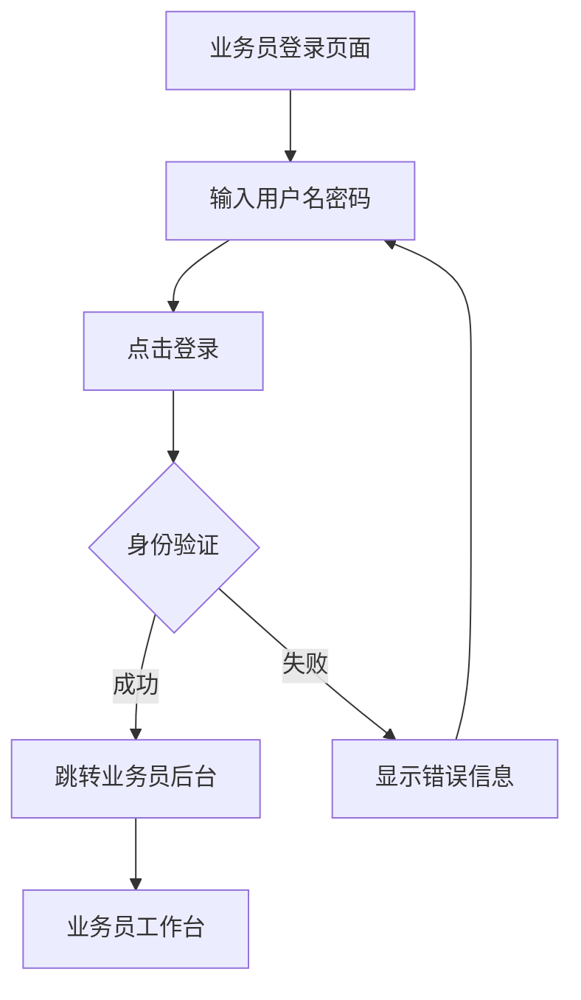

# 业务员专用登录页面产品需求文档

## 1. 产品概述

为业务员创建独立的登录页面，提供专业、友好的登录体验，区别于管理员和普通用户登录界面。该页面将作为业务员访问后台管理系统的专用入口，确保业务员能够快速、安全地登录到专属工作台。

- 解决业务员需要通过管理员登录页面进入系统的混淆问题
- 为业务员提供专业化的登录体验和品牌识别
- 简化业务员的登录流程，提高工作效率

## 2. 核心功能

### 2.1 用户角色

| 角色 | 登录方式 | 核心权限 |
|------|----------|----------|
| 业务员 | 用户名+密码登录 | 访问业务员后台，管理客户，查看业绩统计 |

### 2.2 功能模块

业务员专用登录页面包含以下核心页面：
1. **业务员登录页面**: 登录表单、品牌展示、错误提示、登录状态反馈
2. **登录成功跳转**: 自动跳转到业务员后台工作页面

### 2.3 页面详情

| 页面名称 | 模块名称 | 功能描述 |
|----------|----------|----------|
| 业务员登录页面 | 登录表单 | 提供用户名和密码输入框，支持表单验证和提交 |
| 业务员登录页面 | 品牌标识 | 显示公司LOGO和业务员登录标题，增强品牌识别度 |
| 业务员登录页面 | 错误提示 | 显示登录失败、网络错误等提示信息，提供用户反馈 |
| 业务员登录页面 | 登录状态 | 显示登录进度，防止重复提交，提供加载动画 |
| 业务员登录页面 | 导航链接 | 提供返回首页、忘记密码等辅助功能链接 |

## 3. 核心流程

### 业务员登录流程：
1. 业务员访问专用登录页面
2. 输入用户名和密码
3. 点击登录按钮，系统验证身份
4. 登录成功后自动跳转到业务员后台页面
5. 登录失败显示错误信息，允许重新尝试

## 4. 用户界面设计

### 4.1 设计风格

- **主色调**: 专业蓝色 (#2c3e50) 和辅助色 (#34495e)
- **按钮样式**: 圆角按钮，渐变背景，悬停效果
- **字体**: 系统默认字体，标题16px，正文14px
- **布局风格**: 居中卡片式布局，简洁专业
- **图标风格**: 使用FontAwesome图标，简洁现代

### 4.2 页面设计概览

| 页面名称 | 模块名称 | UI元素 |
|----------|----------|---------|
| 业务员登录页面 | 页面头部 | 居中显示公司LOGO，业务员登录标题，专业蓝色背景 |
| 业务员登录页面 | 登录表单 | 白色卡片容器，圆角边框，阴影效果，输入框带图标 |
| 业务员登录页面 | 登录按钮 | 全宽渐变按钮，悬停动画，加载状态显示 |
| 业务员登录页面 | 提示信息 | 彩色提示框，成功绿色，错误红色，自动消失 |
| 业务员登录页面 | 页面底部 | 返回首页链接，版权信息，简洁灰色文字 |

### 4.3 响应式设计

- **桌面优先**: 主要针对桌面端设计，确保业务员办公使用体验
- **移动端适配**: 支持手机和平板访问，表单和按钮适配触摸操作
- **触摸优化**: 按钮大小适合手指点击，输入框支持移动端键盘