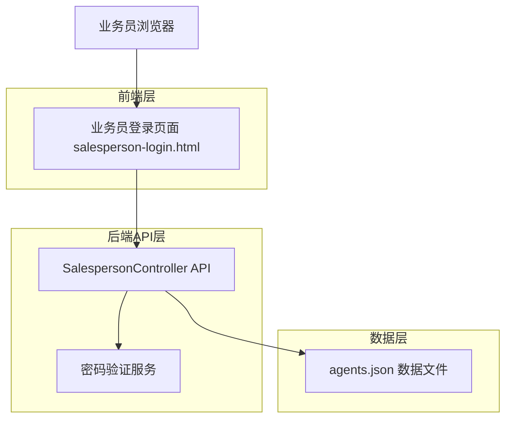
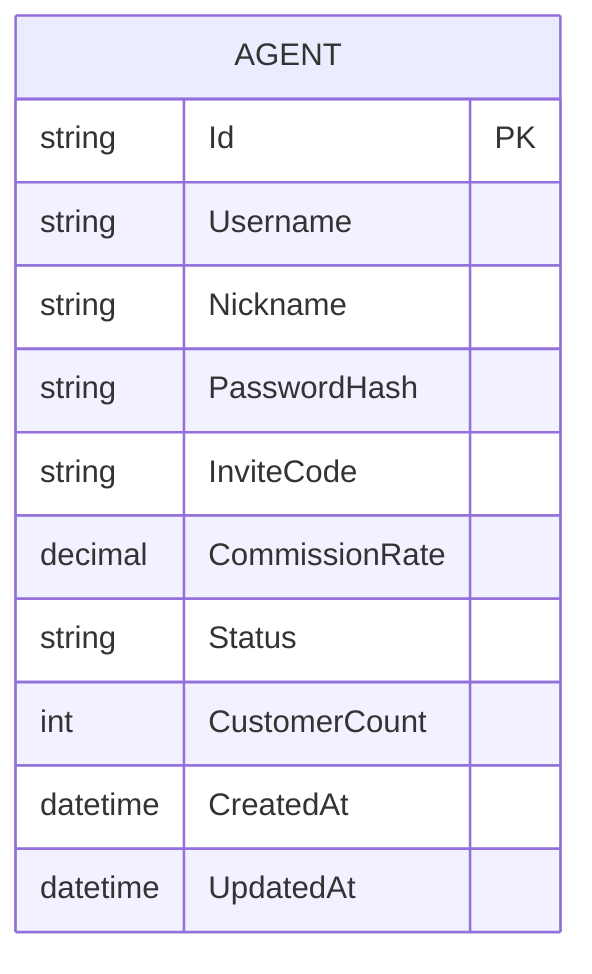

# 业务员专用登录页面技术架构文档

## 1. 架构设计



## 2. 技术描述

- 前端: HTML5 + CSS3 + JavaScript (原生) + Bootstrap 5
- 后端: 现有 SalespersonController API
- 数据存储: agents.json 文件
- 认证: 现有密码哈希验证机制

## 3. 路由定义

| 路由 | 用途 |
|------|------|
| /salesperson-login.html | 业务员专用登录页面 |
| /salesperson.html | 登录成功后跳转的业务员后台页面 |

## 4. API定义

### 4.1 核心API

业务员登录认证
```
POST /api/salesperson/login
```

请求参数:
| 参数名称 | 参数类型 | 是否必需 | 描述 |
|----------|----------|----------|------|
| Username | string | true | 业务员用户名 |
| Password | string | true | 业务员密码 |

响应参数:
| 参数名称 | 参数类型 | 描述 |
|----------|----------|------|
| success | boolean | 登录是否成功 |
| message | string | 响应消息 |
| agent | object | 业务员信息对象 |

请求示例:
```json
{
  "Username": "salesperson01",
  "Password": "password123"
}
```

响应示例:
```json
{
  "success": true,
  "message": "登录成功",
  "agent": {
    "Id": "agent-001",
    "Username": "salesperson01",
    "Nickname": "张业务",
    "InviteCode": "111111",
    "CommissionRate": 0.05,
    "Status": "active",
    "CustomerCount": 15
  }
}
```

## 5. 数据模型

### 5.1 数据模型定义



### 5.2 数据定义语言

业务员数据表 (agents.json)
```json
{
  "Id": "唯一标识符",
  "Username": "登录用户名",
  "Nickname": "显示昵称", 
  "PasswordHash": "加密后的密码",
  "InviteCode": "6位数字邀请码",
  "CommissionRate": "佣金比例",
  "Status": "状态 (active/inactive)",
  "CustomerCount": "客户数量",
  "MonthlyPerformance": "月度业绩",
  "IsActive": "是否激活",
  "RegisterTime": "注册时间",
  "CreatedAt": "创建时间",
  "UpdatedAt": "更新时间"
}
```

现有数据示例:
```json
[
  {
    "Id": "1",
    "Username": "salesperson01",
    "Nickname": "张业务",
    "PasswordHash": "$2a$11$hashed_password",
    "InviteCode": "111111",
    "CommissionRate": 0.05,
    "Status": "active",
    "CustomerCount": 15,
    "MonthlyPerformance": 8500.00,
    "IsActive": true,
    "RegisterTime": "2024-01-15T10:30:00",
    "CreatedAt": "2024-01-15T10:30:00",
    "UpdatedAt": "2024-01-20T15:45:00"
  }
]
```