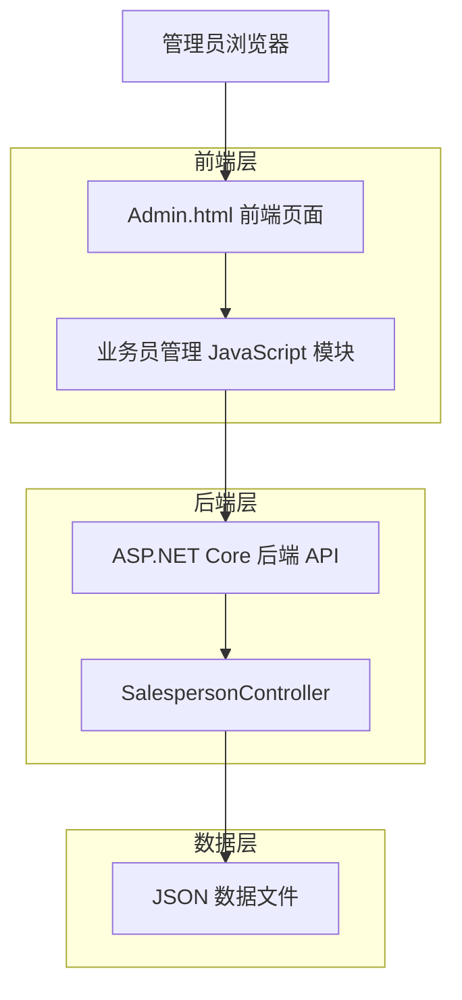
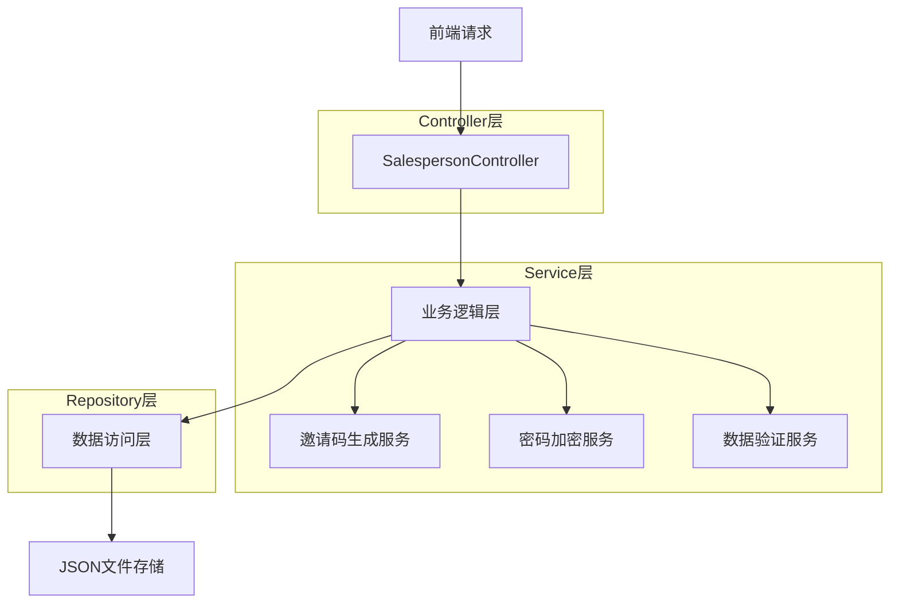
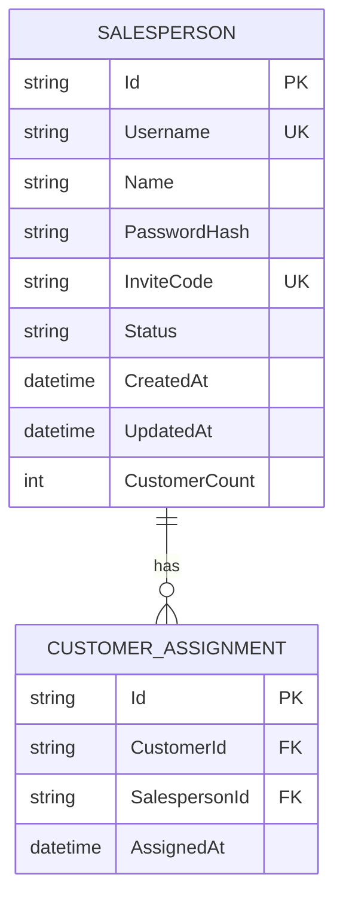

# 业务员管理功能技术架构文档

## 1. 架构设计



## 2. 技术描述
- 前端：Bootstrap@5.1.3 + SweetAlert2@11 + Font Awesome + 原生JavaScript
- 后端：ASP.NET Core@6.0 + System.Text.Json
- 数据存储：JSON文件存储 (salespersons.json)

## 3. 路由定义
| 路由 | 用途 |
|------|------|
| /admin.html#staff-list | 业务员管理主页面，显示业务员列表和管理功能 |
| /admin.html#add-staff | 添加业务员页面（模态框形式） |
| /admin.html#edit-staff | 编辑业务员页面（模态框形式） |

## 4. API定义

### 4.1 核心API

**获取业务员列表**
```
GET /api/salesperson/list
```

Response:
| 参数名称 | 参数类型 | 描述 |
|----------|----------|------|
| salespersons | Array | 业务员列表数组 |
| id | string | 业务员唯一标识 |
| username | string | 业务员账号 |
| name | string | 业务员姓名 |
| password | string | 加密后的密码 |
| inviteCode | string | 6位数字邀请码 |
| status | string | 状态：active/inactive |
| createdAt | datetime | 创建时间 |

**创建业务员**
```
POST /api/salesperson/create
```

Request:
| 参数名称 | 参数类型 | 是否必需 | 描述 |
|----------|----------|----------|------|
| username | string | true | 业务员账号 |
| name | string | true | 业务员姓名 |
| password | string | true | 业务员密码 |
| inviteCode | string | true | 6位数字邀请码 |

Response:
| 参数名称 | 参数类型 | 描述 |
|----------|----------|------|
| success | boolean | 操作是否成功 |
| message | string | 操作结果消息 |
| salesperson | object | 创建的业务员信息 |

**更新业务员信息**
```
PUT /api/salesperson/update/{id}
```

Request:
| 参数名称 | 参数类型 | 是否必需 | 描述 |
|----------|----------|----------|------|
| name | string | false | 业务员姓名 |
| inviteCode | string | false | 6位数字邀请码 |
| status | string | false | 状态：active/inactive |

**删除业务员**
```
DELETE /api/salesperson/delete/{id}
```

Response:
| 参数名称 | 参数类型 | 描述 |
|----------|----------|------|
| success | boolean | 删除是否成功 |
| message | string | 操作结果消息 |

**验证邀请码唯一性**
```
POST /api/salesperson/validate-invite-code
```

Request:
| 参数名称 | 参数类型 | 是否必需 | 描述 |
|----------|----------|----------|------|
| inviteCode | string | true | 待验证的邀请码 |
| excludeId | string | false | 排除的业务员ID（编辑时使用） |

Response:
| 参数名称 | 参数类型 | 描述 |
|----------|----------|------|
| isValid | boolean | 邀请码是否可用 |
| message | string | 验证结果消息 |

**生成邀请码**
```
GET /api/salesperson/generate-invite-code
```

Response:
| 参数名称 | 参数类型 | 描述 |
|----------|----------|------|
| inviteCode | string | 生成的6位数字邀请码 |

## 5. 服务器架构图



## 6. 数据模型

### 6.1 数据模型定义



### 6.2 数据定义语言

**业务员表数据结构 (salespersons.json)**
```json
[
  {
    "id": "uuid-string",
    "username": "业务员账号",
    "name": "业务员姓名", 
    "passwordHash": "加密后的密码",
    "inviteCode": "123456",
    "status": "active",
    "createdAt": "2024-01-01T00:00:00Z",
    "updatedAt": "2024-01-01T00:00:00Z",
    "customerCount": 0
  }
]
```

**扩展的业务员模型类**
```csharp
public class Salesperson
{
    public string Id { get; set; } = string.Empty;
    public string Username { get; set; } = string.Empty;  // 新增：业务员账号
    public string Name { get; set; } = string.Empty;
    public string PasswordHash { get; set; } = string.Empty;  // 新增：加密密码
    public string InviteCode { get; set; } = string.Empty;  // 新增：邀请码
    public string Phone { get; set; } = string.Empty;
    public string Email { get; set; } = string.Empty;
    public string Department { get; set; } = string.Empty;
    public double CommissionRate { get; set; }
    public string Status { get; set; } = "active";
    public DateTime CreatedAt { get; set; }
    public DateTime? UpdatedAt { get; set; }
    public int CustomerCount { get; set; }
}
```

**新增请求模型**
```csharp
public class CreateSalespersonRequest
{
    public string Username { get; set; } = string.Empty;
    public string Name { get; set; } = string.Empty;
    public string Password { get; set; } = string.Empty;
    public string InviteCode { get; set; } = string.Empty;
    public string Phone { get; set; } = string.Empty;
    public string Email { get; set; } = string.Empty;
    public string Department { get; set; } = string.Empty;
    public double CommissionRate { get; set; }
}

public class ValidateInviteCodeRequest
{
    public string InviteCode { get; set; } = string.Empty;
    public string? ExcludeId { get; set; }
}
```

**数据初始化示例**
```json
[
  {
    "id": "550e8400-e29b-41d4-a716-446655440001",
    "username": "sales001",
    "name": "张业务",
    "passwordHash": "hashed_password_here",
    "inviteCode": "123456",
    "phone": "13800138001",
    "email": "zhang@example.com",
    "department": "sales",
    "commissionRate": 5.0,
    "status": "active",
    "createdAt": "2024-01-01T00:00:00Z",
    "updatedAt": "2024-01-01T00:00:00Z",
    "customerCount": 0
  }
]
```