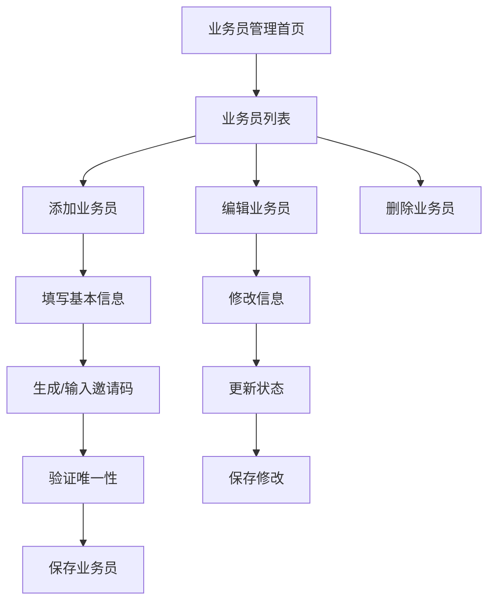

# 业务员管理功能需求文档

## 1. 产品概述
业务员管理功能是后台管理系统的核心模块，用于管理平台的业务员账户、权限和邀请码系统。
该功能为管理员提供完整的业务员生命周期管理，包括账户创建、信息维护、状态控制和邀请码管理，确保业务员团队的有效管理和客户分配。

## 2. 核心功能

### 2.1 用户角色
| 角色 | 权限说明 | 核心权限 |
|------|----------|----------|
| 系统管理员 | 完全管理权限 | 可以添加、编辑、删除、查看所有业务员信息，管理邀请码 |
| 业务员 | 受限访问权限 | 只能查看自己的信息和分配的客户 |

### 2.2 功能模块
业务员管理功能包含以下主要页面：
1. **业务员列表页面**：展示所有业务员信息，支持搜索筛选和批量操作
2. **添加业务员页面**：创建新业务员账户，设置基本信息和邀请码
3. **编辑业务员页面**：修改业务员信息，更新状态和权限设置

### 2.3 页面详情
| 页面名称 | 模块名称 | 功能描述 |
|----------|----------|----------|
| 业务员列表页面 | 业务员展示模块 | 显示业务员列表，包含姓名、账号、邀请码、状态等信息 |
| 业务员列表页面 | 搜索筛选模块 | 支持按姓名、账号、邀请码搜索，按状态筛选 |
| 业务员列表页面 | 操作按钮模块 | 提供编辑、删除、启用/禁用等操作按钮 |
| 添加业务员页面 | 基本信息表单 | 输入业务员账号、姓名、密码等基本信息 |
| 添加业务员页面 | 邀请码管理模块 | 自动生成或手动输入6位数字邀请码，验证唯一性 |
| 添加业务员页面 | 表单验证模块 | 验证输入数据的有效性和完整性 |
| 编辑业务员页面 | 信息修改表单 | 修改业务员基本信息，不包含密码重置 |
| 编辑业务员页面 | 状态管理模块 | 启用或禁用业务员账户 |
| 编辑业务员页面 | 邀请码更新模块 | 重新生成或修改邀请码 |

## 3. 核心流程

### 管理员操作流程
1. 管理员登录后台管理系统
2. 进入"会员管理" → "业务员管理"页面
3. 查看业务员列表，可进行搜索和筛选
4. 点击"添加业务员"创建新账户
5. 填写业务员信息，生成或输入邀请码
6. 保存后业务员账户创建成功
7. 可对现有业务员进行编辑、删除或状态管理

### 业务员邀请码生成流程
1. 在添加/编辑业务员页面
2. 点击"生成邀请码"按钮自动生成6位数字
3. 或手动输入6位数字邀请码
4. 系统验证邀请码唯一性
5. 保存业务员信息和邀请码

## 4. 用户界面设计

### 4.1 设计风格
- **主色调**：蓝色系 (#007bff) 作为主色，绿色 (#28a745) 作为成功状态色
- **按钮风格**：圆角按钮，带图标的现代化设计
- **字体**：Microsoft YaHei, 14px 为主要字体大小
- **布局风格**：卡片式布局，清晰的表格展示
- **图标风格**：Font Awesome 图标库，简洁现代

### 4.2 页面设计概览
| 页面名称 | 模块名称 | UI元素 |
|----------|----------|--------|
| 业务员列表页面 | 页面头部 | 标题"业务员管理"，绿色"添加业务员"按钮，搜索框和筛选下拉框 |
| 业务员列表页面 | 数据表格 | Bootstrap表格样式，包含姓名、账号、邀请码、状态、操作列 |
| 业务员列表页面 | 状态标识 | 绿色"正常"徽章，红色"禁用"徽章 |
| 添加业务员页面 | 表单区域 | 白色卡片背景，标签和输入框垂直排列，蓝色边框聚焦效果 |
| 添加业务员页面 | 邀请码区域 | 输入框配合"生成邀请码"按钮，显示6位数字格式 |
| 添加业务员页面 | 操作按钮 | 蓝色"保存"按钮，灰色"取消"按钮 |

### 4.3 响应式设计
- 桌面优先设计，支持移动端自适应
- 表格在小屏幕下支持横向滚动
- 按钮和表单元素支持触摸操作优化