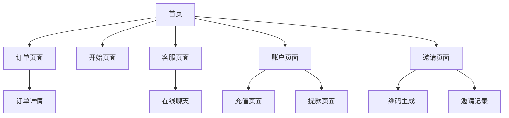

# 基于.NET技术的移动端电商网站产品需求文档

## 1. 产品概述

本项目旨在开发一个基于.NET技术栈的移动端优先电商网站，为用户提供便捷的在线购物体验。网站采用响应式设计，确保在各种移动设备上完美显示，支持用户浏览商品、下单购买、客服咨询等核心功能。

产品目标是构建一个稳定、高效、易扩展的电商平台，支持后续功能模块的逐步添加和业务规模的持续增长。

## 2. 核心功能

### 2.1 用户角色

| 角色 | 注册方式 | 核心权限 | 访问页面 |
|------|----------|----------|----------|
| 注册用户 | 邀请码注册（必须） | 可浏览商品、下单购买、充值提现、查看订单、联系专属业务员 | 网站功能页面（首页、订单、开始、客服、账户等） |
| VIP用户 | 达到VIP要求后自动升级 | 享受VIP专属优惠、更高佣金比例、专属任务 | 网站功能页面（与注册用户相同，但享受VIP特权） |
| 业务员 | 管理员后台创建 | 管理邀请的客户、处理客户咨询、查看客户数据、设置可抓取订单、管理客户信誉分 | 业务员工作页面（客户管理、订单管理、聊天管理等） |
| 管理员 | 超级管理员创建 | 创建业务员、管理系统配置、查看运营数据、LOGO管理、VIP等级配置 | 后台管理页面（系统管理、用户管理、内容管理等） |
| 超级管理员 | 系统预设 | 最高权限，创建管理员、系统核心配置、数据库管理、安全设置 | 后台管理页面（全部管理功能） |

### 2.2 功能模块

我们的电商网站需求包含以下主要页面：

1. **首页**：顶部幻灯片轮播、跑马灯公告、余额显示、合作伙伴展示、会员权益展示
2. **登录页面**：用户身份验证、后台可编辑LOGO、简洁登录表单
3. **注册页面**：用户注册、邀请码验证、后台可编辑LOGO、简洁注册表单
4. **订单页面**：订单列表、订单详情、订单状态跟踪
5. **开始页面**：用户引导、功能介绍、快速入口
6. **客服页面**：在线客服、常见问题、联系方式
7. **账户页面**：个人信息、账户余额、会员等级、设置选项
8. **充值页面**：充值账号地址显示、充值流程引导、充值记录查询
9. **提款页面**：提款金额输入、网络选择、提款地址管理、提款验证
10. **邀请页面**：邀请链接分享、二维码生成、邀请码管理、邀请记录
11. **业务员管理系统**：邀请码和客户绑定管理
   - 业务员创建：管理员在后台创建业务员账户
   - 邀请码生成：系统自动为每个业务员生成6位数专属邀请码
   - 客户绑定：通过邀请码注册的客户自动绑定到对应业务员
   - 客户管理：业务员可查看和管理自己邀请的客户列表
   - 专属客服：客户点击客服直接联系绑定的业务员

### 2.3 页面详情

| 页面名称 | 模块名称 | 功能描述 |
|----------|----------|----------|
| 首页 | 顶部LOGO区域 | 左侧显示网站品牌LOGO，支持三种LOGO类型：纯图片LOGO（PNG/JPG/SVG格式）、纯文字LOGO（自定义文字内容和样式）、图文组合LOGO（图片+文字组合），建议显示尺寸120x40px |
| 登录页面 | 顶部LOGO区域 | 页面顶部中央显示品牌LOGO，支持后台编辑，与首页LOGO功能相同但可设置不同尺寸，建议显示尺寸150x50px，支持三种LOGO类型 |
| 登录页面 | 登录表单区域 | 简洁的登录界面，包含手机号输入框（带国家代码选择）、密码输入框、记住我复选框、忘记密码链接、登录按钮 |
| 登录页面 | 语言选择组件 | 右上角语言切换按钮，显示国旗图标，预留功能开发 |
| 登录页面 | 注册引导 | 页面底部新用户注册链接，引导用户跳转到注册页面 |
| 注册页面 | 顶部LOGO区域 | 页面顶部中央显示品牌LOGO，支持后台编辑，与首页和登录页LOGO功能相同但可设置不同尺寸，建议显示尺寸150x50px |
| 注册页面 | 注册表单区域 | 简洁的注册界面，包含手机号输入框（带国家代码选择）、密码输入框、确认密码输入框、昵称输入框、邀请码输入框（必填）、注册按钮 |
| 注册页面 | 语言选择组件 | 右上角语言切换按钮，显示国旗图标，预留功能开发 |
| 注册页面 | 登录引导 | 页面底部已有账号登录链接，引导用户跳转到登录页面 |
| 注册页面 | 邀请码验证 | 用户必须输入有效的6位数邀请码才能完成注册，系统自动验证邀请码有效性 |
| 首页 | LOGO文字设计 | 文字LOGO字体库：中文艺术字体（方正兰亭黑、汉仪旗黑、思源黑体、站酷高端黑、优设标题黑、胡晓波男神体、庞门正道标题体、阿里巴巴普惠体）；英文艺术字体（Montserrat、Roboto、Open Sans、Lato、Poppins、Nunito、Source Sans Pro、Raleway、Ubuntu、Playfair Display）；中英文兼容字体（Noto Sans CJK、Source Han Sans、Microsoft YaHei UI、PingFang SC） |
| 首页 | LOGO样式设置 | 字体大小12-48px自由调节、RGB颜色选择器+预设常用颜色、字体粗细100-900字重选择（Thin、Light、Regular、Medium、Bold、Black）、文字特效（阴影、描边、渐变） |
| 首页 | LOGO组合布局 | 图文组合支持四种布局：左图右文、上图下文、右图左文、下图上文；支持图片与文字间距自定义、对齐方式（居左、居中、居右）、整体尺寸120x40px内容自适应 |
| 首页 | LOGO后台管理 | LOGO类型选择（单选框：图片/文字/组合模式）、实时预览（所见即所得）、样式保存（保存为模板）、版本管理（多版本切换） |
| 首页 | 语言选择组件 | 右上角语言切换占位符，显示当前语言标识，预留80x30px空间，暂时显示"功能开发中"提示 |
| 首页 | 顶部幻灯片区域 | 自动轮播展示推广图片，支持后台配置图片和链接 |
| 首页 | 跑马灯信息区域 | 滚动显示系统公告，后台可编辑内容，逗号分割多条信息，每条信息前显示礼花图标 |
| 首页 | 账户余额显示 | 实时显示用户数据库中的当前余额和累计收入，支持数据同步更新 |
| 首页 | 快捷功能区 | 提供充值、取款、邀请、客服等快捷入口，点击跳转到对应功能页面 |
| 首页 | 合作伙伴展示 | 展示Shopify、Wish、AliExpress等合作平台logo |
| 首页 | 会员权益区域 | 显示VIP等级、任务进度、会员特权 |
| 首页 | 底部导航栏 | 固定导航：首页、订单、开始、客服、账户 |
| 订单页面 | 订单状态分类 | 三个状态标签：进行中、冻结、已完成，支持状态切换筛选 |
| 订单页面 | 订单列表 | 卡片式布局显示订单信息，包含订单号、商品图片、金额、状态、时间 |
| 订单页面 | 订单详情 | 点击订单卡片进入详情页，显示完整订单信息、商品明细、状态历史 |
| 订单页面 | 状态管理 | 进行中订单显示绿色标识，冻结订单显示橙色标识，已完成订单显示灰色标识 |
| 订单页面 | 下拉刷新 | 支持下拉刷新获取最新订单数据，上拉加载更多历史订单 |
| 开始页面 | 订单展示区域 | 显示业务员后台设置的可抓取订单列表，包含商品图片、名称、价格等信息 |
| 开始页面 | 抓取订单按钮 | 大按钮样式，只有业务员设置好可抓取订单后才能点击开始抓取 |
| 开始页面 | 我的等级权益 | 可调用的VIP等级卡片，与首页会员权益内容完全一致，根据用户当前VIP等级动态显示 |
| 开始页面 | 任务统计区域 | 显示已完成、ALL、未完成三个数据，未完成数=VIP等级每日任务上限-已完成数 |
| 开始页面 | 数据展示区域 | 显示当前金额、订单佣金、冻结金额、信誉分四个关键数据 |
| 开始页面 | 订购说明 | 根据用户VIP等级显示不同的订购说明文字，内容由后台编辑配置 |
| 客服页面 | 专属客服聊天 | 用户与分配的专属业务员进行一对一实时聊天 |
| 客服页面 | 聊天历史记录 | 保存并显示用户与专属业务员的历史对话，按时间排序 |
| 客服页面 | 消息状态显示 | 显示消息的已读/未读状态，发送时间等信息 |
| 客服页面 | 业务员信息 | 显示专属业务员的姓名、头像和在线状态 |
| 账户页面 | 用户信息区域 | 显示用户头像（默认头像或用户上传）、手机号码（从用户注册数据读取）、退出登录按钮 |
| 账户页面 | 账户数据展示 | 四个数据卡片：当前余额（读取current_balance）、冻结金额（读取frozen_amount）、信誉分（业务员设置）、邀请码（读取invite_code_used） |
| 账户页面 | 设置功能区域 | 个人资料编辑（演示功能）、账户记录查看（演示功能）、等级权益说明（演示功能）、修改登录密码（演示功能）、修改取款密码（演示功能） |
| 账户页面 | 其他功能区域 | 条款与协议查看（演示功能）、语言切换设置（演示功能） |
| 充值页面 | 充值信息展示 | 显示充值账号地址，支持后台编辑管理充值账号 |
| 充值页面 | 充值流程 | 充值步骤引导、金额确认、到账通知 |
| 充值页面 | 充值记录 | 历史充值记录查询、状态跟踪 |
| 提款页面 | 提款表单 | 金额输入、网络选择（USDC-ETH、USDT-TRC20、USDT-ERC20） |
| 提款页面 | 地址管理 | 提款地址绑定、修改、验证功能 |
| 提款页面 | 安全验证 | 提款密码验证、短信验证码确认 |
| 提款页面 | 提款记录 | 提款历史、状态跟踪、手续费说明 |
| 邀请页面 | 邀请链接生成 | 生成包含邀请码的专属邀请链接，支持复制分享 |
| 邀请页面 | 二维码生成 | 根据邀请链接自动生成二维码图片，支持保存和分享 |
| 邀请页面 | 邀请记录 | 显示邀请的用户列表、注册状态、奖励统计 |
| 邀请页面 | 邀请奖励 | 邀请成功奖励展示、奖励发放记录 |
| 客服页面 | 在线聊天 | 实时聊天界面，支持文字、图片、表情消息 |
| 客服页面 | 客服列表 | 显示可用客服人员，支持选择特定客服 |
| 客服页面 | 聊天记录 | 历史聊天记录查看，支持搜索和筛选 |
| 注册页面 | 邀请码验证 | 用户必须输入有效的6位数邀请码才能注册 |
| 注册页面 | 业务员绑定 | 根据邀请码自动绑定用户到对应业务员 |
| 业务员管理 | 业务员创建 | 管理员创建业务员账户并自动分配6位邀请码 |
| 业务员管理 | 客户列表 | 业务员查看通过自己邀请码注册的客户列表 |
| 业务员管理 | 客户数据 | 业务员查看客户的基本信息、余额、订单等数据 |
| 首页 | 合作伙伴展示 | 三行三列布局展示9个合作伙伴logo：Shopify、Wish、OnBuy、AliExpress、Wayfair、eBay、TikTok、ManoMano、Zalando |
| 首页 | VIP会员权益 | 动态显示后台配置的VIP等级卡片，包含等级、要求、福利信息，支持自定义颜色 |

## 3. 核心流程

**普通用户流程：**
用户首先访问登录页面进行身份验证，新用户可点击注册链接跳转到注册页面。注册成功后自动登录进入首页，可以浏览推广内容和跑马灯公告信息，查看实时余额和累计收入。用户可以通过快捷功能区进行充值（查看充值地址并转账）、提款（选择网络和地址进行提现）、邀请好友获得奖励。用户可以在订单页面查看交易记录，遇到问题时通过客服页面寻求帮助。

**登录流程：**
用户访问登录页面→查看页面顶部品牌LOGO→选择国家代码并输入手机号→输入密码→可选择记住我→点击登录按钮→验证成功后跳转到首页。

**注册流程：**
用户点击注册链接→进入注册页面→查看页面顶部品牌LOGO→选择国家代码并输入手机号→设置密码并确认→输入昵称→输入有效的6位数邀请码→点击注册按钮→系统验证邀请码→注册成功后自动绑定到对应业务员→跳转到首页。

**充值流程：**
用户点击充值按钮→进入充值页面→查看充值地址→复制地址进行转账→系统确认到账→余额更新。

**提款流程：**
用户点击提款按钮→进入提款页面→输入提款金额→选择网络类型→输入或选择提款地址→验证提款密码→提交申请→等待审核处理。

**邀请流程：**
用户点击邀请按钮→进入邀请页面→生成专属邀请链接和二维码→分享给好友→好友通过链接注册→获得邀请奖励。

**开始页面流程：**
用户进入开始页面→查看业务员设置的可抓取订单→查看当前VIP等级权益→确认任务完成情况和账户数据→阅读订购说明→点击开始抓取订单按钮→开始执行订单任务。

**抓取订单流程：**
业务员在后台设置可抓取订单→用户在开始页面看到订单列表→用户点击开始抓取按钮→系统分配订单给用户→用户完成订单任务→获得佣金奖励→更新任务完成统计。

**客服流程：**
用户点击客服按钮→进入客服页面→自动连接专属业务员→开始在线聊天→发送消息→接收业务员回复。

**业务员管理流程：**
管理员创建业务员账户→系统自动生成6位邀请码→业务员分享邀请码→用户通过邀请码注册→自动绑定到业务员→业务员管理客户。

**管理员流程：**
管理员通过后台登录系统，可以管理首页幻灯片内容、跑马灯公告内容、VIP等级配置、合作伙伴展示、充值账号地址、用户账户信息、提款申请审核、订单状态、客服消息、邀请码管理等，并可以配置系统参数和查看运营数据。

## 4. 用户界面设计

### 4.1 设计风格

- **主色调**：蓝色系（#007AFF）和橙色系（#FF9500）
- **辅助色**：灰色系（#F2F2F7、#8E8E93）和白色（#FFFFFF）
- **按钮样式**：圆角矩形，渐变色背景，阴影效果
- **字体**：系统默认字体，标题16px，正文14px，说明文字12px
- **布局风格**：卡片式设计，顶部导航，底部固定导航栏
- **图标风格**：线性图标，简洁现代，支持多色彩搭配

### 4.2 页面设计概览

| 页面名称 | 模块名称 | UI元素 |
|----------|----------|--------|
| 首页 | 顶部LOGO区域 | 左侧LOGO显示区域，120x40px尺寸，支持三种LOGO类型：1)纯图片LOGO-支持PNG/JPG/SVG格式上传；2)纯文字LOGO-支持丰富艺术字体库、字体大小12-48px、RGB颜色选择、字重100-900、阴影描边渐变特效；3)图文组合LOGO-支持左图右文/上图下文/右图左文/下图上文四种布局、间距调节、对齐方式设置，移动端自适应 |
| 登录页面 | 顶部LOGO区域 | 页面顶部中央LOGO显示区域，150x50px尺寸，支持后台编辑，与首页LOGO功能相同：1)纯图片LOGO-支持PNG/JPG/SVG格式；2)纯文字LOGO-支持艺术字体库、字体大小14-50px、RGB颜色选择、字重设置、文字特效；3)图文组合LOGO-支持四种布局方式，移动端自适应 |
| 登录页面 | 语言选择组件 | 右上角80x30px区域，显示国旗图标+语言标识，点击显示开发中提示，圆角按钮样式 |
| 登录页面 | 登录表单区域 | 白色卡片背景，圆角12px，包含：手机号输入框（左侧国家代码选择+86，右侧手机号输入）、密码输入框（带显示/隐藏切换）、记住我复选框（蓝色选中状态）、忘记密码链接（蓝色文字），表单间距20px |
| 登录页面 | 登录按钮 | 全宽按钮，蓝色渐变背景#007AFF，白色文字，圆角8px，高度50px，字体16px加粗 |
| 登录页面 | 注册引导 | 页面底部中央，灰色文字"新用户？"+ 蓝色链接"注册"，字体14px |
| 注册页面 | 顶部LOGO区域 | 页面顶部中央LOGO显示区域，150x50px尺寸，支持后台编辑，与登录页LOGO功能完全相同，支持三种LOGO类型和样式设置 |
| 注册页面 | 语言选择组件 | 右上角80x30px区域，显示国旗图标+语言标识，点击显示开发中提示，圆角按钮样式 |
| 注册页面 | 注册表单区域 | 白色卡片背景，圆角12px，包含：手机号输入框（左侧国家代码选择+86）、密码输入框、确认密码输入框、昵称输入框、邀请码输入框（必填，6位数字验证），表单间距20px |
| 注册页面 | 注册按钮 | 全宽按钮，蓝色渐变背景#007AFF，白色文字，圆角8px，高度50px，字体16px加粗 |
| 注册页面 | 登录引导 | 页面底部中央，灰色文字"已有账号？"+ 蓝色链接"登录"，字体14px |
| 首页 | 语言选择组件 | 右上角80x30px占位符区域，显示"中文"或"CN"标识，点击显示开发中提示 |
| 首页 | 顶部幻灯片 | 全屏轮播图，自动切换，指示器，圆角设计 |
| 首页 | 跑马灯区域 | 灰色背景，礼花图标+滚动文字，从右到左滚动，字体12px |
| 首页 | 余额显示区 | 卡片式布局，蓝色背景渐变，白色文字，大号数字，实时数据 |
| 首页 | 功能按钮区 | 4个圆形图标按钮，灰色背景，图标+文字标签，点击反馈 |
| 首页 | 合作伙伴展示 | 三行三列网格布局，每个logo卡片120x80px，圆角8px，浅灰色边框，包含：Shopify(绿色)、Wish(蓝色)、OnBuy(橙色)、AliExpress(橙色)、Wayfair(紫色)、eBay(红蓝)、TikTok(黑色)、ManoMano(蓝绿)、Zalando(橙色) |
| 首页 | VIP会员权益 | 动态VIP卡片展示，支持后台自定义颜色方案，每个卡片包含VIP等级、存款要求、每日任务数、佣金比例，右侧皇冠图标，卡片高度80px |
| 邀请页面 | 邀请链接区域 | 大按钮样式，主色调蓝色#007AFF，包含复制链接按钮，字体16px |
| 邀请页面 | 二维码展示 | 200x200px二维码图片，白色背景，黑色边框，下方保存按钮 |
| 邀请页面 | 邀请统计 | 卡片式布局，显示邀请人数、成功注册数、获得奖励，使用数字强调色#FF6B35 |
| 客服页面 | 聊天界面 | 仿微信聊天界面，消息气泡左右对齐，用户消息蓝色气泡，客服消息灰色气泡 |
| 客服页面 | 输入框 | 底部固定输入框，高度50px，圆角25px，右侧发送按钮蓝色 |
| 首页 | 底部导航 | 固定底部，5个图标+文字，选中状态高亮 |
| 充值页面 | 充值信息卡片 | 深色背景，金币图标，充值地址展示，复制按钮 |
| 充值页面 | 充值记录 | 列表布局，时间+金额+状态，分页显示 |
| 提款页面 | 提款表单 | 白色卡片，输入框+下拉选择，蓝色确认按钮 |
| 提款页面 | 网络选择 | 列表选择，币种图标+网络名称，单选模式 |
| 提款页面 | 地址管理 | 表单布局，输入框+保存按钮，地址验证提示 |
| 订单页面 | 状态标签栏 | 顶部三个标签按钮，选中状态蓝色背景#007AFF，未选中灰色背景#F5F5F5 |
| 订单页面 | 订单卡片 | 白色背景卡片，圆角8px，阴影效果，包含订单号、商品缩略图、订单金额、状态标识、创建时间 |
| 订单页面 | 状态标识 | 进行中(绿色#34C759)、冻结(橙色#FF9500)、已完成(灰色#8E8E93)，圆角标签样式 |
| 订单页面 | 空状态页面 | 当某状态下无订单时，显示空状态插图和提示文字 |
| 账户页面 | 用户信息区域 | 顶部用户头像（圆形，默认灰色头像），手机号码显示（黑色字体14px），右上角退出登录按钮（蓝色#007AFF） |
| 账户页面 | 数据卡片区域 | 2x2网格布局，每个卡片包含标题和数值，当前余额和冻结金额显示美元符号，信誉分和邀请码纯数字显示 |
| 账户页面 | 设置列表区域 | 白色背景列表，每项包含图标+文字+右箭头，分为"设置"和"其他"两个分组，灰色分割线 |
| 账户页面 | 功能状态标识 | 演示功能项目右侧显示"演示"标签（灰色背景#F5F5F5），实际功能项目无标识 |

### 4.3 响应式设计

网站采用移动端优先设计，固定尺寸布局确保在各种手机设备上完美显示。主要适配iPhone和Android主流机型，支持触摸操作优化，包括点击反馈、滑动手势等交互效果。