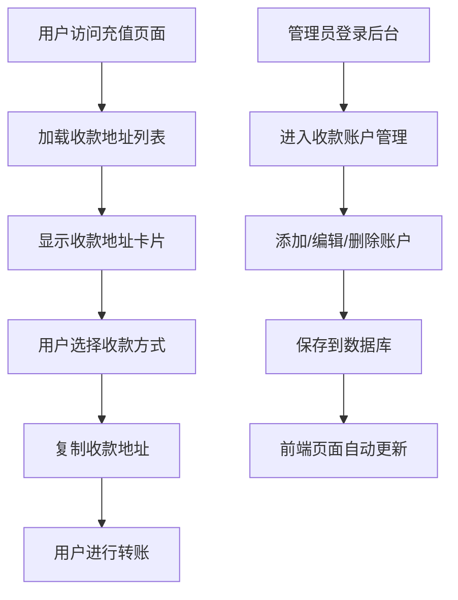

# 充值页面重构和收款账户管理产品需求文档

## 1. Product Overview

本项目旨在重新设计充值页面并添加收款账户管理功能，为用户提供更好的充值体验和管理员提供灵活的收款方式管理。

- 重新设计充值页面，采用与首页一致的设计风格和布局，提升用户体验
- 在后台管理系统中添加收款账户管理功能，支持多种货币的收款地址管理
- 实现前后端数据联动，管理员设置的收款地址能够实时显示在用户充值页面

## 2. Core Features

### 2.1 User Roles

| Role | Registration Method | Core Permissions |
|------|---------------------|------------------|
| 普通用户 | 已有用户系统 | 可以查看充值页面，选择收款地址进行充值 |
| 管理员 | 已有管理员系统 | 可以管理收款账户，添加、编辑、删除收款地址 |

### 2.2 Feature Module

本次重构包含以下主要页面：

1. **充值页面**：用户充值界面，显示所有可用收款地址，采用首页风格设计
2. **收款账户管理页面**：后台管理界面，管理员可以管理所有收款账户

### 2.3 Page Details

| Page Name | Module Name | Feature description |
|-----------|-------------|---------------------|
| 充值页面 | 页面头部 | 显示页面标题，采用首页风格的头部设计 |
| 充值页面 | 收款地址列表 | 显示所有可用的收款地址，包括货币种类和地址信息 |
| 充值页面 | 收款地址卡片 | 每个收款地址以卡片形式展示，包含货币图标、名称、地址和复制功能 |
| 充值页面 | 底部导航栏 | 集成首页的底部导航栏组件 |
| 收款账户管理页面 | 账户列表 | 显示所有已添加的收款账户，支持搜索和筛选 |
| 收款账户管理页面 | 添加账户 | 提供表单添加新的收款账户，包含货币种类选择和地址输入 |
| 收款账户管理页面 | 编辑账户 | 支持编辑现有收款账户的信息 |
| 收款账户管理页面 | 删除账户 | 支持删除不需要的收款账户，包含确认提示 |

## 3. Core Process

### 管理员流程
1. 管理员登录后台管理系统
2. 进入收款账户管理页面
3. 添加新的收款账户（选择货币种类，输入收款地址）
4. 可以编辑或删除现有账户
5. 设置完成后，用户端充值页面会自动更新显示

### 用户充值流程
1. 用户访问充值页面
2. 查看所有可用的收款地址
3. 选择合适的货币种类
4. 复制收款地址进行转账
5. 通过底部导航栏返回其他页面

## 4. User Interface Design

### 4.1 Design Style

- **主色调**：与首页保持一致的蓝色系（#007bff）和白色
- **辅助色**：灰色系用于文本和边框（#6c757d, #dee2e6）
- **按钮风格**：圆角按钮，与首页风格保持一致
- **字体**：使用系统默认字体，标题16-18px，正文14px
- **布局风格**：卡片式布局，响应式设计
- **图标风格**：使用Font Awesome图标库，简洁现代

### 4.2 Page Design Overview

| Page Name | Module Name | UI Elements |
|-----------|-------------|-------------|
| 充值页面 | 页面头部 | 白色背景，居中标题，与首页头部风格一致 |
| 充值页面 | 收款地址列表 | 网格布局，每行2-3个卡片，响应式适配 |
| 充值页面 | 收款地址卡片 | 白色卡片，圆角边框，包含货币图标、名称、地址和复制按钮 |
| 充值页面 | 底部导航栏 | 固定底部，与首页导航栏完全一致 |
| 收款账户管理页面 | 管理界面 | 表格布局，包含添加按钮、搜索框和操作按钮 |
| 收款账户管理页面 | 添加表单 | 模态框形式，包含货币选择下拉框和地址输入框 |

### 4.3 Responsiveness

- **桌面优先设计**：主要针对桌面端管理员使用
- **移动端适配**：充值页面需要良好的移动端体验
- **触摸优化**：按钮和链接区域足够大，便于触摸操作
- **响应式布局**：使用Bootstrap网格系统确保各设备兼容性