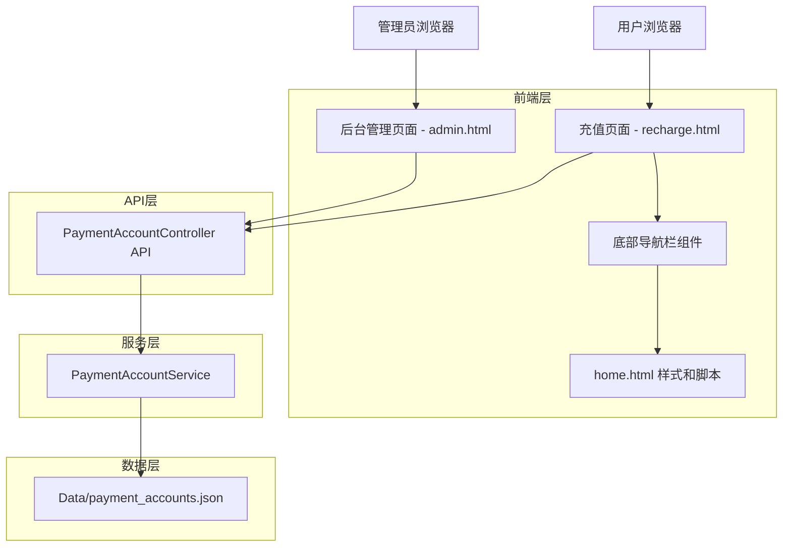
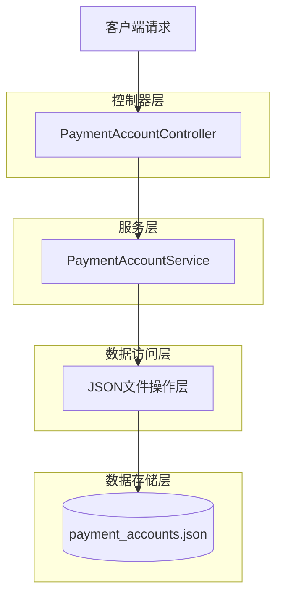
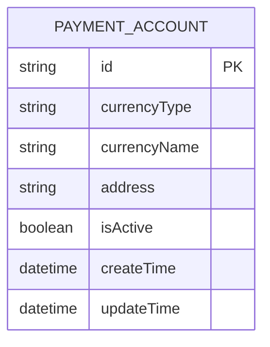

# 充值页面重构和收款账户管理技术架构文档

## 1. Architecture design



## 2. Technology Description

- Frontend: HTML5 + CSS3 + JavaScript (ES6+) + Bootstrap 5
- Backend: ASP.NET Core 6.0
- Data Storage: JSON文件存储 (payment_accounts.json)
- UI Framework: Bootstrap 5 + Font Awesome图标

## 3. Route definitions

| Route | Purpose |
|-------|---------|
| /recharge.html | 用户充值页面，显示所有可用收款地址 |
| /admin.html | 后台管理页面，包含收款账户管理模块 |

## 4. API definitions

### 4.1 Core API

收款账户管理相关API

```
GET /api/payment-accounts
```

获取所有收款账户列表

Response:
| Param Name | Param Type | Description |
|------------|------------|-------------|
| success | boolean | 请求是否成功 |
| data | array | 收款账户列表 |

Example Response:
```json
{
  "success": true,
  "data": [
    {
      "id": "1",
      "currencyType": "BTC",
      "currencyName": "比特币",
      "address": "1A1zP1eP5QGefi2DMPTfTL5SLmv7DivfNa",
      "isActive": true,
      "createTime": "2024-01-01T00:00:00Z"
    }
  ]
}
```

```
POST /api/admin/payment-accounts
```

添加新的收款账户

Request:
| Param Name | Param Type | isRequired | Description |
|------------|------------|------------|-------------|
| currencyType | string | true | 货币类型代码 (如: BTC, ETH, USDT) |
| currencyName | string | true | 货币名称 (如: 比特币, 以太坊) |
| address | string | true | 收款地址 |

Response:
| Param Name | Param Type | Description |
|------------|------------|-------------|
| success | boolean | 操作是否成功 |
| message | string | 操作结果消息 |
| data | object | 新创建的账户信息 |

```
PUT /api/admin/payment-accounts/{id}
```

更新收款账户信息

Request:
| Param Name | Param Type | isRequired | Description |
|------------|------------|------------|-------------|
| currencyType | string | true | 货币类型代码 |
| currencyName | string | true | 货币名称 |
| address | string | true | 收款地址 |
| isActive | boolean | false | 是否启用 |

```
DELETE /api/admin/payment-accounts/{id}
```

删除收款账户

Response:
| Param Name | Param Type | Description |
|------------|------------|-------------|
| success | boolean | 删除是否成功 |
| message | string | 操作结果消息 |

## 5. Server architecture diagram



## 6. Data model

### 6.1 Data model definition



### 6.2 Data Definition Language

收款账户表 (payment_accounts.json)

```json
{
  "paymentAccounts": [
    {
      "id": "uuid-string",
      "currencyType": "BTC",
      "currencyName": "比特币",
      "address": "1A1zP1eP5QGefi2DMPTfTL5SLmv7DivfNa",
      "isActive": true,
      "createTime": "2024-01-01T00:00:00Z",
      "updateTime": "2024-01-01T00:00:00Z"
    }
  ]
}
```

数据结构说明：
- `id`: 唯一标识符，使用UUID
- `currencyType`: 货币类型代码，如BTC、ETH、USDT等
- `currencyName`: 货币中文名称，用于前端显示
- `address`: 收款地址，支持各种加密货币地址格式
- `isActive`: 是否启用，用于控制前端是否显示
- `createTime`: 创建时间
- `updateTime`: 最后更新时间

初始化数据示例：
```json
{
  "paymentAccounts": [
    {
      "id": "550e8400-e29b-41d4-a716-446655440001",
      "currencyType": "BTC",
      "currencyName": "比特币",
      "address": "1A1zP1eP5QGefi2DMPTfTL5SLmv7DivfNa",
      "isActive": true,
      "createTime": "2024-01-01T00:00:00Z",
      "updateTime": "2024-01-01T00:00:00Z"
    },
    {
      "id": "550e8400-e29b-41d4-a716-446655440002",
      "currencyType": "ETH",
      "currencyName": "以太坊",
      "address": "0x742d35Cc6634C0532925a3b8D4C2C2C2C2C2C2C2",
      "isActive": true,
      "createTime": "2024-01-01T00:00:00Z",
      "updateTime": "2024-01-01T00:00:00Z"
    },
    {
      "id": "550e8400-e29b-41d4-a716-446655440003",
      "currencyType": "USDT",
      "currencyName": "泰达币",
      "address": "TQn9Y2khEsLJW1ChVWFMSMeRDow5CNYY7r",
      "isActive": true,
      "createTime": "2024-01-01T00:00:00Z",
      "updateTime": "2024-01-01T00:00:00Z"
    }
  ]
}
```