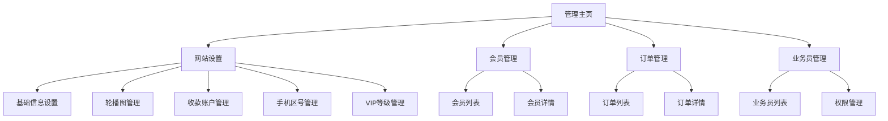

# 后台管理系统重构产品需求文档

## 1. Product Overview

重构现有后台管理系统，采用左侧导航菜单+右侧内容区的经典布局，提升管理效率和用户体验。
系统主要服务于网站管理员，提供网站配置、会员管理、订单处理、业务员管理等核心功能模块。

## 2. Core Features

### 2.1 User Roles

| Role | Registration Method | Core Permissions |
|------|---------------------|------------------|
| 系统管理员 | 内部账号分配 | 拥有所有模块的完整访问和管理权限 |

### 2.2 Feature Module

我们的后台管理系统重构需求包含以下主要页面：
1. **管理主页**：左侧导航菜单、右侧内容展示区、顶部标题栏
2. **网站设置页面**：基础信息设置、轮播图管理、收款账户管理、手机区号管理、VIP等级管理
3. **会员管理页面**：会员列表、会员详情、会员操作
4. **订单管理页面**：订单列表、订单详情、订单状态管理
5. **业务员管理页面**：业务员列表、业务员信息管理

### 2.3 Page Details

| Page Name | Module Name | Feature description |
|-----------|-------------|---------------------|
| 管理主页 | 左侧导航菜单 | 显示四大主分类（网站设置、会员管理、订单管理、业务员管理），支持菜单项点击高亮，子菜单展开收起 |
| 管理主页 | 右侧内容区 | 动态显示选中菜单对应的内容页面，支持内容区切换动画效果 |
| 管理主页 | 顶部标题栏 | 显示当前页面标题、用户信息、退出登录按钮 |
| 网站设置页面 | 基础信息设置 | 网站名称、Logo上传、联系方式等基本信息配置 |
| 网站设置页面 | 轮播图管理 | 轮播图片上传、排序、删除、预览功能 |
| 网站设置页面 | 收款账户管理 | 支付账户添加、编辑、删除、状态管理 |
| 网站设置页面 | 手机区号管理 | 国家区号列表维护、添加、编辑、删除 |
| 网站设置页面 | VIP等级管理 | VIP等级设置、权益配置、价格管理 |
| 会员管理页面 | 会员列表 | 会员信息展示、搜索、筛选、分页 |
| 会员管理页面 | 会员操作 | 会员状态管理、信息编辑、删除操作 |
| 订单管理页面 | 订单列表 | 订单信息展示、状态筛选、时间筛选、分页 |
| 订单管理页面 | 订单详情 | 订单详细信息查看、状态修改、备注添加 |
| 业务员管理页面 | 业务员列表 | 业务员信息展示、添加、编辑、删除 |
| 业务员管理页面 | 权限管理 | 业务员权限分配、角色设置 |

## 3. Core Process

### 管理员操作流程

1. **登录系统** → 进入管理主页
2. **选择功能模块** → 点击左侧导航菜单
3. **查看/编辑内容** → 在右侧内容区进行相应操作
4. **保存设置** → 确认修改并保存
5. **退出系统** → 安全退出登录

### 网站设置操作流程

1. **点击网站设置** → 展开子菜单
2. **选择具体功能** → 点击子菜单项（如轮播图管理）
3. **执行操作** → 在右侧内容区进行添加/编辑/删除操作
4. **保存更改** → 确认并保存设置

## 4. User Interface Design

### 4.1 Design Style

- **主色调**：深蓝色 (#2c3e50) 作为主导航背景，白色 (#ffffff) 作为内容区背景
- **辅助色**：浅灰色 (#f8f9fa) 作为分割线和次要背景，橙色 (#ff6b35) 作为强调色
- **按钮样式**：圆角矩形按钮，主要按钮使用渐变蓝色，次要按钮使用灰色边框
- **字体**：微软雅黑，标题使用 16-18px，正文使用 14px，小字使用 12px
- **布局风格**：左右分栏布局，左侧固定宽度导航，右侧自适应内容区
- **图标风格**：使用简洁的线性图标，统一的视觉风格

### 4.2 Page Design Overview

| Page Name | Module Name | UI Elements |
|-----------|-------------|-------------|
| 管理主页 | 左侧导航菜单 | 深蓝色背景，白色文字，悬停时浅蓝色背景，选中时橙色左边框高亮，子菜单缩进显示 |
| 管理主页 | 右侧内容区 | 白色背景，灰色边框，内容区顶部显示面包屑导航，卡片式内容布局 |
| 管理主页 | 顶部标题栏 | 白色背景，深色文字，右侧用户信息和退出按钮，底部浅灰色分割线 |
| 网站设置页面 | 表单区域 | 白色卡片背景，标签左对齐，输入框统一样式，按钮右对齐排列 |
| 网站设置页面 | 列表区域 | 表格样式，斑马纹背景，悬停高亮，操作按钮使用图标+文字 |
| 会员管理页面 | 搜索筛选区 | 浅灰色背景卡片，表单元素水平排列，搜索按钮使用主色调 |
| 订单管理页面 | 状态标签 | 不同状态使用不同颜色标签，圆角设计，清晰易识别 |

### 4.3 Responsiveness

系统采用桌面优先设计，针对1200px以上宽屏显示器优化。左侧导航固定宽度240px，右侧内容区自适应剩余空间。暂不考虑移动端适配，专注于桌面端管理体验。