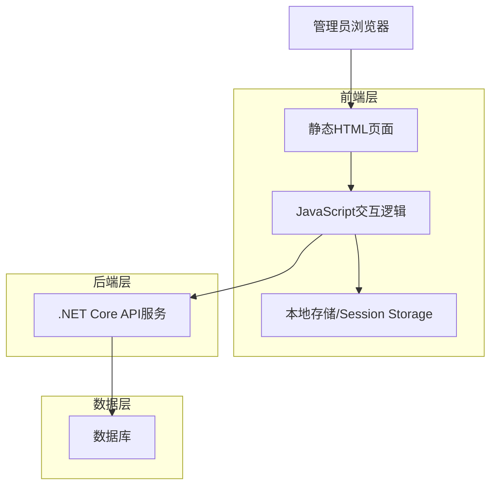
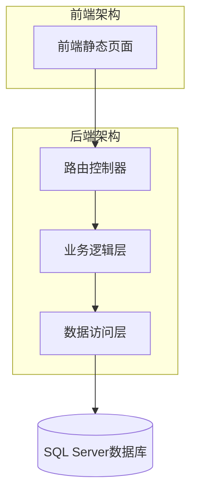
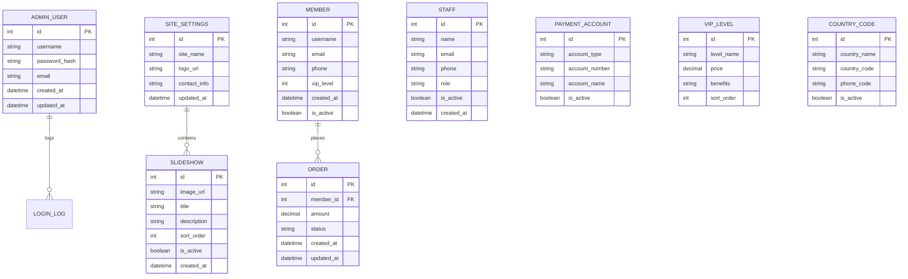

# 后台管理系统重构技术架构文档

## 1. Architecture design



## 2. Technology Description

- Frontend: HTML5 + CSS3 + Vanilla JavaScript + Bootstrap 5
- Backend: .NET Core API (现有)
- Database: SQL Server (现有)
- Storage: LocalStorage + SessionStorage

## 3. Route definitions

| Route | Purpose |
|-------|---------|
| /admin.html | 后台管理主页，包含完整的导航和内容区域 |
| /login.html | 管理员登录页面 |
| /admin.html#website-settings | 网站设置模块页面 |
| /admin.html#member-management | 会员管理模块页面 |
| /admin.html#order-management | 订单管理模块页面 |
| /admin.html#staff-management | 业务员管理模块页面 |

## 4. API definitions

### 4.1 Core API

网站设置相关接口
```
GET /api/admin/settings/basic
```

Request: 无参数

Response:
| Param Name| Param Type  | Description |
|-----------|-------------|-------------|
| siteName  | string      | 网站名称 |
| logo      | string      | Logo图片URL |
| contact   | string      | 联系方式 |

轮播图管理接口
```
GET /api/admin/slideshow
POST /api/admin/slideshow
PUT /api/admin/slideshow/{id}
DELETE /api/admin/slideshow/{id}
```

会员管理接口
```
GET /api/admin/members
GET /api/admin/members/{id}
PUT /api/admin/members/{id}
DELETE /api/admin/members/{id}
```

订单管理接口
```
GET /api/admin/orders
GET /api/admin/orders/{id}
PUT /api/admin/orders/{id}/status
```

业务员管理接口
```
GET /api/admin/staff
POST /api/admin/staff
PUT /api/admin/staff/{id}
DELETE /api/admin/staff/{id}
```

## 5. Server architecture diagram



## 6. Data model

### 6.1 Data model definition



### 6.2 Data Definition Language

管理员用户表 (admin_users)
```sql
-- 创建管理员用户表
CREATE TABLE admin_users (
    id INT PRIMARY KEY IDENTITY(1,1),
    username NVARCHAR(50) UNIQUE NOT NULL,
    password_hash NVARCHAR(255) NOT NULL,
    email NVARCHAR(100),
    created_at DATETIME2 DEFAULT GETDATE(),
    updated_at DATETIME2 DEFAULT GETDATE()
);

-- 创建网站设置表
CREATE TABLE site_settings (
    id INT PRIMARY KEY IDENTITY(1,1),
    site_name NVARCHAR(100) NOT NULL,
    logo_url NVARCHAR(255),
    contact_info NVARCHAR(500),
    updated_at DATETIME2 DEFAULT GETDATE()
);

-- 创建轮播图表
CREATE TABLE slideshow (
    id INT PRIMARY KEY IDENTITY(1,1),
    image_url NVARCHAR(255) NOT NULL,
    title NVARCHAR(100),
    description NVARCHAR(500),
    sort_order INT DEFAULT 0,
    is_active BIT DEFAULT 1,
    created_at DATETIME2 DEFAULT GETDATE()
);

-- 创建会员表
CREATE TABLE members (
    id INT PRIMARY KEY IDENTITY(1,1),
    username NVARCHAR(50) UNIQUE NOT NULL,
    email NVARCHAR(100),
    phone NVARCHAR(20),
    vip_level INT DEFAULT 0,
    created_at DATETIME2 DEFAULT GETDATE(),
    is_active BIT DEFAULT 1
);

-- 创建订单表
CREATE TABLE orders (
    id INT PRIMARY KEY IDENTITY(1,1),
    member_id INT FOREIGN KEY REFERENCES members(id),
    amount DECIMAL(10,2) NOT NULL,
    status NVARCHAR(20) DEFAULT 'pending',
    created_at DATETIME2 DEFAULT GETDATE(),
    updated_at DATETIME2 DEFAULT GETDATE()
);

-- 创建业务员表
CREATE TABLE staff (
    id INT PRIMARY KEY IDENTITY(1,1),
    name NVARCHAR(50) NOT NULL,
    email NVARCHAR(100),
    phone NVARCHAR(20),
    role NVARCHAR(20) DEFAULT 'staff',
    is_active BIT DEFAULT 1,
    created_at DATETIME2 DEFAULT GETDATE()
);

-- 创建收款账户表
CREATE TABLE payment_accounts (
    id INT PRIMARY KEY IDENTITY(1,1),
    account_type NVARCHAR(20) NOT NULL,
    account_number NVARCHAR(50) NOT NULL,
    account_name NVARCHAR(100) NOT NULL,
    is_active BIT DEFAULT 1
);

-- 创建VIP等级表
CREATE TABLE vip_levels (
    id INT PRIMARY KEY IDENTITY(1,1),
    level_name NVARCHAR(50) NOT NULL,
    price DECIMAL(10,2) NOT NULL,
    benefits NVARCHAR(1000),
    sort_order INT DEFAULT 0
);

-- 创建国家区号表
CREATE TABLE country_codes (
    id INT PRIMARY KEY IDENTITY(1,1),
    country_name NVARCHAR(50) NOT NULL,
    country_code NVARCHAR(5) NOT NULL,
    phone_code NVARCHAR(10) NOT NULL,
    is_active BIT DEFAULT 1
);

-- 创建索引
CREATE INDEX idx_slideshow_sort_order ON slideshow(sort_order);
CREATE INDEX idx_orders_member_id ON orders(member_id);
CREATE INDEX idx_orders_status ON orders(status);
CREATE INDEX idx_members_vip_level ON members(vip_level);

-- 初始化数据
INSERT INTO site_settings (site_name, contact_info) 
VALUES ('网站管理系统', '联系电话：400-000-0000');

INSERT INTO admin_users (username, password_hash, email) 
VALUES ('admin', 'hashed_password_here', 'admin@example.com');

INSERT INTO vip_levels (level_name, price, benefits, sort_order) 
VALUES 
('普通会员', 0.00, '基础功能使用', 1),
('VIP会员', 99.00, '高级功能 + 优先客服', 2),
('SVIP会员', 299.00, '全功能 + 专属客服 + 定制服务', 3);
```