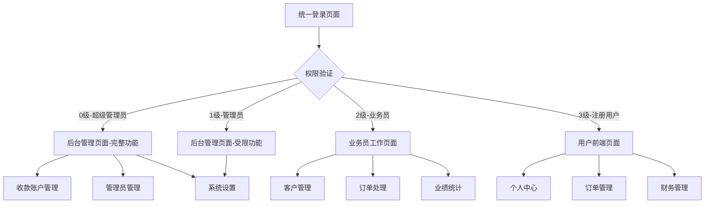

# 四级权限管理系统产品需求文档

## 1. 产品概述

本项目旨在建立一个完整的四级权限管理系统，将用户按照权限等级划分为超级管理员、管理员、业务员和注册用户四个层次，实现精细化的权限控制和差异化的用户界面。

系统将根据用户权限等级提供不同的登录入口和功能访问权限，确保数据安全和操作规范，提升管理效率和用户体验。

## 2. 核心功能

### 2.1 用户角色

| 角色 | 权限等级 | 登录方式 | 核心权限 |
|------|----------|----------|----------|
| 超级管理员 | 0级 | 账号密码登录 | 所有后台功能，包括收款账户管理、管理员管理等 |
| 管理员 | 1级 | 账号密码登录 | 大部分后台功能，除收款账户管理外 |
| 业务员 | 2级 | 账号密码登录 | 客户管理、订单处理、业绩查看等 |
| 注册用户 | 3级 | 手机号/邮箱注册登录 | 个人信息、订单查看、充值提现等 |

### 2.2 功能模块

我们的四级权限管理系统包含以下主要页面：

1. **统一登录页面**：权限验证、登录路由分发
2. **后台管理页面**：超级管理员和管理员使用的管理界面
3. **业务员工作页面**：业务员专用的客户和订单管理界面
4. **用户前端页面**：注册用户的个人中心和业务操作界面

### 2.3 页面详情

| 页面名称 | 模块名称 | 功能描述 |
|----------|----------|----------|
| 统一登录页面 | 登录验证模块 | 验证用户身份，根据权限等级跳转到对应界面 |
| 统一登录页面 | 权限路由模块 | 0-1级跳转后台管理，2级跳转业务员界面，3级跳转用户前端 |
| 后台管理页面 | 权限控制模块 | 根据用户等级显示/隐藏功能菜单和操作按钮 |
| 后台管理页面 | 收款账户管理 | 仅超级管理员可访问的收款账户增删改查功能 |
| 后台管理页面 | 管理员管理 | 仅超级管理员可访问的管理员账户管理功能 |
| 后台管理页面 | 系统设置管理 | 超级管理员和管理员都可访问的基础设置功能 |
| 业务员工作页面 | 客户管理模块 | 查看和管理分配的客户信息，客户状态跟踪 |
| 业务员工作页面 | 订单处理模块 | 处理客户订单，订单状态更新，订单历史查询 |
| 业务员工作页面 | 业绩统计模块 | 查看个人业绩数据，客户转化率，收入统计 |
| 用户前端页面 | 个人中心模块 | 个人信息管理，密码修改，账户安全设置 |
| 用户前端页面 | 订单管理模块 | 查看订单历史，订单状态跟踪，重新下单 |
| 用户前端页面 | 财务管理模块 | 账户余额查看，充值提现，交易记录 |

## 3. 核心流程

### 用户登录流程
用户在统一登录页面输入凭据后，系统验证身份并根据权限等级进行路由分发：
- 0级和1级用户登录成功后跳转到后台管理页面
- 2级用户登录成功后跳转到业务员工作页面  
- 3级用户登录成功后跳转到用户前端页面

### 权限验证流程
每个页面和功能模块都会进行权限验证：
- 前端根据用户等级显示对应的菜单和功能
- 后端API对每个请求进行权限验证
- 未授权访问将被拒绝并重定向到登录页面

## 4. 用户界面设计

### 4.1 设计风格
- 主色调：蓝色系（#007bff）和灰色系（#6c757d）
- 按钮样式：圆角按钮，hover效果
- 字体：系统默认字体，标题16px，正文14px
- 布局风格：卡片式布局，左侧导航菜单
- 图标风格：Font Awesome图标库

### 4.2 页面设计概览

| 页面名称 | 模块名称 | UI元素 |
|----------|----------|--------|
| 统一登录页面 | 登录表单 | 居中卡片布局，蓝色主题，响应式设计 |
| 后台管理页面 | 导航菜单 | 左侧折叠菜单，根据权限等级动态显示菜单项 |
| 后台管理页面 | 用户信息显示 | 右上角显示用户名和权限等级标识 |
| 业务员工作页面 | 工作台布局 | 仪表板风格，数据卡片展示，操作按钮突出 |
| 用户前端页面 | 个人中心 | 简洁友好的用户界面，突出核心功能 |

### 4.3 响应式设计
系统采用移动端优先的响应式设计，支持桌面端、平板端和移动端访问，确保在不同设备上都有良好的用户体验。