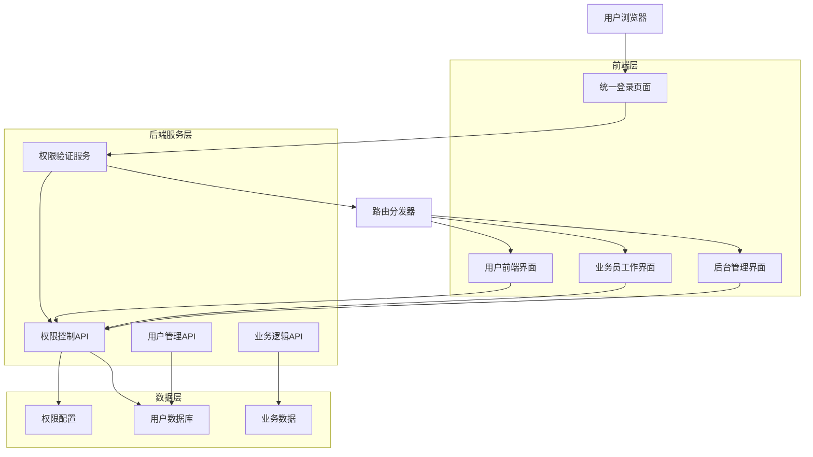
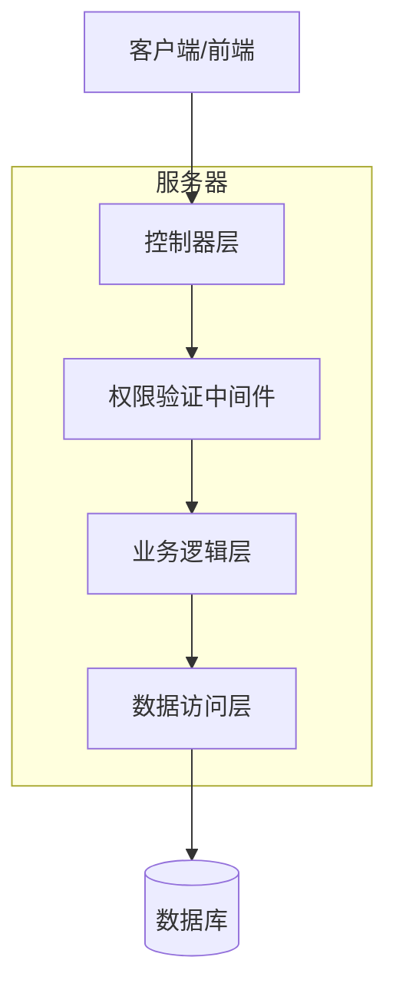
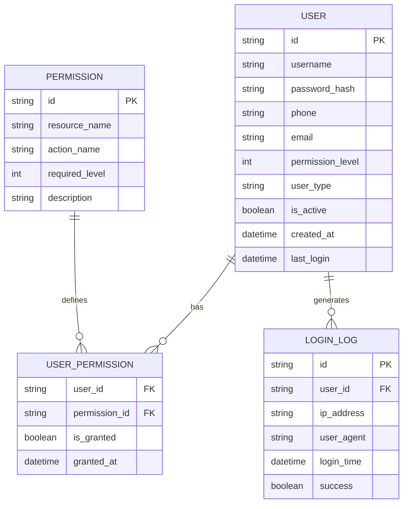

# 四级权限管理系统技术架构文档

## 1. 架构设计



## 2. 技术描述

- 前端：React@18 + tailwindcss@3 + vite
- 后端：ASP.NET Core 6 + Entity Framework
- 数据库：Supabase (PostgreSQL)
- 认证：JWT Token + 权限等级验证

## 3. 路由定义

| 路由 | 用途 | 权限要求 |
|------|------|----------|
| /login | 统一登录页面，处理所有用户登录 | 无 |
| /admin | 后台管理页面，超级管理员和管理员使用 | 0级或1级 |
| /salesperson | 业务员工作页面，业务员专用界面 | 2级 |
| /user | 用户前端页面，注册用户个人中心 | 3级 |
| /api/auth/login | 用户登录验证API | 无 |
| /api/auth/check-permission | 权限验证API | 需要Token |

## 4. API定义

### 4.1 核心API

用户登录认证
```
POST /api/auth/login
```

请求参数：
| 参数名 | 参数类型 | 是否必需 | 描述 |
|--------|----------|----------|------|
| username | string | true | 用户名或手机号 |
| password | string | true | 密码 |

响应参数：
| 参数名 | 参数类型 | 描述 |
|--------|----------|------|
| success | boolean | 登录是否成功 |
| token | string | JWT认证令牌 |
| user | object | 用户信息对象 |
| permissionLevel | number | 用户权限等级(0-3) |
| redirectUrl | string | 登录后跳转URL |

示例：
```json
{
  "success": true,
  "token": "eyJhbGciOiJIUzI1NiIsInR5cCI6IkpXVCJ9...",
  "user": {
    "id": "1",
    "username": "admin",
    "permissionLevel": 0
  },
  "redirectUrl": "/admin"
}
```

权限验证API
```
GET /api/auth/check-permission
```

请求参数：
| 参数名 | 参数类型 | 是否必需 | 描述 |
|--------|----------|----------|------|
| resource | string | true | 资源名称 |
| action | string | false | 操作类型 |

响应参数：
| 参数名 | 参数类型 | 描述 |
|--------|----------|------|
| hasPermission | boolean | 是否有权限 |
| permissionLevel | number | 用户权限等级 |
| message | string | 权限检查结果说明 |

## 5. 服务器架构图



## 6. 数据模型

### 6.1 数据模型定义



### 6.2 数据定义语言

用户表 (users)
```sql
-- 更新用户表结构，添加权限等级字段
ALTER TABLE users ADD COLUMN permission_level INTEGER DEFAULT 3;

-- 更新现有用户的权限等级
UPDATE users SET permission_level = 0 WHERE user_type = 'super_admin';
UPDATE users SET permission_level = 1 WHERE user_type = 'admin';
UPDATE users SET permission_level = 2 WHERE user_type = 'agent' OR user_type = 'salesperson';
UPDATE users SET permission_level = 3 WHERE user_type IS NULL OR user_type = 'user';

-- 创建权限配置表
CREATE TABLE permissions (
    id UUID PRIMARY KEY DEFAULT gen_random_uuid(),
    resource_name VARCHAR(100) NOT NULL,
    action_name VARCHAR(50) DEFAULT 'access',
    required_level INTEGER NOT NULL,
    description TEXT,
    created_at TIMESTAMP WITH TIME ZONE DEFAULT NOW()
);

-- 创建用户权限关联表
CREATE TABLE user_permissions (
    user_id UUID REFERENCES users(id),
    permission_id UUID REFERENCES permissions(id),
    is_granted BOOLEAN DEFAULT true,
    granted_at TIMESTAMP WITH TIME ZONE DEFAULT NOW(),
    PRIMARY KEY (user_id, permission_id)
);

-- 创建登录日志表
CREATE TABLE login_logs (
    id UUID PRIMARY KEY DEFAULT gen_random_uuid(),
    user_id UUID REFERENCES users(id),
    ip_address INET,
    user_agent TEXT,
    login_time TIMESTAMP WITH TIME ZONE DEFAULT NOW(),
    success BOOLEAN NOT NULL
);

-- 插入基础权限配置
INSERT INTO permissions (resource_name, action_name, required_level, description) VALUES
('payment_accounts', 'access', 0, '收款账户管理权限'),
('admin_management', 'access', 0, '管理员管理权限'),
('system_settings', 'access', 1, '系统设置权限'),
('user_management', 'access', 1, '用户管理权限'),
('customer_management', 'access', 2, '客户管理权限'),
('order_processing', 'access', 2, '订单处理权限'),
('personal_center', 'access', 3, '个人中心权限');

-- 创建索引
CREATE INDEX idx_users_permission_level ON users(permission_level);
CREATE INDEX idx_permissions_resource ON permissions(resource_name);
CREATE INDEX idx_login_logs_user_time ON login_logs(user_id, login_time DESC);

-- 设置权限
GRANT SELECT, INSERT, UPDATE ON users TO authenticated;
GRANT SELECT ON permissions TO authenticated;
GRANT SELECT, INSERT ON user_permissions TO authenticated;
GRANT INSERT ON login_logs TO authenticated;
```