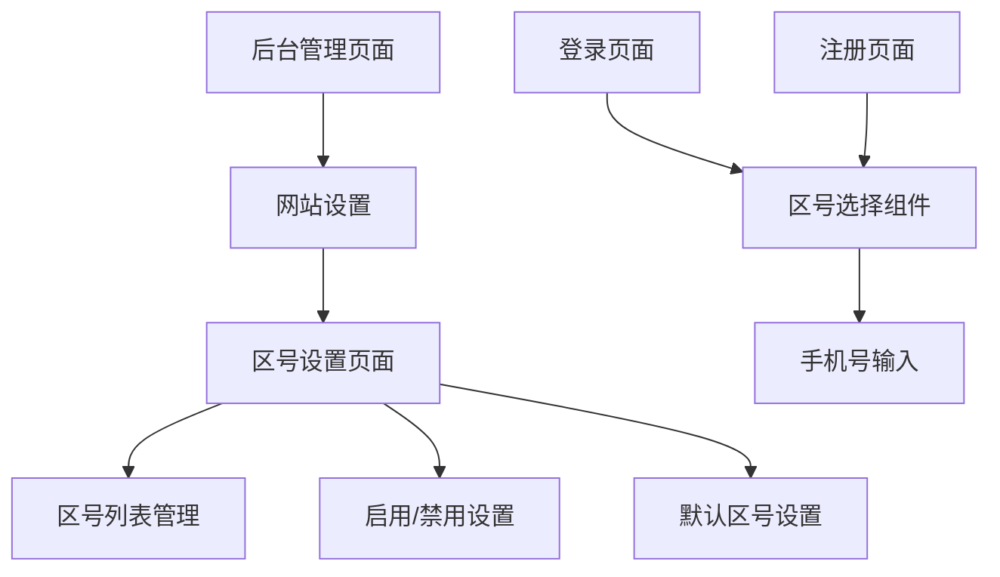

# 手机区号管理功能需求文档

## 1. 产品概述

手机区号管理功能是一个为登录和注册页面提供国际手机区号选择的管理系统。该功能允许管理员在后台配置可用的国际区号，设置默认区号，并为前端页面提供统一的区号选择组件。

该功能主要解决用户在注册和登录时需要选择正确手机区号的问题，提升用户体验并支持国际化业务需求。

## 2. 核心功能

### 2.1 用户角色

| 角色 | 权限说明 | 核心权限 |
|------|----------|----------|
| 管理员 | 后台登录访问 | 可以管理区号设置、启用/禁用区号、设置默认区号 |
| 普通用户 | 前端页面访问 | 可以在登录/注册页面选择可用的手机区号 |

### 2.2 功能模块

我们的手机区号管理功能包含以下主要页面：

1. **后台区号设置页面**：区号列表管理、启用/禁用控制、默认区号设置
2. **登录页面**：集成区号选择组件
3. **注册页面**：集成区号选择组件

### 2.3 页面详情

| 页面名称 | 模块名称 | 功能描述 |
|----------|----------|----------|
| 后台区号设置页面 | 区号列表管理 | 显示所有可用区号列表，包含国家名称、区号、启用状态 |
| 后台区号设置页面 | 启用/禁用控制 | 提供开关控件，允许管理员启用或禁用特定区号 |
| 后台区号设置页面 | 默认区号设置 | 允许管理员设置一个默认选中的区号 |
| 后台区号设置页面 | 排序管理 | 按经济发达程度排序，发达国家区号排在前列 |
| 登录页面 | 区号选择组件 | 下拉抽屉形式的区号选择器，显示已启用的区号 |
| 注册页面 | 区号选择组件 | 下拉抽屉形式的区号选择器，显示已启用的区号 |

## 3. 核心流程

**管理员操作流程：**
管理员登录后台 → 进入网站设置 → 选择区号设置 → 查看区号列表 → 启用/禁用特定区号 → 设置默认区号 → 保存设置

**用户操作流程：**
用户访问登录/注册页面 → 点击区号选择器 → 从下拉列表选择区号 → 输入手机号码 → 完成登录/注册

## 4. 用户界面设计

### 4.1 设计风格

- **主色调**：蓝色系 (#007bff) 作为主色，灰色系 (#6c757d) 作为辅助色
- **按钮样式**：圆角按钮，3D 效果，悬停时有阴影变化
- **字体**：系统默认字体，标题 16px，正文 14px，小字 12px
- **布局风格**：卡片式布局，顶部导航，左侧菜单
- **图标风格**：使用 Font Awesome 图标库，简洁现代风格

### 4.2 页面设计概览

| 页面名称 | 模块名称 | UI 元素 |
|----------|----------|----------|
| 后台区号设置页面 | 区号列表 | 表格布局，包含国旗图标、国家名称、区号、开关按钮、默认选择单选框 |
| 后台区号设置页面 | 操作按钮 | 保存按钮（蓝色，右上角），重置按钮（灰色，保存按钮旁边） |
| 登录/注册页面 | 区号选择器 | 下拉抽屉样式，显示国旗+国家名+区号，默认区号预选中 |
| 登录/注册页面 | 手机号输入框 | 与区号选择器并排，占据剩余宽度，placeholder 提示 |

### 4.3 响应式设计

产品采用移动端优先的响应式设计，在手机端区号选择器将以全屏抽屉形式展示，支持触摸滑动操作，确保在小屏幕设备上的良好用户体验。

## 5. 数据规格

### 5.1 区号数据结构

包含世界主流发达国家的手机区号，按经济发达程度排序：

1. 美国 (+1)
2. 日本 (+81)
3. 德国 (+49)
4. 英国 (+44)
5. 法国 (+33)
6. 加拿大 (+1)
7. 澳大利亚 (+61)
8. 韩国 (+82)
9. 意大利 (+39)
10. 西班牙 (+34)
11. 荷兰 (+31)
12. 瑞士 (+41)
13. 瑞典 (+46)
14. 挪威 (+47)
15. 丹麦 (+45)
16. 芬兰 (+358)
17. 比利时 (+32)
18. 奥地利 (+43)
19. 新西兰 (+64)
20. 新加坡 (+65)

### 5.2 功能约束

- 不包含中国大陆 (+86)、中国香港 (+852)、中国台湾 (+886) 的区号
- 默认启用前10个经济发达国家的区号
- 默认选中美国区号 (+1)
- 支持管理员自定义启用状态和默认选择