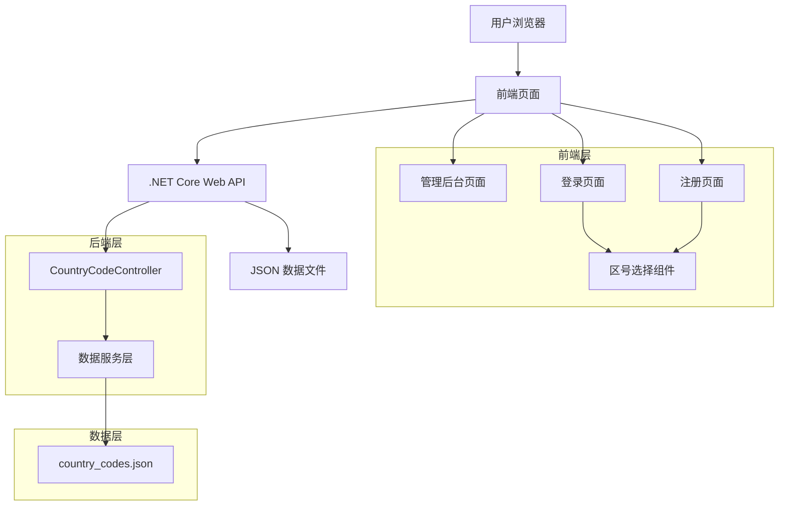
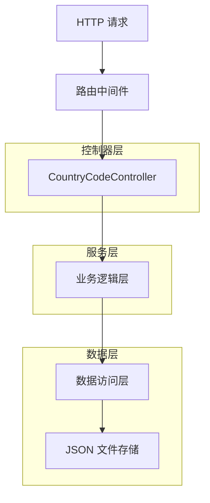
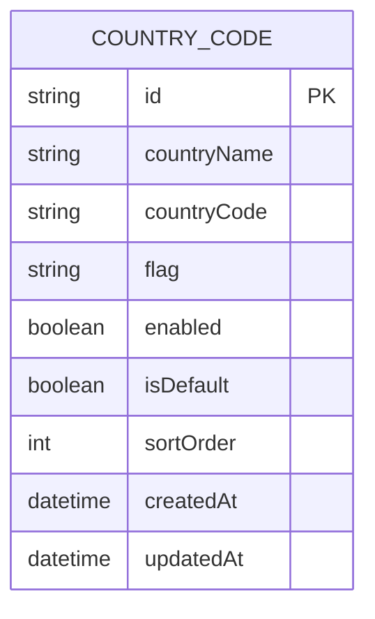

# 手机区号管理技术架构文档

## 1. 架构设计



## 2. 技术描述

- 前端：原生 HTML + CSS + JavaScript
- 后端：.NET Core 6.0 Web API
- 数据存储：JSON 文件
- UI 框架：Bootstrap 5 + Font Awesome 图标

## 3. 路由定义

| 路由 | 用途 |
|------|------|
| /admin.html#website | 后台网站设置页面，包含区号管理功能 |
| /login.html | 登录页面，集成区号选择组件 |
| /register.html | 注册页面，集成区号选择组件 |

## 4. API 定义

### 4.1 核心 API

**获取区号设置**
```
GET /api/admin/country-codes
```

响应：
| 参数名称 | 参数类型 | 描述 |
|----------|----------|------|
| success | boolean | 请求是否成功 |
| data | array | 区号数据数组 |

示例响应：
```json
{
  "success": true,
  "data": [
    {
      "id": "US",
      "countryName": "美国",
      "countryCode": "+1",
      "flag": "🇺🇸",
      "enabled": true,
      "isDefault": true,
      "sortOrder": 1
    }
  ]
}
```

**更新区号设置**
```
POST /api/admin/country-codes
```

请求：
| 参数名称 | 参数类型 | 是否必需 | 描述 |
|----------|----------|----------|------|
| countryCodes | array | true | 区号设置数组 |

**获取启用的区号列表（前端调用）**
```
GET /api/country-codes
```

响应：
| 参数名称 | 参数类型 | 描述 |
|----------|----------|------|
| success | boolean | 请求是否成功 |
| data | array | 启用的区号数据数组 |
| defaultCode | string | 默认区号 |

## 5. 服务器架构图



## 6. 数据模型

### 6.1 数据模型定义



### 6.2 数据定义语言

**区号数据文件 (country_codes.json)**
```json
{
  "countryCodes": [
    {
      "id": "US",
      "countryName": "美国",
      "countryCode": "+1",
      "flag": "🇺🇸",
      "enabled": true,
      "isDefault": true,
      "sortOrder": 1,
      "createdAt": "2024-01-01T00:00:00Z",
      "updatedAt": "2024-01-01T00:00:00Z"
    },
    {
      "id": "JP",
      "countryName": "日本",
      "countryCode": "+81",
      "flag": "🇯🇵",
      "enabled": true,
      "isDefault": false,
      "sortOrder": 2,
      "createdAt": "2024-01-01T00:00:00Z",
      "updatedAt": "2024-01-01T00:00:00Z"
    },
    {
      "id": "DE",
      "countryName": "德国",
      "countryCode": "+49",
      "flag": "🇩🇪",
      "enabled": true,
      "isDefault": false,
      "sortOrder": 3,
      "createdAt": "2024-01-01T00:00:00Z",
      "updatedAt": "2024-01-01T00:00:00Z"
    },
    {
      "id": "GB",
      "countryName": "英国",
      "countryCode": "+44",
      "flag": "🇬🇧",
      "enabled": true,
      "isDefault": false,
      "sortOrder": 4,
      "createdAt": "2024-01-01T00:00:00Z",
      "updatedAt": "2024-01-01T00:00:00Z"
    },
    {
      "id": "FR",
      "countryName": "法国",
      "countryCode": "+33",
      "flag": "🇫🇷",
      "enabled": true,
      "isDefault": false,
      "sortOrder": 5,
      "createdAt": "2024-01-01T00:00:00Z",
      "updatedAt": "2024-01-01T00:00:00Z"
    },
    {
      "id": "CA",
      "countryName": "加拿大",
      "countryCode": "+1",
      "flag": "🇨🇦",
      "enabled": true,
      "isDefault": false,
      "sortOrder": 6,
      "createdAt": "2024-01-01T00:00:00Z",
      "updatedAt": "2024-01-01T00:00:00Z"
    },
    {
      "id": "AU",
      "countryName": "澳大利亚",
      "countryCode": "+61",
      "flag": "🇦🇺",
      "enabled": true,
      "isDefault": false,
      "sortOrder": 7,
      "createdAt": "2024-01-01T00:00:00Z",
      "updatedAt": "2024-01-01T00:00:00Z"
    },
    {
      "id": "KR",
      "countryName": "韩国",
      "countryCode": "+82",
      "flag": "🇰🇷",
      "enabled": true,
      "isDefault": false,
      "sortOrder": 8,
      "createdAt": "2024-01-01T00:00:00Z",
      "updatedAt": "2024-01-01T00:00:00Z"
    },
    {
      "id": "IT",
      "countryName": "意大利",
      "countryCode": "+39",
      "flag": "🇮🇹",
      "enabled": true,
      "isDefault": false,
      "sortOrder": 9,
      "createdAt": "2024-01-01T00:00:00Z",
      "updatedAt": "2024-01-01T00:00:00Z"
    },
    {
      "id": "ES",
      "countryName": "西班牙",
      "countryCode": "+34",
      "flag": "🇪🇸",
      "enabled": true,
      "isDefault": false,
      "sortOrder": 10,
      "createdAt": "2024-01-01T00:00:00Z",
      "updatedAt": "2024-01-01T00:00:00Z"
    },
    {
      "id": "NL",
      "countryName": "荷兰",
      "countryCode": "+31",
      "flag": "🇳🇱",
      "enabled": false,
      "isDefault": false,
      "sortOrder": 11,
      "createdAt": "2024-01-01T00:00:00Z",
      "updatedAt": "2024-01-01T00:00:00Z"
    },
    {
      "id": "CH",
      "countryName": "瑞士",
      "countryCode": "+41",
      "flag": "🇨🇭",
      "enabled": false,
      "isDefault": false,
      "sortOrder": 12,
      "createdAt": "2024-01-01T00:00:00Z",
      "updatedAt": "2024-01-01T00:00:00Z"
    },
    {
      "id": "SE",
      "countryName": "瑞典",
      "countryCode": "+46",
      "flag": "🇸🇪",
      "enabled": false,
      "isDefault": false,
      "sortOrder": 13,
      "createdAt": "2024-01-01T00:00:00Z",
      "updatedAt": "2024-01-01T00:00:00Z"
    },
    {
      "id": "NO",
      "countryName": "挪威",
      "countryCode": "+47",
      "flag": "🇳🇴",
      "enabled": false,
      "isDefault": false,
      "sortOrder": 14,
      "createdAt": "2024-01-01T00:00:00Z",
      "updatedAt": "2024-01-01T00:00:00Z"
    },
    {
      "id": "DK",
      "countryName": "丹麦",
      "countryCode": "+45",
      "flag": "🇩🇰",
      "enabled": false,
      "isDefault": false,
      "sortOrder": 15,
      "createdAt": "2024-01-01T00:00:00Z",
      "updatedAt": "2024-01-01T00:00:00Z"
    },
    {
      "id": "FI",
      "countryName": "芬兰",
      "countryCode": "+358",
      "flag": "🇫🇮",
      "enabled": false,
      "isDefault": false,
      "sortOrder": 16,
      "createdAt": "2024-01-01T00:00:00Z",
      "updatedAt": "2024-01-01T00:00:00Z"
    },
    {
      "id": "BE",
      "countryName": "比利时",
      "countryCode": "+32",
      "flag": "🇧🇪",
      "enabled": false,
      "isDefault": false,
      "sortOrder": 17,
      "createdAt": "2024-01-01T00:00:00Z",
      "updatedAt": "2024-01-01T00:00:00Z"
    },
    {
      "id": "AT",
      "countryName": "奥地利",
      "countryCode": "+43",
      "flag": "🇦🇹",
      "enabled": false,
      "isDefault": false,
      "sortOrder": 18,
      "createdAt": "2024-01-01T00:00:00Z",
      "updatedAt": "2024-01-01T00:00:00Z"
    },
    {
      "id": "NZ",
      "countryName": "新西兰",
      "countryCode": "+64",
      "flag": "🇳🇿",
      "enabled": false,
      "isDefault": false,
      "sortOrder": 19,
      "createdAt": "2024-01-01T00:00:00Z",
      "updatedAt": "2024-01-01T00:00:00Z"
    },
    {
      "id": "SG",
      "countryName": "新加坡",
      "countryCode": "+65",
      "flag": "🇸🇬",
      "enabled": false,
      "isDefault": false,
      "sortOrder": 20,
      "createdAt": "2024-01-01T00:00:00Z",
      "updatedAt": "2024-01-01T00:00:00Z"
    }
  ],
  "lastUpdated": "2024-01-01T00:00:00Z"
}
```

## 7. 前端组件设计

### 7.1 区号选择组件 (CountryCodeSelector)

**功能特性：**
- 下拉抽屉式界面
- 显示国旗、国家名称和区号
- 支持搜索过滤
- 默认选中配置的默认区号
- 响应式设计，移动端友好

**组件接口：**
```javascript
// 初始化区号选择器
function initCountryCodeSelector(containerId, options) {
  // containerId: 容器元素ID
  // options: 配置选项
  //   - onSelect: 选择回调函数
  //   - placeholder: 占位符文本
  //   - showSearch: 是否显示搜索框
}

// 获取选中的区号
function getSelectedCountryCode(selectorId) {
  // 返回选中的区号对象
}

// 设置默认选中区号
function setDefaultCountryCode(selectorId, countryId) {
  // 设置指定区号为选中状态
}
```

### 7.2 后台管理界面

**功能模块：**
- 区号列表展示（表格形式）
- 启用/禁用开关控件
- 默认区号单选控件
- 批量操作功能
- 保存和重置按钮

**数据绑定：**
- 实时同步前端状态与后端数据
- 表单验证（确保至少有一个启用的区号）
- 自动保存功能（可选）