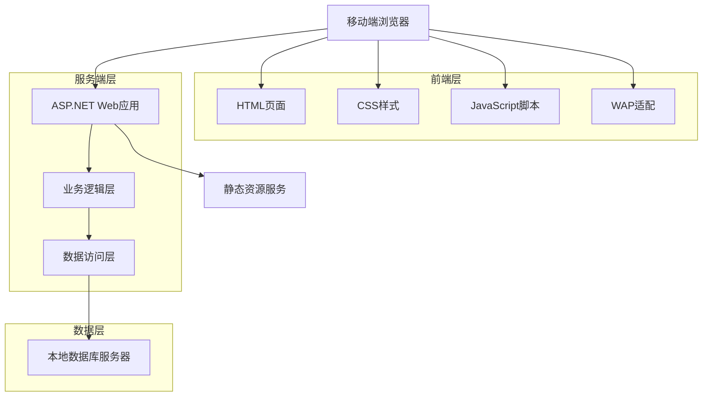
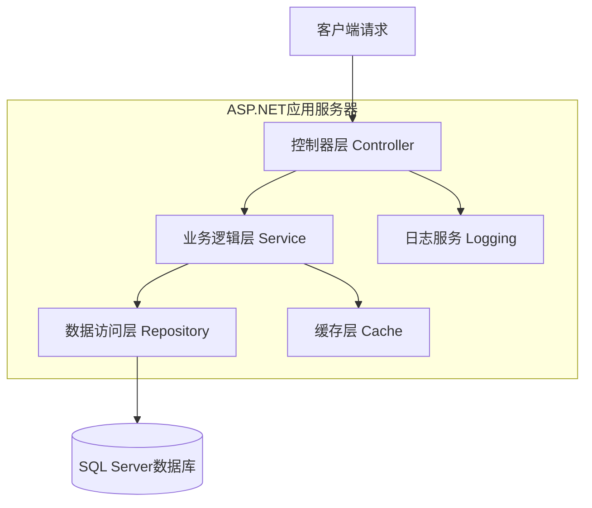
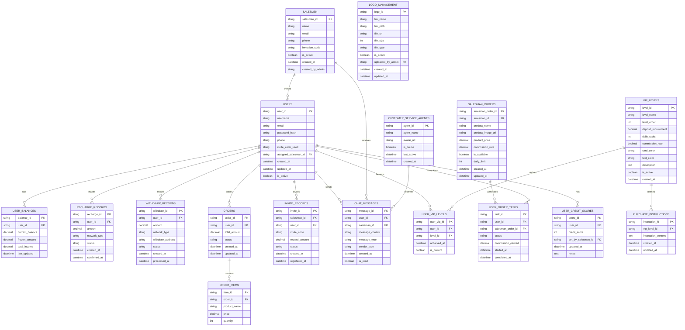

# 基于.NET技术的移动端电商网站技术架构文档

## 1. 架构设计



## 2. 技术描述

* **前端**: HTML5 + CSS3 + JavaScript + Bootstrap 4

* **后端**: ASP.NET Core 6.0 + 本地DB数据库访问层

* **数据库**: 本地DB数据库（服务器本地文件存储）

* **Web服务器**: IIS或Kestrel

## 3. 路由定义

| 路由             | 用途                      |
| -------------- | ----------------------- |
| /              | 首页，显示幻灯片、余额信息、合作伙伴和会员权益 |
| /home          | 首页重定向                   |
| /orders        | 订单页面，显示用户订单列表和详情        |
| /start         | 开始页面，订单抓取、等级权益、任务统计和数据展示 |
| /service       | 客服页面，在线客服和帮助中心          |
| /account       | 账户页面，个人信息和账户管理          |
| /recharge      | 充值页面，显示充值地址和充值记录        |
| /withdraw      | 提款页面，提款申请和地址管理          |
| /invite        | 邀请页面，邀请链接和二维码生成         |
| /invite/records | 邀请记录和奖励统计页面             |
| /customer-service | 客服页面，在线聊天和客服列表        |
| /customer-service/chat/:id | 具体客服聊天页面          |
| /login         | 用户登录页面，支持后台可编辑LOGO显示     |
| /register      | 用户注册页面，支持后台可编辑LOGO显示     |
| /admin         | 后台管理入口                  |
| /api/slideshow | 幻灯片管理API                |
| /api/marquee   | 跑马灯内容管理API              |
| /api/orders    | 订单管理API                 |
| /api/users     | 用户管理API                 |
| /api/recharge  | 充值相关API                 |
| /api/withdraw  | 提款相关API                 |
| /api/balance   | 用户余额查询API               |

## 4. API定义

### 4.1 核心API

**用户认证相关**

```
POST /api/auth/login
```

请求参数:

| 参数名称     | 参数类型   | 是否必需 | 描述      |
| -------- | ------ | ---- | ------- |
| username | string | true | 用户名或手机号 |
| password | string | true | 密码      |

响应参数:

| 参数名称     | 参数类型    | 描述     |
| -------- | ------- | ------ |
| success  | boolean | 登录是否成功 |
| token    | string  | 认证令牌   |
| userInfo | object  | 用户基本信息 |

示例:

```json
{
  "username": "13800138000",
  "password": "123456"
}
```

**幻灯片管理**

```
GET /api/slideshow
POST /api/slideshow
PUT /api/slideshow/{id}
DELETE /api/slideshow/{id}
```

**订单管理**

```
GET /api/orders
GET /api/orders/{id}
POST /api/orders
PUT /api/orders/{id}
```

**跑马灯管理**
```
GET /api/marquee
POST /api/marquee
PUT /api/marquee/{id}
DELETE /api/marquee/{id}
```

**用户管理**
```
GET /api/users/profile
PUT /api/users/profile
```

**余额管理**
```
GET /api/balance
POST /api/balance/update
```

**充值管理**
```
GET /api/recharge/address
POST /api/recharge/record
GET /api/recharge/history
PUT /api/recharge/address
```

**邀请管理**
```
GET /api/invite/code
POST /api/invite/generate-qr
GET /api/invite/records
```

**客服管理**
```
GET /api/customer-service/agents
POST /api/customer-service/send-message
GET /api/customer-service/chat-history/:agentId
```

**VIP管理**
```
GET /api/vip/levels
POST /api/admin/vip/create
```

**LOGO管理**
```
GET /api/admin/logo
POST /api/admin/logo/upload
PUT /api/admin/logo/update
DELETE /api/admin/logo/{id}
GET /api/admin/logo/fonts
POST /api/admin/logo/text-config
PUT /api/admin/logo/text-config
GET /api/admin/logo/preview
POST /api/admin/logo/save-template
GET /api/admin/logo/templates
GET /api/admin/logo/login-page
PUT /api/admin/logo/login-page
GET /api/admin/logo/register-page
PUT /api/admin/logo/register-page
```

**开始页面相关**
```
GET /api/start/available-orders
POST /api/start/grab-order
GET /api/start/task-stats
GET /api/start/user-data
GET /api/start/purchase-instructions/:vipLevel
```

**业务员订单管理**
```
GET /api/salesman/orders
POST /api/salesman/orders
PUT /api/salesman/orders/:id
DELETE /api/salesman/orders/:id
PUT /api/salesman/orders/:id/available
```

**信誉分管理**
```
GET /api/users/:id/credit-score
PUT /api/salesman/users/:id/credit-score
```

**提款管理**
```
POST /api/withdraw/apply
GET /api/withdraw/history
PUT /api/withdraw/address
GET /api/withdraw/networks
POST /api/withdraw/verify
```

**账户页面管理**

获取用户账户信息
```
GET /api/account/profile
```

响应参数:

| 参数名称 | 参数类型 | 描述 |
|---------|---------|------|
| phone | string | 用户注册手机号码 |
| avatar_url | string | 用户头像URL（默认头像或用户上传） |
| username | string | 用户名 |
| created_at | string | 注册时间 |

获取账户数据信息
```
GET /api/account/balance-info
```

响应参数:

| 参数名称 | 参数类型 | 描述 |
|---------|---------|------|
| current_balance | decimal | 当前余额（从用户数据库读取） |
| frozen_amount | decimal | 冻结金额（从用户数据库读取） |
| credit_score | int | 信誉分（业务员设置） |
| invite_code_used | string | 注册时使用的邀请码 |

示例响应:
```json
{
  "current_balance": 10.00,
  "frozen_amount": 0.00,
  "credit_score": 100,
  "invite_code_used": "631300"
}
```

用户退出登录
```
POST /api/account/logout
```

其他账户功能（演示功能）
```
PUT /api/account/avatar          # 头像上传（演示功能）
GET /api/account/records         # 账户记录查看（演示功能）
GET /api/account/vip-benefits    # 等级权益说明（演示功能）
PUT /api/account/password        # 修改登录密码（演示功能）
PUT /api/account/withdraw-password # 修改取款密码（演示功能）
GET /api/account/terms           # 条款与协议（演示功能）**语言设置（演示功能）**
```
GET /api/account/language-settings # 语言设置（演示功能）
PUT /api/account/language        # 语言切换（演示功能）
```

**LOGO管理API详细说明**

获取当前LOGO配置信息
```
GET /api/admin/logo
```

响应参数:

| 参数名称 | 参数类型 | 描述 |
|---------|---------|------|
| logo_id | string | LOGO唯一标识 |
| logo_type | string | LOGO类型：image/text/combined |
| logo_url | string | LOGO图片访问URL（图片类型时） |
| text_content | string | 文字内容（文字类型时） |
| text_config | object | 文字样式配置 |
| combined_config | object | 组合布局配置 |
| is_active | boolean | 是否为当前使用的LOGO |
| created_at | string | 创建时间 |

上传图片LOGO
```
POST /api/admin/logo/upload
```

请求参数:

| 参数名称 | 参数类型 | 是否必需 | 描述 |
|---------|---------|---------|------|
| logo_file | file | true | LOGO图片文件（支持PNG/JPG/SVG格式） |
| description | string | false | LOGO描述信息 |

获取可用字体列表
```
GET /api/admin/logo/fonts
```

响应参数:

| 参数名称 | 参数类型 | 描述 |
|---------|---------|------|
| chinese_fonts | array | 中文艺术字体列表 |
| english_fonts | array | 英文艺术字体列表 |
| compatible_fonts | array | 中英文兼容字体列表 |

示例响应:
```json
{
  "chinese_fonts": [
    {"name": "方正兰亭黑", "value": "FZLanTingHei", "preview_url": "/fonts/preview/fzlth.png"},
    {"name": "汉仪旗黑", "value": "HYQiHei", "preview_url": "/fonts/preview/hyqh.png"}
  ],
  "english_fonts": [
    {"name": "Montserrat", "value": "Montserrat", "preview_url": "/fonts/preview/montserrat.png"},
    {"name": "Roboto", "value": "Roboto", "preview_url": "/fonts/preview/roboto.png"}
  ],
  "compatible_fonts": [
    {"name": "Noto Sans CJK", "value": "NotoSansCJK", "preview_url": "/fonts/preview/noto.png"}
  ]
}
```

配置文字LOGO
```
POST /api/admin/logo/text-config
```

请求参数:

| 参数名称 | 参数类型 | 是否必需 | 描述 |
|---------|---------|---------|------|
| text_content | string | true | 文字内容 |
| font_family | string | true | 字体名称 |
| font_size | int | true | 字体大小（12-48px） |
| font_weight | int | true | 字体粗细（100-900） |
| color | string | true | 字体颜色（RGB格式） |
| text_shadow | object | false | 阴影效果配置 |
| text_stroke | object | false | 描边效果配置 |
| gradient | object | false | 渐变效果配置 |

获取LOGO预览
```
GET /api/admin/logo/preview
```

请求参数:

| 参数名称 | 参数类型 | 是否必需 | 描述 |
|---------|---------|---------|------|
| logo_type | string | true | LOGO类型 |
| config | object | true | LOGO配置参数 |

响应参数:

| 参数名称 | 参数类型 | 描述 |
|---------|---------|------|
| preview_url | string | 预览图片URL |
| success | boolean | 生成是否成功 |

保存LOGO模板
```
POST /api/admin/logo/save-template
```

请求参数:

| 参数名称 | 参数类型 | 是否必需 | 描述 |
|---------|---------|---------|------|
| template_name | string | true | 模板名称 |
| logo_config | object | true | LOGO完整配置 |
| description | string | false | 模板描述 |
## 5. 服务器架构图



## 6. 数据模型

### 6.1 数据模型定义



### 6.2 本地DB数据库文件结构

**本地DB数据库设计方案说明：**
使用JSON文件格式存储数据，便于读取和管理。这种设计方案的优势：
1. 数据一致性：本地文件存储，避免网络延迟
2. 查询效率：直接文件读取，响应速度快
3. 维护简便：JSON格式易于理解和修改
4. 成本控制：无需额外数据库服务器，降低运维成本

数据文件结构:
```
/Data/
├── users.json              # 用户数据
├── salesmen.json           # 业务员数据
├── orders.json             # 订单数据
├── products.json           # 产品数据
├── recharge_records.json   # 充值记录
├── withdrawal_records.json # 提现记录
├── invitation_records.json # 邀请记录
├── vip_levels.json         # VIP等级配置
├── vip_memberships.json    # VIP会员关系
├── partners.json           # 合作伙伴
├── chat_messages.json      # 聊天消息
├── marquee_content.json    # 跑马灯内容
├── logo_management.json    # LOGO管理数据
├── logo_fonts.json         # LOGO字体库数据
└── logo_templates.json     # LOGO模板数据
```

示例数据格式:

业务员数据 (salesmen.json):
```json
[
  {
    "id": "sm_001",
    "name": "张业务",
    "email": "zhang@company.com",
    "phone": "13800138001",
    "invitation_code": "123456",
    "is_active": true,
    "created_at": "2024-01-01T00:00:00Z",
    "created_by_admin": "admin_001"
  }
]
```

用户数据 (users.json):
```json
[
  {
    "id": "user_001",
    "username": "testuser1",
    "phone": "19196390502",
    "email": "test1@example.com",
    "password_hash": "hashed_password_1",
    "avatar_url": "/images/default_avatar.png",
    "current_balance": 10.00,
    "frozen_amount": 0.00,
    "cumulative_income": 500.00,
    "credit_score": 100,
    "vip_level": "VIP1",
    "invitation_code_used": "631300",
    "assigned_salesman_id": "sm_001",
    "created_at": "2024-01-01T00:00:00Z",
    "updated_at": "2024-01-01T00:00:00Z"
  }
]
```

聊天消息数据 (chat_messages.json):
```json
[
  {
    "id": "msg_001",
    "user_id": "user_001",
    "salesman_id": "sm_001",
    "message_content": "您好，有什么可以帮助您的吗？",
    "message_type": "text",
    "sender_type": "salesman",
    "sent_at": "2024-01-01T10:00:00Z",
    "is_read": false
  }
]
```

LOGO管理数据 (logo_management.json):
```json
[
  {
    "id": "logo_001",
    "logo_type": "image",
    "file_name": "company_logo.png",
    "file_path": "/uploads/logo/company_logo.png",
    "file_url": "/uploads/logo/company_logo.png",
    "file_size": 15360,
    "file_type": "image/png",
    "text_content": null,
    "text_config": null,
    "combined_config": null,
    "is_active": true,
    "uploaded_by_admin": "admin_001",
    "created_at": "2024-01-01T00:00:00Z",
    "updated_at": "2024-01-01T00:00:00Z"
  },
  {
    "id": "logo_002",
    "logo_type": "text",
    "file_name": null,
    "file_path": null,
    "file_url": null,
    "file_size": 0,
    "file_type": null,
    "text_content": "我的网站",
    "text_config": {
      "font_family": "方正兰亭黑",
      "font_size": 24,
      "font_weight": 700,
      "color": "#007AFF",
      "text_shadow": {
        "enabled": true,
        "offset_x": 2,
        "offset_y": 2,
        "blur_radius": 4,
        "color": "rgba(0,0,0,0.3)"
      },
      "text_stroke": {
        "enabled": false,
        "width": 1,
        "color": "#000000"
      },
      "gradient": {
        "enabled": false,
        "start_color": "#007AFF",
        "end_color": "#FF9500",
        "direction": "to right"
      }
    },
    "combined_config": null,
    "is_active": false,
    "uploaded_by_admin": "admin_001",
    "created_at": "2024-01-01T00:00:00Z",
    "updated_at": "2024-01-01T00:00:00Z"
  },
  {
    "id": "logo_003",
    "logo_type": "combined",
    "file_name": "icon.png",
    "file_path": "/uploads/logo/icon.png",
    "file_url": "/uploads/logo/icon.png",
    "file_size": 8192,
    "file_type": "image/png",
    "text_content": "品牌名称",
    "text_config": {
      "font_family": "Montserrat",
      "font_size": 18,
      "font_weight": 600,
      "color": "#333333"
    },
    "combined_config": {
      "layout": "left_image_right_text",
      "spacing": 8,
      "alignment": "center",
      "image_width": 32,
      "image_height": 32
    },
    "is_active": false,
    "uploaded_by_admin": "admin_001",
    "created_at": "2024-01-01T00:00:00Z",
    "updated_at": "2024-01-01T00:00:00Z"
  }
]
```

LOGO字体库数据 (logo_fonts.json):
```json
{
  "chinese_fonts": [
    {"name": "方正兰亭黑", "value": "FZLanTingHei", "file_path": "/fonts/FZLanTingHei.woff2", "preview_url": "/fonts/preview/fzlth.png"},
    {"name": "汉仪旗黑", "value": "HYQiHei", "file_path": "/fonts/HYQiHei.woff2", "preview_url": "/fonts/preview/hyqh.png"},
    {"name": "思源黑体", "value": "SourceHanSans", "file_path": "/fonts/SourceHanSans.woff2", "preview_url": "/fonts/preview/syhei.png"},
    {"name": "站酷高端黑", "value": "ZhanKuGaoDuanHei", "file_path": "/fonts/ZhanKuGaoDuanHei.woff2", "preview_url": "/fonts/preview/zkgdh.png"},
    {"name": "优设标题黑", "value": "YouSheBiaoTiHei", "file_path": "/fonts/YouSheBiaoTiHei.woff2", "preview_url": "/fonts/preview/ysbth.png"},
    {"name": "胡晓波男神体", "value": "HuXiaoBo", "file_path": "/fonts/HuXiaoBo.woff2", "preview_url": "/fonts/preview/hxb.png"},
    {"name": "庞门正道标题体", "value": "PangMenZhengDao", "file_path": "/fonts/PangMenZhengDao.woff2", "preview_url": "/fonts/preview/pmzd.png"},
    {"name": "阿里巴巴普惠体", "value": "AlibabaPuHuiTi", "file_path": "/fonts/AlibabaPuHuiTi.woff2", "preview_url": "/fonts/preview/albb.png"}
  ],
  "english_fonts": [
    {"name": "Montserrat", "value": "Montserrat", "file_path": "/fonts/Montserrat.woff2", "preview_url": "/fonts/preview/montserrat.png"},
    {"name": "Roboto", "value": "Roboto", "file_path": "/fonts/Roboto.woff2", "preview_url": "/fonts/preview/roboto.png"},
    {"name": "Open Sans", "value": "OpenSans", "file_path": "/fonts/OpenSans.woff2", "preview_url": "/fonts/preview/opensans.png"},
    {"name": "Lato", "value": "Lato", "file_path": "/fonts/Lato.woff2", "preview_url": "/fonts/preview/lato.png"},
    {"name": "Poppins", "value": "Poppins", "file_path": "/fonts/Poppins.woff2", "preview_url": "/fonts/preview/poppins.png"},
    {"name": "Nunito", "value": "Nunito", "file_path": "/fonts/Nunito.woff2", "preview_url": "/fonts/preview/nunito.png"},
    {"name": "Source Sans Pro", "value": "SourceSansPro", "file_path": "/fonts/SourceSansPro.woff2", "preview_url": "/fonts/preview/sourcesans.png"},
    {"name": "Raleway", "value": "Raleway", "file_path": "/fonts/Raleway.woff2", "preview_url": "/fonts/preview/raleway.png"},
    {"name": "Ubuntu", "value": "Ubuntu", "file_path": "/fonts/Ubuntu.woff2", "preview_url": "/fonts/preview/ubuntu.png"},
    {"name": "Playfair Display", "value": "PlayfairDisplay", "file_path": "/fonts/PlayfairDisplay.woff2", "preview_url": "/fonts/preview/playfair.png"}
  ],
  "compatible_fonts": [
    {"name": "Noto Sans CJK", "value": "NotoSansCJK", "file_path": "/fonts/NotoSansCJK.woff2", "preview_url": "/fonts/preview/noto.png"},
    {"name": "Source Han Sans", "value": "SourceHanSans", "file_path": "/fonts/SourceHanSans.woff2", "preview_url": "/fonts/preview/sourcehan.png"},
    {"name": "Microsoft YaHei UI", "value": "MicrosoftYaHeiUI", "file_path": "/fonts/MicrosoftYaHeiUI.woff2", "preview_url": "/fonts/preview/yahei.png"},
    {"name": "PingFang SC", "value": "PingFangSC", "file_path": "/fonts/PingFangSC.woff2", "preview_url": "/fonts/preview/pingfang.png"}
  ]
}
```

LOGO模板数据 (logo_templates.json):
```json
[
  {
    "id": "template_001",
    "template_name": "经典蓝色文字LOGO",
    "description": "适合科技类网站的蓝色文字LOGO",
    "logo_config": {
      "logo_type": "text",
      "text_content": "网站名称",
      "text_config": {
        "font_family": "方正兰亭黑",
        "font_size": 28,
        "font_weight": 700,
        "color": "#007AFF",
        "text_shadow": {
          "enabled": true,
          "offset_x": 1,
          "offset_y": 1,
          "blur_radius": 2,
          "color": "rgba(0,0,0,0.2)"
        }
      }
    },
    "created_at": "2024-01-01T00:00:00Z"
  }
]
```

**用户表 (Users)**

```sql
-- 创建用户表
CREATE TABLE Users (
    UserId INT IDENTITY(1,1) PRIMARY KEY,
    Username NVARCHAR(50) UNIQUE NOT NULL,
    Password NVARCHAR(255) NOT NULL,
    Phone NVARCHAR(20),
    Email NVARCHAR(100),
    InviteCode NVARCHAR(20) UNIQUE,
    InvitedBy NVARCHAR(50),
    VipLevel INT DEFAULT 0,
    CreatedAt DATETIME2 DEFAULT GETDATE(),
    UpdatedAt DATETIME2 DEFAULT GETDATE()
);

-- 创建索引
CREATE INDEX IX_Users_Username ON Users(Username);
CREATE INDEX IX_Users_Phone ON Users(Phone);
CREATE INDEX IX_Users_InviteCode ON Users(InviteCode);
```

**用户余额表 (UserBalance)**

```sql
-- 创建用户余额表
CREATE TABLE UserBalance (
    BalanceId INT IDENTITY(1,1) PRIMARY KEY,
    UserId INT NOT NULL,
    CurrentBalance DECIMAL(18,2) DEFAULT 0.00,
    FrozenAmount DECIMAL(18,2) DEFAULT 0.00,
    TotalIncome DECIMAL(18,2) DEFAULT 0.00,
    LastUpdated DATETIME2 DEFAULT GETDATE(),
    FOREIGN KEY (UserId) REFERENCES Users(UserId)
);

-- 创建索引
CREATE INDEX IX_UserBalance_UserId ON UserBalance(UserId);
```

**订单表 (Orders)**

```sql
-- 创建订单表
CREATE TABLE Orders (
    OrderId INT IDENTITY(1,1) PRIMARY KEY,
    UserId INT NOT NULL,
    OrderNumber NVARCHAR(50) UNIQUE NOT NULL,
    TotalAmount DECIMAL(18,2) NOT NULL,
    Status NVARCHAR(20) DEFAULT 'Pending',
    CreatedAt DATETIME2 DEFAULT GETDATE(),
    UpdatedAt DATETIME2 DEFAULT GETDATE(),
    FOREIGN KEY (UserId) REFERENCES Users(UserId)
);

-- 创建索引
CREATE INDEX IX_Orders_UserId ON Orders(UserId);
CREATE INDEX IX_Orders_OrderNumber ON Orders(OrderNumber);
CREATE INDEX IX_Orders_Status ON Orders(Status);
```

**幻灯片表 (Slideshow)**

```sql
-- 创建幻灯片表
CREATE TABLE Slideshow (
    SlideshowId INT IDENTITY(1,1) PRIMARY KEY,
    Title NVARCHAR(100) NOT NULL,
    ImageUrl NVARCHAR(500) NOT NULL,
    LinkUrl NVARCHAR(500),
    SortOrder INT DEFAULT 0,
    IsActive BIT DEFAULT 1,
    CreatedAt DATETIME2 DEFAULT GETDATE()
);

-- 创建索引
CREATE INDEX IX_Slideshow_SortOrder ON Slideshow(SortOrder);
CREATE INDEX IX_Slideshow_IsActive ON Slideshow(IsActive);

-- 初始化数据
INSERT INTO Slideshow (Title, ImageUrl, LinkUrl, SortOrder, IsActive)
VALUES 
('欢迎使用', '/images/slide1.jpg', '/start', 1, 1),
('特惠活动', '/images/slide2.jpg', '/orders', 2, 1),
('VIP会员', '/images/slide3.jpg', '/account', 3, 1);
```

**邀请记录表 (InviteRecords)**
```sql
-- 创建邀请记录表
CREATE TABLE InviteRecords (
    InviteId INT IDENTITY(1,1) PRIMARY KEY,
    InviterId INT NOT NULL,
    InvitedUserId INT,
    InviteCode NVARCHAR(20) NOT NULL,
    RewardAmount DECIMAL(18,2) DEFAULT 0,
    Status NVARCHAR(20) DEFAULT '待注册',
    CreatedAt DATETIME2 DEFAULT GETDATE(),
    RegisteredAt DATETIME2,
    FOREIGN KEY (InviterId) REFERENCES Users(UserId),
    FOREIGN KEY (InvitedUserId) REFERENCES Users(UserId)
);

-- 创建索引
CREATE INDEX IX_InviteRecords_InviterId ON InviteRecords(InviterId);
CREATE INDEX IX_InviteRecords_InviteCode ON InviteRecords(InviteCode);
```

**VIP等级表 (VipLevels)**
```sql
-- 创建VIP等级表
CREATE TABLE VipLevels (
    LevelId INT IDENTITY(1,1) PRIMARY KEY,
    LevelName NVARCHAR(50) NOT NULL,
    LevelOrder INT NOT NULL,
    DepositRequirement DECIMAL(18,2) NOT NULL,
    DailyTasks INT DEFAULT 0,
    CommissionRate DECIMAL(5,4) DEFAULT 0,
    CardColor NVARCHAR(20) DEFAULT '#007AFF',
    TextColor NVARCHAR(20) DEFAULT '#FFFFFF',
    Description NTEXT,
    IsActive BIT DEFAULT 1,
    CreatedAt DATETIME2 DEFAULT GETDATE()
);

-- 初始化VIP等级数据
INSERT INTO VipLevels (LevelName, LevelOrder, DepositRequirement, DailyTasks, CommissionRate, CardColor, TextColor, Description)
VALUES 
('VIP 0', 0, 0, 30, 0.01, '#87CEEB', '#000000', '新用户等级，享受基础服务'),
('VIP 1', 1, 1000, 43, 0.015, '#FFB347', '#000000', '存款1000升级，提升任务数量和佣金'),
('VIP 2', 2, 3000, 51, 0.02, '#F08080', '#FFFFFF', '存款3000升级，享受更高佣金比例'),
('VIP 3', 3, 5000, 60, 0.025, '#2F4F4F', '#FFFFFF', '顶级会员，最高佣金和任务奖励');
```

**客服代理表 (CustomerServiceAgents)**
```sql
-- 创建客服代理表
CREATE TABLE CustomerServiceAgents (
    AgentId INT IDENTITY(1,1) PRIMARY KEY,
    AgentName NVARCHAR(100) NOT NULL,
    AvatarUrl NVARCHAR(500),
    IsOnline BIT DEFAULT 0,
    LastActive DATETIME2 DEFAULT GETDATE(),
    CreatedAt DATETIME2 DEFAULT GETDATE()
);

-- 初始化客服代理
INSERT INTO CustomerServiceAgents (AgentName, AvatarUrl, IsOnline)
VALUES 
('客服小美', '/images/avatar1.jpg', 1),
('客服小王', '/images/avatar2.jpg', 1),
('客服小李', '/images/avatar3.jpg', 0);
```

**聊天消息表 (ChatMessages)**
```sql
-- 创建聊天消息表
CREATE TABLE ChatMessages (
    MessageId INT IDENTITY(1,1) PRIMARY KEY,
    UserId INT NOT NULL,
    AgentId INT NOT NULL,
    MessageContent NTEXT NOT NULL,
    MessageType NVARCHAR(20) DEFAULT 'text',
    SenderType NVARCHAR(20) NOT NULL,
    CreatedAt DATETIME2 DEFAULT GETDATE(),
    IsRead BIT DEFAULT 0,
    FOREIGN KEY (UserId) REFERENCES Users(UserId),
    FOREIGN KEY (AgentId) REFERENCES CustomerServiceAgents(AgentId)
);

-- 创建索引
CREATE INDEX IX_ChatMessages_UserId ON ChatMessages(UserId);
CREATE INDEX IX_ChatMessages_AgentId ON ChatMessages(AgentId);
```

**初始化管理员账户**

```sql
**跑马灯表 (Marquee)**
```sql
-- 创建跑马灯表
CREATE TABLE Marquee (
    MarqueeId INT IDENTITY(1,1) PRIMARY KEY,
    Content NVARCHAR(500) NOT NULL,
    SortOrder INT DEFAULT 0,
    IsActive BIT DEFAULT 1,
    CreatedAt DATETIME2 DEFAULT GETDATE(),
    UpdatedAt DATETIME2 DEFAULT GETDATE()
);

-- 创建索引
CREATE INDEX IX_Marquee_SortOrder ON Marquee(SortOrder);
CREATE INDEX IX_Marquee_IsActive ON Marquee(IsActive);

-- 初始化跑马灯数据
INSERT INTO Marquee (Content, SortOrder, IsActive)
VALUES 
('🎉 欢迎使用我们的平台！,🎉 充值即送额外奖励！,🎉 邀请好友获得丰厚回报！', 1, 1);
```

**充值地址表 (RechargeAddresses)**
```sql
-- 创建充值地址表
CREATE TABLE RechargeAddresses (
    AddressId INT IDENTITY(1,1) PRIMARY KEY,
    NetworkType NVARCHAR(20) NOT NULL,
    Address NVARCHAR(100) NOT NULL,
    IsActive BIT DEFAULT 1,
    CreatedAt DATETIME2 DEFAULT GETDATE()
);

-- 创建索引
CREATE INDEX IX_RechargeAddresses_NetworkType ON RechargeAddresses(NetworkType);
CREATE INDEX IX_RechargeAddresses_IsActive ON RechargeAddresses(IsActive);

-- 初始化充值地址
INSERT INTO RechargeAddresses (NetworkType, Address, IsActive)
VALUES 
('USDC-ETH', '0x1234567890abcdef1234567890abcdef12345678', 1),
('USDT-TRC20', 'TXYZabcdef1234567890abcdef1234567890', 1),
('USDT-ERC20', '0xabcdef1234567890abcdef1234567890abcdef12', 1);
```

**充值记录表 (RechargeRecords)**
```sql
-- 创建充值记录表
CREATE TABLE RechargeRecords (
    RecordId INT IDENTITY(1,1) PRIMARY KEY,
    UserId INT NOT NULL,
    TxHash NVARCHAR(100),
    Amount DECIMAL(18,2) NOT NULL,
    NetworkType NVARCHAR(20) NOT NULL,
    Status NVARCHAR(20) DEFAULT 'Pending',
    CreatedAt DATETIME2 DEFAULT GETDATE(),
    ConfirmedAt DATETIME2,
    FOREIGN KEY (UserId) REFERENCES Users(UserId)
);

-- 创建索引
CREATE INDEX IX_RechargeRecords_UserId ON RechargeRecords(UserId);
CREATE INDEX IX_RechargeRecords_Status ON RechargeRecords(Status);
CREATE INDEX IX_RechargeRecords_TxHash ON RechargeRecords(TxHash);
```

**提款地址表 (WithdrawAddresses)**
```sql
-- 创建提款地址表
CREATE TABLE WithdrawAddresses (
    AddressId INT IDENTITY(1,1) PRIMARY KEY,
    UserId INT NOT NULL,
    NetworkType NVARCHAR(20) NOT NULL,
    Address NVARCHAR(100) NOT NULL,
    Label NVARCHAR(50),
    IsDefault BIT DEFAULT 0,
    CreatedAt DATETIME2 DEFAULT GETDATE(),
    FOREIGN KEY (UserId) REFERENCES Users(UserId)
);

-- 创建索引
CREATE INDEX IX_WithdrawAddresses_UserId ON WithdrawAddresses(UserId);
CREATE INDEX IX_WithdrawAddresses_NetworkType ON WithdrawAddresses(NetworkType);
```

**提款记录表 (WithdrawRecords)**
```sql
-- 创建提款记录表
CREATE TABLE WithdrawRecords (
    RecordId INT IDENTITY(1,1) PRIMARY KEY,
    UserId INT NOT NULL,
    Amount DECIMAL(18,2) NOT NULL,
    NetworkType NVARCHAR(20) NOT NULL,
    ToAddress NVARCHAR(100) NOT NULL,
    Status NVARCHAR(20) DEFAULT 'Pending',
    TxHash NVARCHAR(100),
    Fee DECIMAL(18,2) DEFAULT 0.00,
    CreatedAt DATETIME2 DEFAULT GETDATE(),
    ProcessedAt DATETIME2,
    FOREIGN KEY (UserId) REFERENCES Users(UserId)
);

-- 创建索引
CREATE INDEX IX_WithdrawRecords_UserId ON WithdrawRecords(UserId);
CREATE INDEX IX_WithdrawRecords_Status ON WithdrawRecords(Status);
CREATE INDEX IX_WithdrawRecords_TxHash ON WithdrawRecords(TxHash);
```

**页面LOGO配置表 (PageLogos)**
```sql
-- 创建页面LOGO配置表
CREATE TABLE PageLogos (
    LogoId INT IDENTITY(1,1) PRIMARY KEY,
    PageType NVARCHAR(20) NOT NULL, -- 'homepage', 'login', 'register'
    LogoType NVARCHAR(20) NOT NULL, -- 'image', 'text', 'combined'
    ImageUrl NVARCHAR(500),
    TextContent NVARCHAR(100),
    TextConfig NTEXT, -- JSON格式存储文字样式配置
    Width INT DEFAULT 150,
    Height INT DEFAULT 50,
    IsActive BIT DEFAULT 1,
    CreatedAt DATETIME2 DEFAULT GETDATE(),
    UpdatedAt DATETIME2 DEFAULT GETDATE()
);

-- 创建索引
CREATE INDEX IX_PageLogos_PageType ON PageLogos(PageType);
CREATE INDEX IX_PageLogos_IsActive ON PageLogos(IsActive);

-- 初始化页面LOGO数据
INSERT INTO PageLogos (PageType, LogoType, ImageUrl, TextContent, TextConfig, Width, Height, IsActive)
VALUES 
('homepage', 'image', '/images/logo-homepage.png', NULL, NULL, 200, 60, 1),
('login', 'image', '/images/logo-login.png', NULL, NULL, 150, 50, 1),
('register', 'image', '/images/logo-register.png', NULL, NULL, 150, 50, 1);
```

**初始化管理员账户**
```sql
-- 初始化管理员账户
INSERT INTO Users (Username, Password, Phone, Email, VipLevel)
VALUES ('admin', 'admin123', '13800138000', 'admin@example.com', 999);

-- 为管理员创建余额记录
INSERT INTO UserBalance (UserId, CurrentBalance, TotalIncome)
VALUES (1, 10000.00, 10000.00);
```
```

