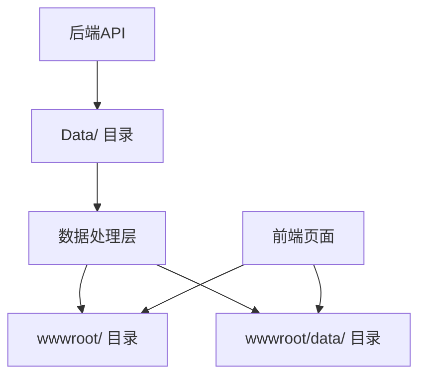

# 数据文件管理说明文档

## 1. 项目数据架构概览

本项目采用分层数据管理架构，数据文件分布在以下三个主要目录：

```
项目根目录/
├── Data/                    # 后端数据存储（主要数据源）
├── wwwroot/                 # 前端静态数据
└── wwwroot/data/           # 前端展示数据
```

### 1.1 数据流向图



## 2. 核心数据文件详细说明

### 2.1 后端数据存储 (Data/ 目录)

#### 2.1.1 用户相关数据

**文件：`Data/users.json`**
- **作用**：存储系统管理员账户信息
- **数据结构**：
```json
{
  "Id": "用户ID",
  "Username": "用户名",
  "Nickname": "昵称", 
  "Email": "邮箱",
  "Phone": "手机号",
  "IsAdmin": "是否管理员",
  "InviteCode": "邀请码",
  "CreatedAt": "创建时间",
  "IsActive": "是否激活"
}
```
- **当前数据量**：2条管理员记录
- **API对应**：`/api/admin/users`

**文件：`Data/customers.json`**
- **作用**：存储客户信息
- **数据结构**：
```json
{
  "Id": "客户ID",
  "Name": "客户姓名",
  "Phone": "手机号",
  "Email": "邮箱",
  "CreatedAt": "创建时间",
  "SalespersonId": "所属业务员ID",
  "SalespersonName": "业务员姓名"
}
```
- **当前数据量**：10条客户记录
- **API对应**：`/api/customers`

#### 2.1.2 业务员相关数据

**文件：`Data/agents.json`**
- **作用**：存储代理商信息（当前为空）
- **数据结构**：标准代理商信息格式
- **当前数据量**：0条记录
- **API对应**：`/api/agents`

**文件：`Data/salespersons.json`**
- **作用**：存储业务员账户信息
- **数据结构**：
```json
{
  "Id": "业务员ID",
  "Username": "用户名",
  "PasswordHash": "密码哈希",
  "InviteCode": "邀请码",
  "CommissionRate": "佣金比例",
  "Status": "状态",
  "CreatedAt": "创建时间",
  "CustomerCount": "客户数量"
}
```
- **当前数据量**：1条业务员记录
- **API对应**：`/api/salespersons`

#### 2.1.3 关系映射数据

**文件：`Data/customer_assignments.json`**
- **作用**：存储客户与业务员的分配关系
- **数据结构**：
```json
{
  "Id": "分配ID",
  "CustomerId": "客户ID",
  "SalespersonId": "业务员ID",
  "AssignedAt": "分配时间"
}
```
- **当前数据量**：5条分配记录
- **API对应**：`/api/customer-assignments`

**文件：`Data/user_agent_mapping.json`**
- **作用**：存储用户与代理商的映射关系
- **数据结构**：
```json
{
  "UserId": "用户ID",
  "AgentId": "代理商ID"
}
```
- **当前数据量**：1条映射记录

#### 2.1.4 邀请系统数据

**文件：`Data/invitations.json`**
- **作用**：存储邀请码和邀请记录
- **数据结构**：
```json
{
  "id": "邀请ID",
  "inviteCode": "邀请码",
  "inviteLink": "邀请链接",
  "totalInvitations": "总邀请数",
  "successfulInvitations": "成功邀请数",
  "totalRewards": "总奖励",
  "invitees": "被邀请人列表"
}
```
- **当前数据量**：多条邀请记录
- **API对应**：`/api/invitations`

**文件：`Data/agent_invite_codes.json`**
- **作用**：存储代理商邀请码（当前为空）
- **当前数据量**：0条记录

### 2.2 前端静态数据 (wwwroot/ 目录)

**文件：`wwwroot/agents.json`**
- **作用**：前端展示用的代理商数据
- **数据结构**：包含昵称、账户、邀请码、客户数量、月度业绩等
- **当前数据量**：3条代理商记录
- **使用页面**：admin.html 代理商管理模块

**文件：`wwwroot/users.json`**
- **作用**：前端展示用的用户数据（当前为空）
- **当前数据量**：0条记录

**文件：`wwwroot/salespersons.json`**
- **作用**：前端展示用的业务员数据
- **数据结构**：包含姓名、电话、邮箱、部门、佣金比例等
- **当前数据量**：3条业务员记录
- **使用页面**：admin.html 业务员管理模块

### 2.3 前端展示数据 (wwwroot/data/ 目录)

**文件：`wwwroot/data/agents.json`**
- **作用**：前端页面直接使用的代理商展示数据
- **数据结构**：详细的代理商信息，包含头像、注册时间等
- **当前数据量**：3条代理商记录
- **使用页面**：各个前端展示页面

**文件：`wwwroot/data/users.json`**
- **作用**：前端页面直接使用的用户展示数据
- **数据结构**：完整的用户信息，包含余额、信用分、VIP等级等
- **当前数据量**：6条用户记录
- **使用页面**：用户管理相关页面

## 3. API控制器与数据文件对应关系

### 3.1 用户管理API
- **控制器**：`UsersController`
- **主要数据文件**：
  - `Data/users.json` (后端存储)
  - `wwwroot/data/users.json` (前端展示)
- **相关端点**：
  - `GET /api/admin/users` - 获取用户列表
  - `POST /api/admin/users` - 创建用户
  - `PUT /api/admin/users/{id}` - 更新用户
  - `DELETE /api/admin/users/{id}` - 删除用户

### 3.2 业务员管理API
- **控制器**：`SalespersonsController`
- **主要数据文件**：
  - `Data/salespersons.json` (后端存储)
  - `wwwroot/salespersons.json` (前端静态)
- **相关端点**：
  - `GET /api/salespersons` - 获取业务员列表
  - `POST /api/salespersons` - 创建业务员
  - `PUT /api/salespersons/{id}` - 更新业务员
  - `DELETE /api/salespersons/{id}` - 删除业务员

### 3.3 代理商管理API
- **控制器**：`AgentsController`
- **主要数据文件**：
  - `Data/agents.json` (后端存储)
  - `wwwroot/agents.json` (前端静态)
  - `wwwroot/data/agents.json` (前端展示)
- **相关端点**：
  - `GET /api/agents` - 获取代理商列表
  - `POST /api/agents` - 创建代理商
  - `PUT /api/agents/{id}` - 更新代理商
  - `DELETE /api/agents/{id}` - 删除代理商

### 3.4 客户管理API
- **控制器**：`CustomersController`
- **主要数据文件**：
  - `Data/customers.json` (后端存储)
  - `Data/customer_assignments.json` (关系映射)
- **相关端点**：
  - `GET /api/customers` - 获取客户列表
  - `POST /api/customers` - 创建客户
  - `PUT /api/customers/{id}` - 更新客户
  - `DELETE /api/customers/{id}` - 删除客户

## 4. 数据管理规范和最佳实践

### 4.1 数据一致性原则
1. **主数据源**：`Data/` 目录为主要数据源，所有增删改操作应通过后端API进行
2. **展示数据同步**：`wwwroot/` 和 `wwwroot/data/` 目录的数据应定期从主数据源同步
3. **避免直接修改**：不应直接修改前端数据文件，应通过API更新后同步

### 4.2 文件命名规范
- 使用复数形式：`users.json`, `agents.json`, `customers.json`
- 关系映射文件使用下划线连接：`user_agent_mapping.json`
- 保持一致的命名风格

### 4.3 数据结构规范
- 所有实体必须包含 `Id` 字段作为主键
- 时间字段统一使用 `CreatedAt`, `UpdatedAt` 格式
- 布尔字段使用 `Is` 前缀：`IsActive`, `IsAdmin`
- 状态字段使用枚举值：`active`, `inactive`, `pending`

## 5. 常见操作指南

### 5.1 添加新用户
1. 通过 `POST /api/admin/users` 添加到 `Data/users.json`
2. 系统自动同步到前端展示文件
3. 更新相关统计数据

### 5.2 管理业务员客户关系
1. 在 `Data/customer_assignments.json` 中建立映射关系
2. 更新业务员的客户数量统计
3. 同步到前端展示数据

### 5.3 数据查询优化
- 使用索引字段进行查询：`Id`, `Phone`, `Email`
- 避免全表扫描，使用分页查询
- 缓存常用查询结果

## 6. 数据备份和恢复策略

### 6.1 备份策略
- **每日备份**：自动备份 `Data/` 目录所有文件
- **版本控制**：使用Git管理数据文件变更
- **增量备份**：只备份有变更的文件

### 6.2 恢复策略
- **文件恢复**：从备份目录恢复指定文件
- **数据回滚**：使用Git回滚到指定版本
- **部分恢复**：恢复特定实体的数据

### 6.3 备份文件位置
```
备份目录/
├── daily/          # 每日备份
├── weekly/         # 每周备份
└── monthly/        # 每月备份
```

## 7. 故障排查指南

### 7.1 数据不一致问题
1. 检查 `Data/` 目录主数据源
2. 对比前端展示数据
3. 执行数据同步操作
4. 验证API响应数据

### 7.2 文件损坏问题
1. 检查JSON文件格式是否正确
2. 验证必需字段是否存在
3. 从备份恢复损坏文件
4. 重新同步相关数据

### 7.3 性能问题
1. 检查文件大小是否过大
2. 优化查询条件
3. 实施数据分页
4. 考虑数据归档

## 8. 未来优化建议

### 8.1 数据库迁移
- 考虑迁移到关系型数据库（PostgreSQL/MySQL）
- 实现真正的外键约束
- 提升查询性能和数据一致性

### 8.2 缓存机制
- 实现Redis缓存层
- 缓存热点数据
- 减少文件I/O操作

### 8.3 数据同步
- 实现实时数据同步机制
- 使用消息队列处理数据更新
- 确保多实例数据一致性

---

## 快速参考表

| 数据类型 | 主要文件 | 备用文件 | API端点 |
|---------|---------|---------|---------|
| 管理员用户 | `Data/users.json` | `wwwroot/data/users.json` | `/api/admin/users` |
| 普通客户 | `Data/customers.json` | - | `/api/customers` |
| 业务员 | `Data/salespersons.json` | `wwwroot/salespersons.json` | `/api/salespersons` |
| 代理商 | `Data/agents.json` | `wwwroot/agents.json`, `wwwroot/data/agents.json` | `/api/agents` |
| 客户分配 | `Data/customer_assignments.json` | - | `/api/customer-assignments` |
| 邀请记录 | `Data/invitations.json` | - | `/api/invitations` |

**重要提醒**：在与我沟通时，请明确指出要操作的具体文件路径，这样我能更准确地帮助您处理相关问题。