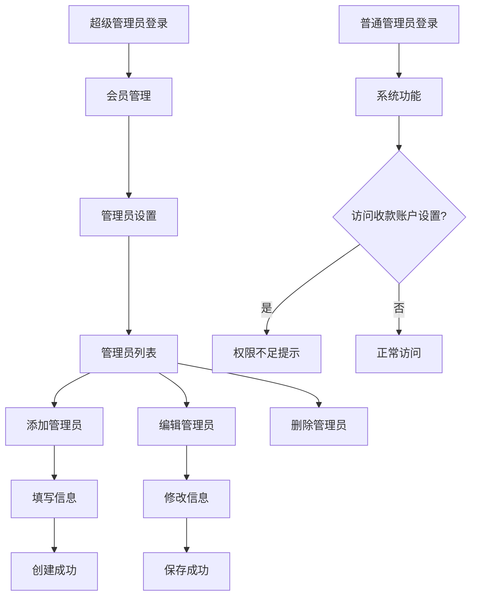

# 管理员设置功能产品需求文档

## 1. 产品概述

本功能旨在为现有的后台管理系统增加管理员权限管理功能，允许超级管理员创建和管理普通管理员账户。普通管理员拥有除收款账户设置外的所有管理权限，实现分级权限管理，提高系统安全性和管理效率。

- 解决问题：当前系统只有超级管理员，无法实现权限分级管理，存在安全风险
- 目标用户：超级管理员、普通管理员
- 产品价值：提升系统安全性，实现精细化权限控制，支持多人协作管理

## 2. 核心功能

### 2.1 用户角色

| 角色 | 注册方法 | 核心权限 |
|------|----------|----------|
| 超级管理员 | 系统预设 | 拥有所有权限，包括收款账户设置、管理员管理 |
| 普通管理员 | 超级管理员创建 | 拥有除收款账户设置外的所有权限 |

### 2.2 功能模块

本功能需求包含以下主要页面：
1. **管理员设置页面**：管理员列表展示、搜索筛选、统计信息
2. **添加管理员页面**：创建新的普通管理员账户
3. **编辑管理员页面**：修改管理员基本信息

### 2.3 页面详情

| 页面名称 | 模块名称 | 功能描述 |
|----------|----------|----------|
| 管理员设置页面 | 管理员列表 | 展示所有管理员信息，包括用户名、昵称、角色类型、创建时间、最后登录时间、状态 |
| 管理员设置页面 | 搜索筛选 | 支持按用户名、昵称搜索，按状态、角色类型筛选 |
| 管理员设置页面 | 统计信息 | 显示总管理员数、活跃管理员数、普通管理员数 |
| 管理员设置页面 | 操作功能 | 编辑、启用/禁用、删除管理员（超级管理员不可删除） |
| 添加管理员页面 | 信息填写 | 输入用户名、昵称、密码，设置初始状态 |
| 添加管理员页面 | 表单验证 | 验证用户名唯一性、密码强度、必填字段 |
| 编辑管理员页面 | 信息修改 | 修改昵称、重置密码、更改状态 |
| 权限控制 | 页面访问控制 | 普通管理员无法访问收款账户设置页面 |
| 权限控制 | 操作权限验证 | 前端和后端双重验证管理员操作权限 |

## 3. 核心流程

### 超级管理员流程
1. 登录系统 → 进入会员管理 → 点击管理员设置标签
2. 查看管理员列表 → 点击添加管理员 → 填写信息 → 确认创建
3. 选择管理员 → 编辑信息 → 保存修改
4. 选择管理员 → 启用/禁用 → 确认操作

### 普通管理员流程
1. 登录系统 → 访问允许的功能模块
2. 尝试访问收款账户设置 → 系统提示权限不足

## 4. 用户界面设计

### 4.1 设计风格
- 主色调：#007bff（蓝色）、#28a745（绿色）
- 辅助色：#6c757d（灰色）、#dc3545（红色）
- 按钮样式：圆角按钮，hover效果
- 字体：微软雅黑，主要字号14px，标题16px
- 布局风格：卡片式布局，顶部导航
- 图标风格：Font Awesome图标库

### 4.2 页面设计概览

| 页面名称 | 模块名称 | UI元素 |
|----------|----------|--------|
| 管理员设置页面 | 统计卡片 | 三个统计卡片，蓝色、绿色、橙色背景，显示数字和图标 |
| 管理员设置页面 | 搜索筛选区 | 搜索输入框、状态下拉选择、角色类型筛选、搜索按钮 |
| 管理员设置页面 | 管理员列表 | 表格布局，斑马纹样式，操作按钮组 |
| 添加管理员模态框 | 表单区域 | 垂直表单布局，输入框、密码框、确认按钮 |
| 编辑管理员模态框 | 表单区域 | 预填充数据的表单，保存和取消按钮 |

### 4.3 响应式设计
- 桌面优先设计，适配平板和手机端
- 表格在小屏幕下可横向滚动
- 模态框在移动端全屏显示
- 按钮和输入框支持触摸操作优化