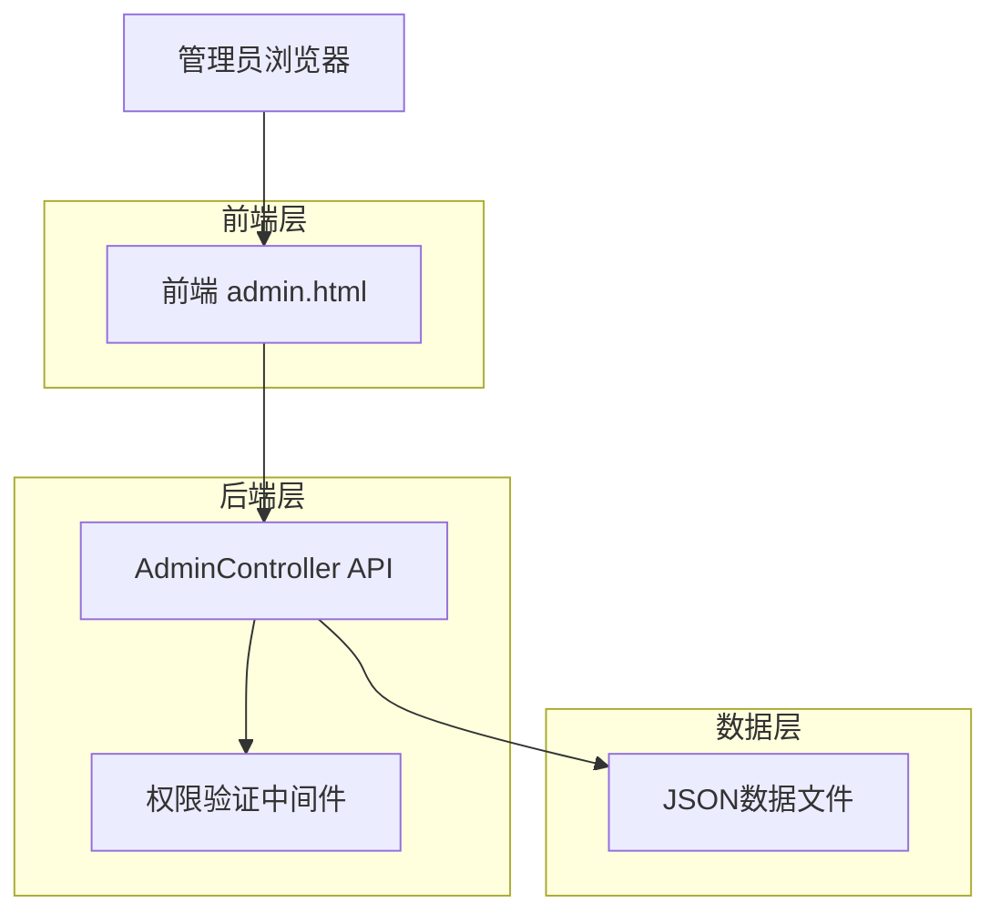
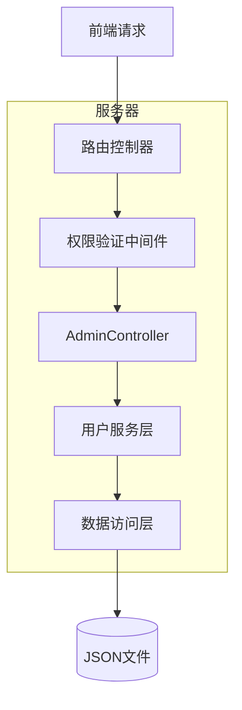
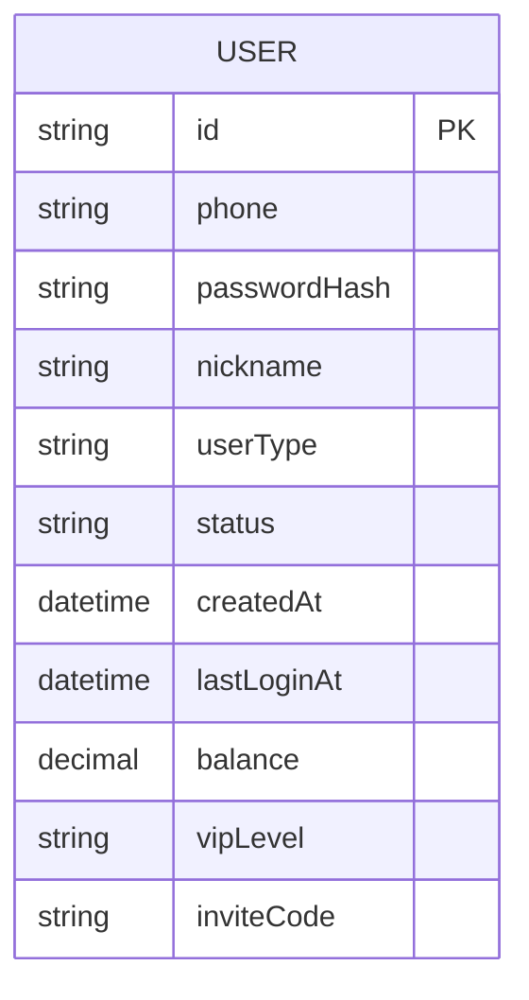

# 管理员设置功能技术架构文档

## 1. 架构设计



## 2. 技术描述

- 前端：原生HTML + JavaScript + Bootstrap 4 + Font Awesome
- 后端：ASP.NET Core Web API
- 数据存储：JSON文件存储（users.json）
- 权限控制：基于角色的访问控制（RBAC）

## 3. 路由定义

| 路由 | 用途 |
|------|------|
| /admin.html#member-management | 会员管理主页面 |
| /admin.html#admin-settings | 管理员设置页面 |

## 4. API定义

### 4.1 管理员管理相关API

获取管理员列表
```
GET /api/admin/administrators
```

Response:
| 参数名称 | 参数类型 | 描述 |
|----------|----------|------|
| success | boolean | 请求是否成功 |
| data | array | 管理员列表数据 |
| message | string | 响应消息 |

示例响应：
```json
{
  "success": true,
  "data": [
    {
      "id": "1",
      "username": "admin",
      "nickname": "超级管理员",
      "userType": "super_admin",
      "status": "active",
      "createdAt": "2024-01-01T00:00:00Z",
      "lastLoginAt": "2024-01-15T10:30:00Z"
    }
  ],
  "message": "获取成功"
}
```

创建管理员
```
POST /api/admin/administrators
```

Request:
| 参数名称 | 参数类型 | 是否必需 | 描述 |
|----------|----------|----------|------|
| username | string | true | 管理员用户名 |
| nickname | string | true | 管理员昵称 |
| password | string | true | 管理员密码 |

Response:
| 参数名称 | 参数类型 | 描述 |
|----------|----------|------|
| success | boolean | 创建是否成功 |
| data | object | 创建的管理员信息 |
| message | string | 响应消息 |

更新管理员信息
```
PUT /api/admin/administrators/{id}
```

Request:
| 参数名称 | 参数类型 | 是否必需 | 描述 |
|----------|----------|----------|------|
| nickname | string | false | 管理员昵称 |
| password | string | false | 新密码 |
| status | string | false | 状态（active/inactive） |

删除管理员
```
DELETE /api/admin/administrators/{id}
```

Response:
| 参数名称 | 参数类型 | 描述 |
|----------|----------|------|
| success | boolean | 删除是否成功 |
| message | string | 响应消息 |

权限验证
```
GET /api/admin/permissions/check
```

Request:
| 参数名称 | 参数类型 | 是否必需 | 描述 |
|----------|----------|----------|------|
| resource | string | true | 资源名称（如payment-settings） |

Response:
| 参数名称 | 参数类型 | 描述 |
|----------|----------|------|
| hasPermission | boolean | 是否有权限 |
| userType | string | 用户类型 |

## 5. 服务器架构图



## 6. 数据模型

### 6.1 数据模型定义



### 6.2 数据定义语言

用户表扩展（users.json）
```json
{
  "id": "唯一标识符",
  "phone": "用户名/手机号",
  "passwordHash": "密码哈希值",
  "nickname": "用户昵称",
  "userType": "用户类型：super_admin/admin/user",
  "status": "状态：active/inactive",
  "createdAt": "创建时间",
  "lastLoginAt": "最后登录时间",
  "balance": "余额",
  "vipLevel": "VIP等级",
  "inviteCode": "邀请码"
}
```

初始数据结构：
```json
[
  {
    "id": "1",
    "phone": "useradmin",
    "passwordHash": "hashed_password",
    "nickname": "超级管理员",
    "userType": "super_admin",
    "status": "active",
    "createdAt": "2024-01-01T00:00:00Z",
    "lastLoginAt": "2024-01-15T10:30:00Z",
    "balance": 0,
    "vipLevel": "none",
    "inviteCode": ""
  }
]
```

权限配置：
```json
{
  "super_admin": {
    "permissions": ["*"],
    "description": "超级管理员，拥有所有权限"
  },
  "admin": {
    "permissions": [
      "member-management",
      "order-management", 
      "website-settings",
      "staff-management"
    ],
    "restrictions": ["payment-settings"],
    "description": "普通管理员，除收款账户设置外的所有权限"
  }
}
```