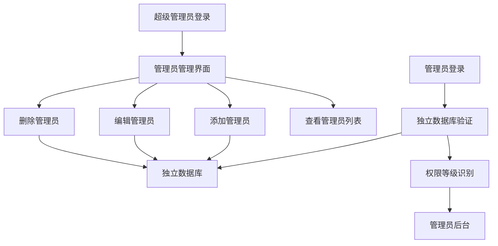

# 管理员账户独立数据库系统产品需求文档

## 1. 产品概述

本项目旨在将管理员账户数据从现有系统中分离，创建独立的管理员数据库系统，实现更安全、更灵活的管理员账户管理功能。通过独立存储管理员数据，提高系统安全性，简化权限管理，并为超级管理员提供完整的管理员账户管理功能。

- 解决现有管理员数据与普通用户数据混合存储的问题，提高数据安全性和管理效率
- 为超级管理员提供专门的管理员账户管理界面，支持完整的增删改查操作
- 确保管理员登录验证的独立性和安全性

## 2. 核心功能

### 2.1 用户角色

| 角色 | 访问方式 | 核心权限 |
|------|----------|----------|
| 超级管理员 | 独立登录系统 | 管理员账户的完整管理权限（增删改查） |
| 普通管理员 | 管理员登录系统 | 使用独立数据库进行身份验证和权限控制 |

### 2.2 功能模块

本系统包含以下核心页面：
1. **超级管理员后台**：管理员账户管理界面，包含管理员列表、添加、编辑、删除功能
2. **管理员登录页面**：使用独立数据库进行身份验证
3. **管理员后台**：普通管理员工作界面，权限基于独立数据库验证

### 2.3 页面详情

| 页面名称 | 模块名称 | 功能描述 |
|----------|----------|----------|
| 超级管理员后台 | 管理员列表 | 显示所有管理员账户，支持搜索、筛选、分页 |
| 超级管理员后台 | 添加管理员 | 创建新的管理员账户，设置用户名、密码、权限等级 |
| 超级管理员后台 | 编辑管理员 | 修改现有管理员信息，包括密码重置、权限调整 |
| 超级管理员后台 | 删除管理员 | 安全删除管理员账户，支持批量操作 |
| 管理员登录页面 | 身份验证 | 使用独立数据库验证管理员身份，支持权限等级识别 |
| 管理员后台 | 权限控制 | 基于独立数据库的权限等级控制页面访问和功能使用 |

## 3. 核心流程

### 超级管理员管理流程
超级管理员登录后，可以访问管理员管理界面，进行以下操作：
1. 查看管理员列表 → 搜索/筛选管理员
2. 添加新管理员 → 填写账户信息 → 设置权限等级 → 保存到独立数据库
3. 编辑管理员 → 修改信息 → 更新数据库
4. 删除管理员 → 确认删除 → 从数据库移除

### 管理员登录验证流程
管理员尝试登录 → 系统查询独立管理员数据库 → 验证用户名密码 → 获取权限等级 → 生成登录令牌 → 跳转到对应权限的管理后台

## 4. 用户界面设计

### 4.1 设计风格

- **主色调**：深蓝色 (#2c3e50) 作为主背景色，橙色 (#ff6b35) 作为强调色
- **按钮样式**：圆角按钮，支持悬停效果和状态变化
- **字体**：系统默认字体，标题使用16-18px，正文使用14px
- **布局风格**：卡片式布局，左侧导航栏，主内容区域采用表格和表单组合
- **图标风格**：使用Font Awesome图标库，保持一致的视觉风格

### 4.2 页面设计概览

| 页面名称 | 模块名称 | UI元素 |
|----------|----------|--------|
| 超级管理员后台 | 管理员列表 | 数据表格，搜索框，筛选下拉框，分页控件，操作按钮组 |
| 超级管理员后台 | 添加管理员模态框 | 表单输入框，下拉选择器，密码强度指示器，保存/取消按钮 |
| 超级管理员后台 | 编辑管理员模态框 | 预填充表单，权限等级选择器，状态切换开关，更新按钮 |
| 管理员登录页面 | 登录表单 | 用户名输入框，密码输入框，登录按钮，错误提示区域 |

### 4.3 响应式设计

系统采用桌面优先的设计策略，支持移动端自适应。管理员界面主要面向桌面用户，但在平板和手机上也能正常使用，表格在小屏幕上支持横向滚动。