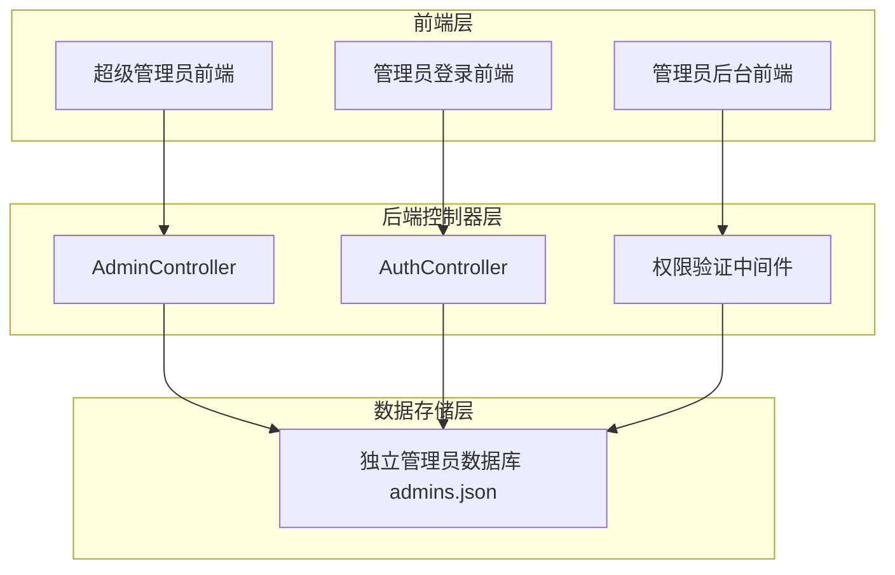
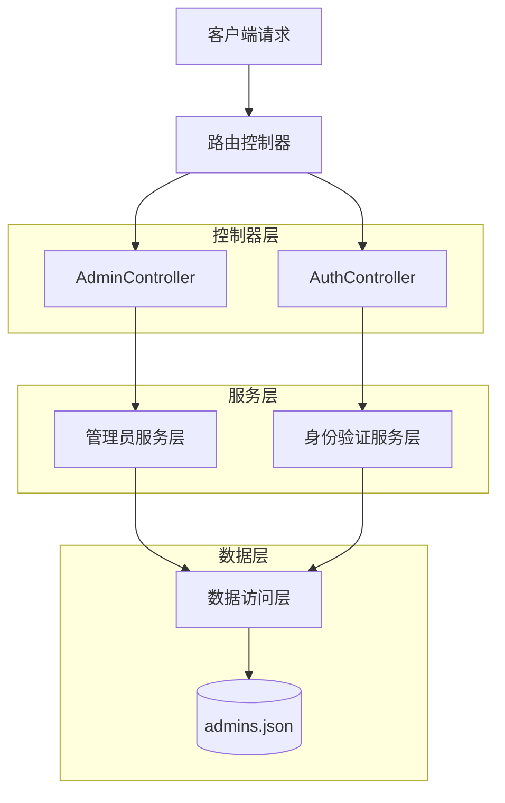
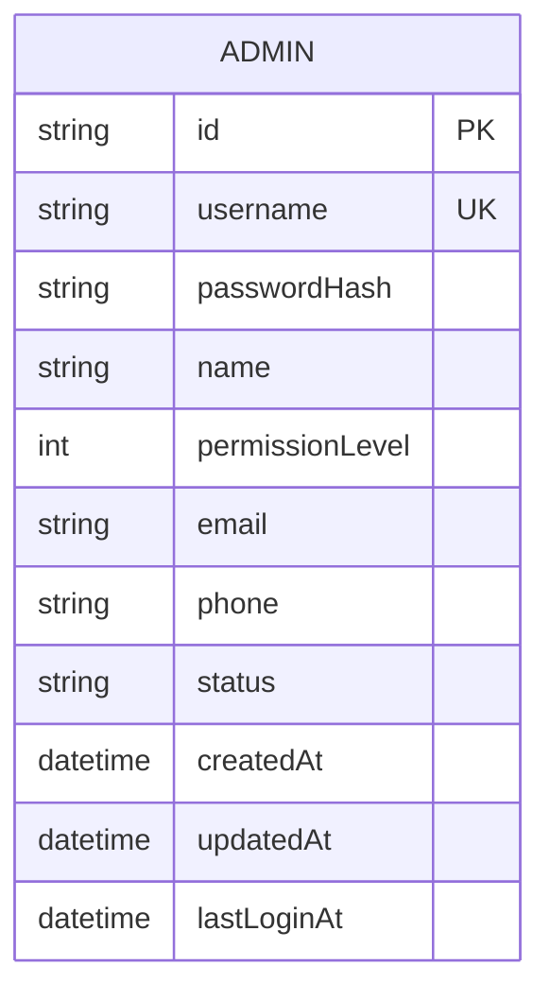

# 管理员账户独立数据库系统技术架构文档

## 1. 架构设计



## 2. 技术描述

- **前端**：现有HTML/JavaScript + Bootstrap + SweetAlert2
- **后端**：ASP.NET Core 6.0 + 新增AdminController
- **数据存储**：独立JSON文件 (admins.json)
- **身份验证**：JWT Token + 权限等级验证
- **密码加密**：BCrypt哈希算法

## 3. 路由定义

| 路由 | 用途 |
|------|------|
| /super-admin.html | 超级管理员后台，包含管理员管理功能 |
| /admin-login.html | 管理员登录页面，使用独立数据库验证 |
| /admin.html | 普通管理员后台，基于独立数据库权限控制 |

## 4. API定义

### 4.1 核心API

#### 管理员管理相关

```
GET /api/admin/administrators
```
获取管理员列表

Response:
| 参数名称 | 参数类型 | 描述 |
|----------|----------|------|
| success | boolean | 请求状态 |
| data | array | 管理员列表 |
| message | string | 响应消息 |

示例响应：
```json
{
  "success": true,
  "data": [
    {
      "id": "admin001",
      "username": "admin",
      "name": "系统管理员",
      "permissionLevel": 1,
      "status": "active",
      "createdAt": "2024-01-01T00:00:00Z"
    }
  ],
  "message": "获取成功"
}
```

```
POST /api/admin/administrators
```
添加管理员

Request:
| 参数名称 | 参数类型 | 是否必需 | 描述 |
|----------|----------|----------|------|
| username | string | true | 管理员用户名 |
| password | string | true | 管理员密码 |
| name | string | true | 管理员姓名 |
| permissionLevel | integer | true | 权限等级 (0-3) |
| email | string | false | 邮箱地址 |
| phone | string | false | 手机号码 |

```
PUT /api/admin/administrators/{id}
```
更新管理员信息

```
DELETE /api/admin/administrators/{id}
```
删除管理员

#### 管理员身份验证

```
POST /api/auth/admin-login
```
管理员登录验证

Request:
| 参数名称 | 参数类型 | 是否必需 | 描述 |
|----------|----------|----------|------|
| username | string | true | 管理员用户名 |
| password | string | true | 管理员密码 |

Response:
| 参数名称 | 参数类型 | 描述 |
|----------|----------|------|
| success | boolean | 登录状态 |
| token | string | JWT令牌 |
| adminInfo | object | 管理员信息 |

示例：
```json
{
  "success": true,
  "token": "eyJhbGciOiJIUzI1NiIsInR5cCI6IkpXVCJ9...",
  "adminInfo": {
    "id": "admin001",
    "username": "admin",
    "name": "系统管理员",
    "permissionLevel": 1,
    "userType": "admin"
  }
}
```

## 5. 服务器架构图



## 6. 数据模型

### 6.1 数据模型定义



### 6.2 数据定义语言

#### 管理员数据表 (admins.json)

```json
{
  "admins": [
    {
      "id": "admin001",
      "username": "admin",
      "passwordHash": "$2b$10$...",
      "name": "系统管理员",
      "permissionLevel": 1,
      "email": "admin@example.com",
      "phone": "13800138000",
      "status": "active",
      "createdAt": "2024-01-01T00:00:00Z",
      "updatedAt": "2024-01-01T00:00:00Z",
      "lastLoginAt": "2024-01-01T00:00:00Z"
    }
  ]
}
```

#### 权限等级定义

```json
{
  "permissionLevels": {
    "0": {
      "name": "超级管理员",
      "description": "拥有所有权限，包括管理员管理",
      "permissions": ["*"]
    },
    "1": {
      "name": "高级管理员", 
      "description": "拥有大部分管理权限，不能管理其他管理员",
      "permissions": ["user_management", "order_management", "system_settings"]
    },
    "2": {
      "name": "普通管理员",
      "description": "拥有基础管理权限",
      "permissions": ["user_management", "order_management"]
    },
    "3": {
      "name": "初级管理员",
      "description": "拥有有限的查看和基础操作权限",
      "permissions": ["user_view", "order_view"]
    }
  }
}
```

#### 初始化数据

```json
{
  "admins": [
    {
      "id": "super_admin_001",
      "username": "superadmin",
      "passwordHash": "$2b$10$rQZ8kHWKtGkVQ7K5vQZ8kO",
      "name": "超级管理员",
      "permissionLevel": 0,
      "email": "superadmin@system.com",
      "phone": "",
      "status": "active",
      "createdAt": "2024-01-01T00:00:00Z",
      "updatedAt": "2024-01-01T00:00:00Z",
      "lastLoginAt": null
    },
    {
      "id": "admin_001",
      "username": "admin",
      "passwordHash": "$2b$10$rQZ8kHWKtGkVQ7K5vQZ8kO",
      "name": "系统管理员",
      "permissionLevel": 1,
      "email": "admin@system.com",
      "phone": "",
      "status": "active",
      "createdAt": "2024-01-01T00:00:00Z",
      "updatedAt": "2024-01-01T00:00:00Z",
      "lastLoginAt": null
    }
  ]
}
```

## 7. 安全措施

### 7.1 密码安全
- 使用BCrypt算法对密码进行哈希加密
- 密码强度要求：至少8位，包含字母和数字
- 支持密码重置功能

### 7.2 权限控制
- 基于权限等级的访问控制
- JWT令牌验证
- 会话超时管理

### 7.3 数据安全
- 独立的管理员数据存储
- 敏感信息加密存储
- 操作日志记录

## 8. 迁移策略

### 8.1 数据迁移
1. 从现有系统中提取管理员数据
2. 密码重新加密存储
3. 权限等级映射转换
4. 创建独立的admins.json文件

### 8.2 系统兼容性
- 保持现有API接口兼容
- 渐进式迁移，确保系统稳定运行
- 提供数据备份和回滚机制