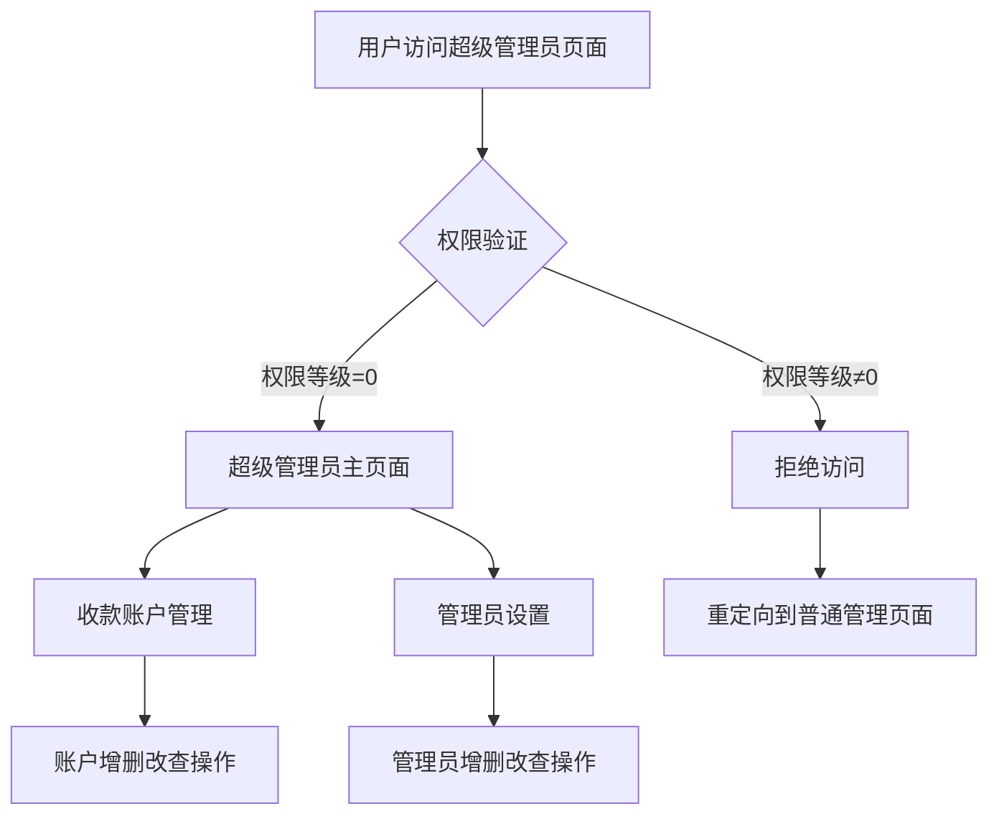

# 超级管理员专用页面产品需求文档

## 1. Product Overview
创建一个专门的超级管理员页面，实现核心管理功能的权限分离，确保只有超级管理员才能访问关键的系统管理功能。
- 解决当前系统中所有管理员都能访问敏感功能的安全隐患，通过页面级权限控制提升系统安全性。
- 为超级管理员提供专用的管理界面，集中管理收款账户和管理员设置等核心功能。

## 2. Core Features

### 2.1 User Roles
| Role | Registration Method | Core Permissions |
|------|---------------------|------------------|
| 超级管理员 | 系统预设账号 | 可访问超级管理员专用页面，管理收款账户和管理员设置 |
| 普通管理员 | 超级管理员创建 | 只能访问基础管理功能，无法访问超级管理员页面 |

### 2.2 Feature Module
我们的超级管理员专用页面包含以下主要页面：
1. **超级管理员登录页面**：独立的登录验证，权限检查
2. **超级管理员主页面**：导航菜单，功能概览
3. **收款账户管理页面**：收款账户的增删改查功能
4. **管理员设置页面**：管理员账号的创建、编辑、删除功能

### 2.3 Page Details
| Page Name | Module Name | Feature description |
|-----------|-------------|---------------------|
| 超级管理员登录页面 | 登录验证模块 | 验证超级管理员身份，检查权限等级，重定向到专用页面 |
| 超级管理员登录页面 | 权限检查模块 | 验证用户权限等级为0（超级管理员），拒绝其他权限等级访问 |
| 超级管理员主页面 | 导航菜单模块 | 显示收款账户管理和管理员设置两个主要功能入口 |
| 超级管理员主页面 | 用户信息模块 | 显示当前登录的超级管理员信息，提供安全退出功能 |
| 收款账户管理页面 | 账户列表模块 | 显示所有收款账户，支持搜索和筛选功能 |
| 收款账户管理页面 | 账户操作模块 | 添加新收款账户，编辑现有账户信息，删除账户，启用/禁用账户状态 |
| 管理员设置页面 | 管理员列表模块 | 显示所有管理员账号，区分超级管理员和普通管理员 |
| 管理员设置页面 | 管理员操作模块 | 创建新管理员账号（仅限普通管理员），编辑管理员信息，删除管理员，修改管理员状态 |

## 3. Core Process
### 超级管理员操作流程
1. 超级管理员通过专用登录页面进行身份验证
2. 系统验证用户权限等级为0（超级管理员）
3. 验证通过后进入超级管理员主页面
4. 选择收款账户管理或管理员设置功能
5. 在相应页面进行具体的管理操作
6. 完成操作后可返回主页面或安全退出

### 权限控制流程
1. 普通管理员尝试访问超级管理员页面
2. 系统检测到权限等级不足（非0级）
3. 拒绝访问并重定向到普通管理员页面
4. 显示权限不足的提示信息

## 4. User Interface Design
### 4.1 Design Style
- 主色调：深蓝色 (#1e3a8a) 和金色 (#f59e0b) 突出超级管理员的特殊身份
- 次要颜色：灰色 (#6b7280) 用于辅助信息
- 按钮样式：圆角按钮，带有阴影效果，突出重要操作
- 字体：微软雅黑，标题使用16-18px，正文使用14px
- 布局风格：卡片式布局，左侧导航菜单，右侧内容区域
- 图标风格：使用Font Awesome图标库，保持与现有系统一致

### 4.2 Page Design Overview
| Page Name | Module Name | UI Elements |
|-----------|-------------|-------------|
| 超级管理员登录页面 | 登录表单 | 深蓝色背景，居中白色登录卡片，金色"超级管理员"标识，用户名密码输入框，登录按钮 |
| 超级管理员主页面 | 导航菜单 | 左侧深蓝色导航栏，金色图标，功能模块卡片式布局，顶部用户信息栏 |
| 收款账户管理页面 | 账户列表 | 表格布局，搜索筛选栏，操作按钮（添加/编辑/删除），状态标签（启用/禁用） |
| 管理员设置页面 | 管理员列表 | 表格布局，权限等级标识，操作按钮，状态指示器，创建管理员模态框 |

### 4.3 Responsiveness
- 桌面优先设计，支持1920x1080及以上分辨率
- 移动端适配，在平板和手机上提供基本的查看和操作功能
- 触摸交互优化，按钮和链接区域适当放大