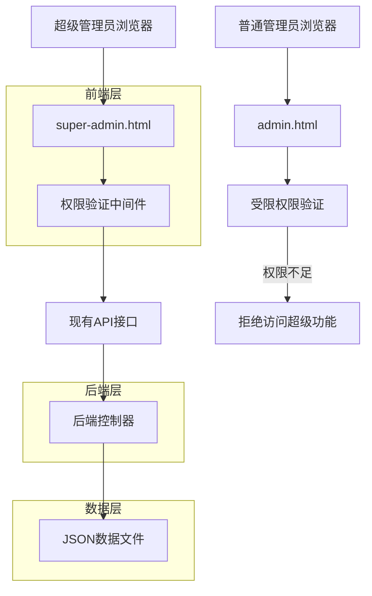
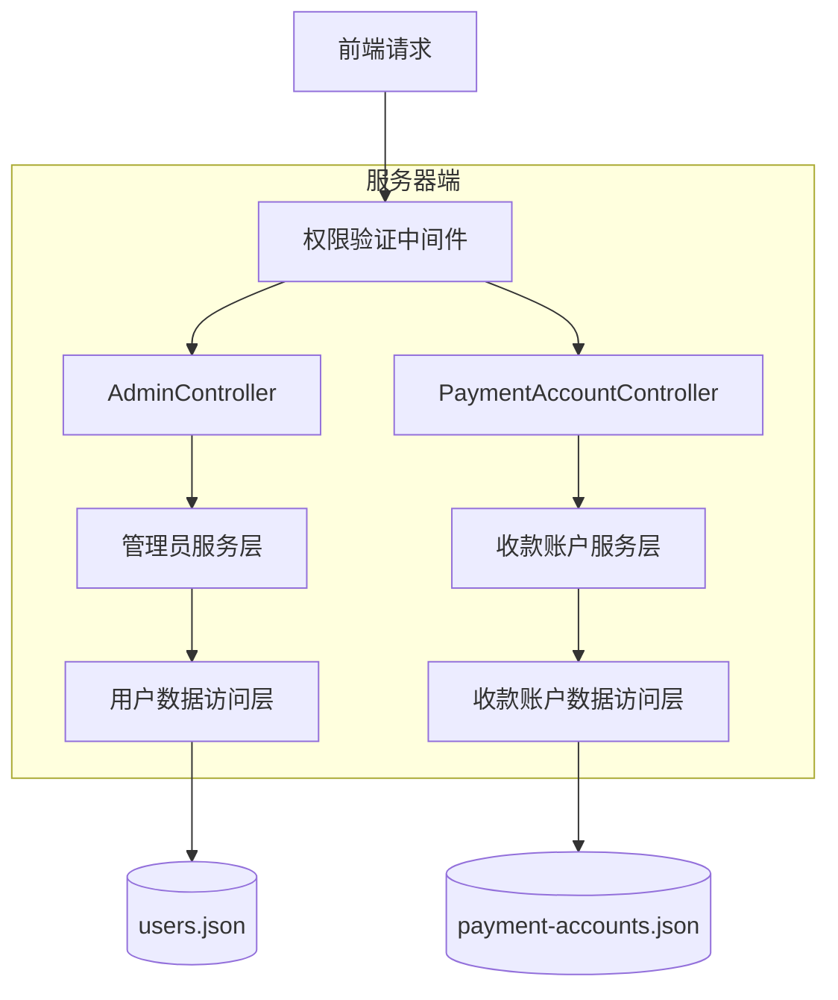
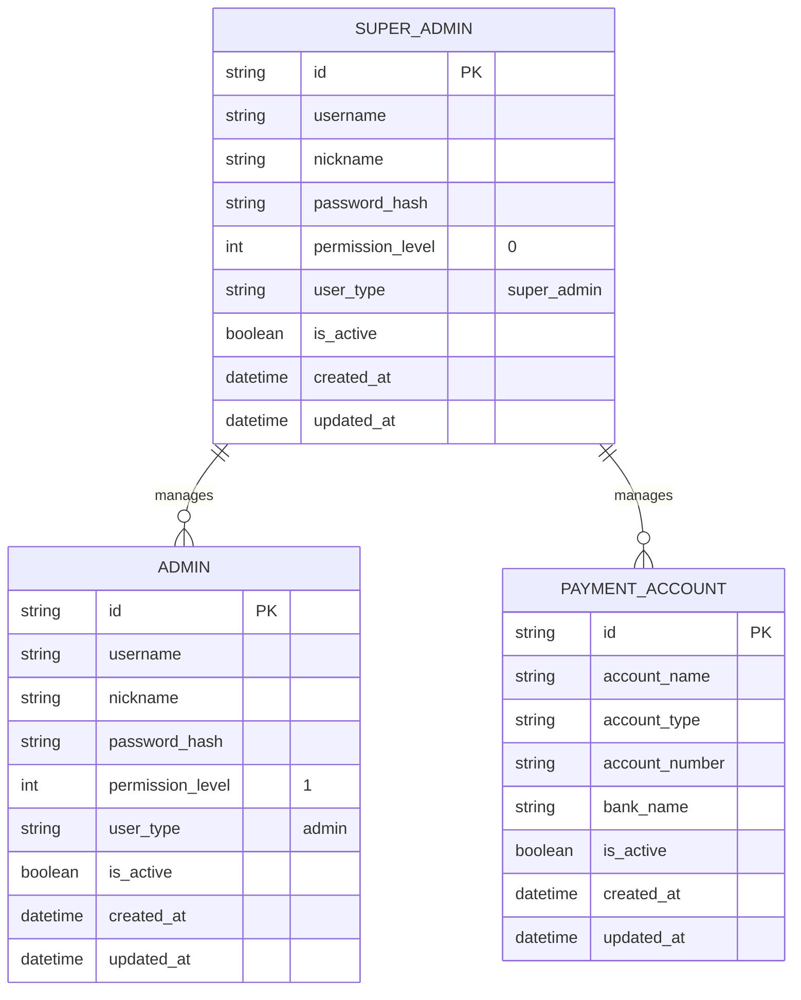

# 超级管理员专用页面技术架构文档

## 1. Architecture design



## 2. Technology Description
- Frontend: HTML5 + CSS3 + JavaScript (ES6+) + Bootstrap 5
- Backend: ASP.NET Core (现有系统)
- Authentication: 基于现有的权限验证系统扩展
- Data Storage: JSON文件存储 (users.json, payment-accounts.json)

## 3. Route definitions
| Route | Purpose |
|-------|---------|
| /super-admin-login.html | 超级管理员专用登录页面 |
| /super-admin.html | 超级管理员主页面，包含导航和功能概览 |
| /super-admin.html#payment-accounts | 收款账户管理功能页面 |
| /super-admin.html#admin-settings | 管理员设置功能页面 |

## 4. API definitions
### 4.1 权限验证API

权限检查接口（扩展现有接口）
```
GET /api/admin/check-permission
```

Request:
| Param Name | Param Type | isRequired | Description |
|------------|------------|------------|-------------|
| resource | string | true | 资源类型，新增"super-admin-access" |

Response:
| Param Name | Param Type | Description |
|------------|------------|-------------|
| hasPermission | boolean | 是否有权限访问 |
| permissionLevel | int | 用户权限等级 |
| message | string | 权限检查结果消息 |

### 4.2 收款账户管理API（复用现有）

获取收款账户列表
```
GET /api/payment-accounts
```

创建收款账户
```
POST /api/payment-accounts
```

更新收款账户
```
PUT /api/payment-accounts/{id}
```

删除收款账户
```
DELETE /api/payment-accounts/{id}
```

### 4.3 管理员设置API（复用现有）

获取管理员列表
```
GET /api/admin/administrators
```

创建管理员
```
POST /api/admin/administrators
```

更新管理员
```
PUT /api/admin/administrators/{id}
```

删除管理员
```
DELETE /api/admin/administrators/{id}
```

## 5. Server architecture diagram



## 6. Data model

### 6.1 Data model definition



### 6.2 Data Definition Language

权限验证扩展（在现有AdminController中添加）
```csharp
// 扩展权限检查方法
public bool CheckSuperAdminPermission(string userId)
{
    var user = GetUserById(userId);
    return user != null && user.PermissionLevel == 0 && user.UserType == "super_admin";
}

// 新增超级管理员访问权限检查
[HttpGet("check-super-admin-permission")]
public IActionResult CheckSuperAdminPermission()
{
    var userId = GetCurrentUserId();
    var hasPermission = CheckSuperAdminPermission(userId);
    
    return Ok(new {
        hasPermission = hasPermission,
        permissionLevel = hasPermission ? 0 : -1,
        message = hasPermission ? "超级管理员权限验证通过" : "权限不足，需要超级管理员权限"
    });
}
```

前端权限控制逻辑
```javascript
// 超级管理员权限验证
async function checkSuperAdminPermission() {
    try {
        const response = await fetch('/api/admin/check-super-admin-permission');
        const result = await response.json();
        
        if (!result.hasPermission) {
            alert('权限不足，只有超级管理员才能访问此页面');
            window.location.href = '/admin-login.html';
            return false;
        }
        
        return true;
    } catch (error) {
        console.error('权限验证失败:', error);
        window.location.href = '/admin-login.html';
        return false;
    }
}

// 页面加载时进行权限验证
document.addEventListener('DOMContentLoaded', async function() {
    const hasPermission = await checkSuperAdminPermission();
    if (hasPermission) {
        initializeSuperAdminPage();
    }
});
```

数据迁移说明
```javascript
// 从admin.html移除的功能模块
const removedModules = [
    'payment-accounts-management',  // 收款账户管理
    'admin-settings-management'     // 管理员设置
];

// 在super-admin.html中实现的功能模块
const superAdminModules = [
    'payment-accounts-management',  // 完整的收款账户管理功能
    'admin-settings-management',    // 完整的管理员设置功能
    'super-admin-navigation',       // 超级管理员专用导航
    'enhanced-security-controls'    // 增强的安