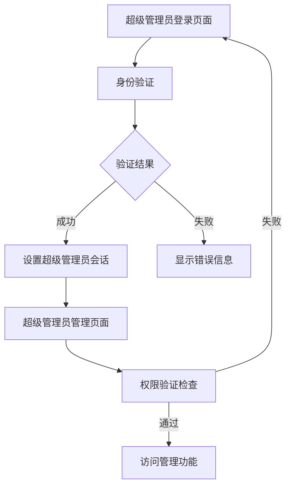

# 超级管理员独立登录系统产品需求文档

## 1. 产品概述

本项目旨在将超级管理员的登录验证系统从现有的统一用户管理系统中独立出来，创建一个专门的超级管理员身份验证机制。通过数据隔离和独立验证流程，提升系统的安全性和可维护性。

- 解决现有系统中超级管理员与普通管理员混合存储带来的安全风险
- 为超级管理员提供更严格的身份验证和权限控制
- 简化超级管理员账户的管理和维护流程

## 2. 核心功能

### 2.1 用户角色

| 角色 | 数据存储 | 核心权限 |
|------|----------|----------|
| 超级管理员 | super_admins.json | 完全系统控制权限，包括收款账户管理、管理员设置等 |
| 普通管理员 | users.json | 基础管理功能，受限的系统访问权限 |

### 2.2 功能模块

本系统主要包含以下核心页面：
1. **超级管理员登录页面**：独立的身份验证入口，专门验证超级管理员身份
2. **超级管理员管理页面**：超级管理员专用的系统管理界面

### 2.3 页面详情

| 页面名称 | 模块名称 | 功能描述 |
|----------|----------|----------|
| 超级管理员登录页面 | 身份验证模块 | 验证超级管理员凭据，独立于普通管理员登录流程 |
| 超级管理员登录页面 | 安全检查模块 | 多重验证机制，包括用户名、密码和权限级别验证 |
| 超级管理员管理页面 | 权限验证模块 | 页面访问时的实时权限检查和会话验证 |
| 超级管理员管理页面 | 数据管理模块 | 收款账户管理、管理员设置等核心功能 |

## 3. 核心流程

### 超级管理员登录流程
1. 用户访问超级管理员登录页面
2. 输入超级管理员凭据（用户名/密码）
3. 系统查询super_admins.json文件进行身份验证
4. 验证通过后设置专用的登录会话
5. 跳转到超级管理员专用管理页面

### 权限验证流程
1. 用户访问超级管理员功能页面
2. 系统检查当前登录会话
3. 验证用户是否为有效的超级管理员
4. 权限验证通过则允许访问，否则重定向到登录页面

## 4. 用户界面设计

### 4.1 设计风格
- **主色调**：深蓝色 (#2c3e50) 和金色 (#f39c12) 突出超级管理员的特殊身份
- **按钮样式**：圆角设计，带有渐变效果和悬停动画
- **字体**：Microsoft YaHei，标题18px，正文14px
- **布局风格**：卡片式布局，顶部导航，左侧菜单
- **图标风格**：FontAwesome图标，统一的视觉风格

### 4.2 页面设计概览

| 页面名称 | 模块名称 | UI元素 |
|----------|----------|---------|
| 超级管理员登录页面 | 登录表单 | 深色背景，居中卡片布局，金色强调色，安全锁图标 |
| 超级管理员登录页面 | 品牌展示 | 顶部LOGO区域，支持图片和文字组合显示 |
| 超级管理员管理页面 | 导航菜单 | 左侧固定菜单，渐变背景，活跃状态高亮 |
| 超级管理员管理页面 | 内容区域 | 右侧主内容区，白色背景，卡片式功能模块 |

### 4.3 响应式设计
桌面优先设计，支持移动端自适应，触摸交互优化，确保在各种设备上的良好用户体验。