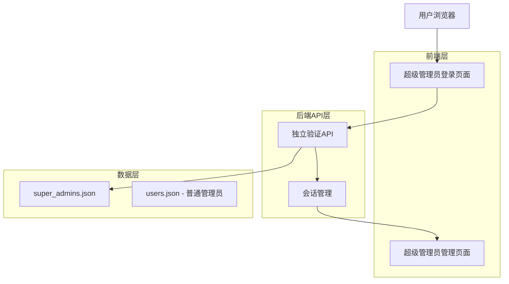
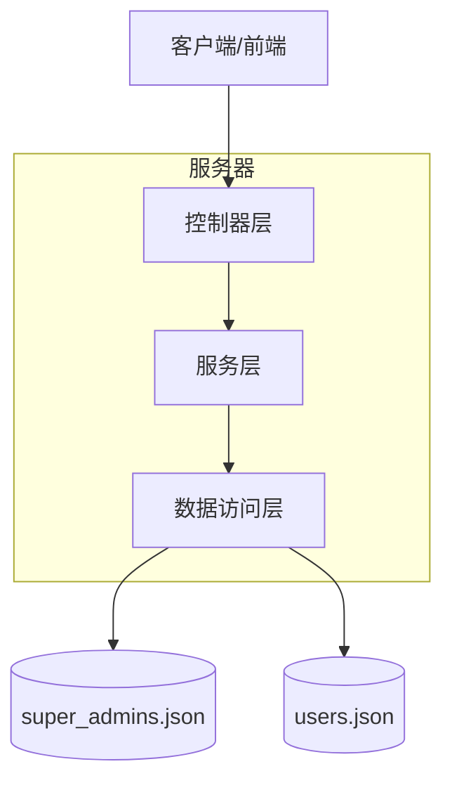
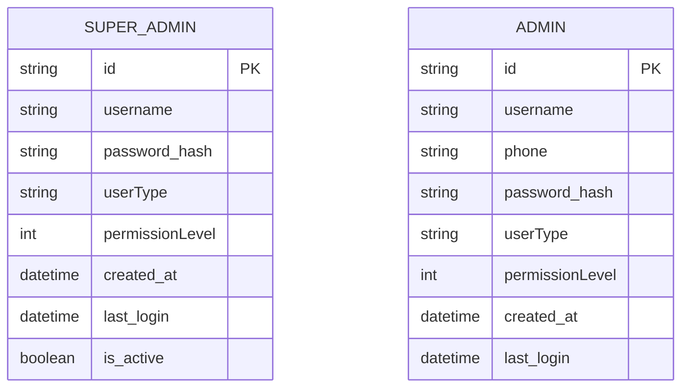

# 超级管理员独立登录系统技术架构文档

## 1. 架构设计



## 2. 技术描述

- 前端：HTML5 + JavaScript ES6 + Bootstrap 5 + FontAwesome
- 后端：ASP.NET Core Web API
- 数据存储：JSON文件存储（super_admins.json + users.json）
- 会话管理：localStorage + JWT Token

## 3. 路由定义

| 路由 | 用途 |
|------|------|
| /super-admin-login.html | 超级管理员专用登录页面 |
| /super-admin.html | 超级管理员管理界面 |
| /admin-login.html | 普通管理员登录页面 |
| /admin.html | 普通管理员管理界面 |

## 4. API定义

### 4.1 核心API

超级管理员身份验证
```
POST /api/super-admin/login
```

请求参数：
| 参数名称 | 参数类型 | 是否必需 | 描述 |
|----------|----------|----------|------|
| username | string | true | 超级管理员用户名 |
| password | string | true | 密码（明文，服务端验证时解码） |

响应参数：
| 参数名称 | 参数类型 | 描述 |
|----------|----------|------|
| success | boolean | 登录是否成功 |
| message | string | 响应消息 |
| admin | object | 超级管理员信息（成功时返回） |
| token | string | JWT认证令牌 |

请求示例：
```json
{
  "username": "superadmin",
  "password": "123456"
}
```

响应示例：
```json
{
  "success": true,
  "message": "登录成功",
  "admin": {
    "id": "super_001",
    "username": "superadmin",
    "userType": "super_admin",
    "permissionLevel": 0,
    "lastLogin": "2024-01-15T10:30:00Z"
  },
  "token": "eyJhbGciOiJIUzI1NiIsInR5cCI6IkpXVCJ9..."
}
```

超级管理员权限验证
```
GET /api/super-admin/verify
```

请求头：
| 参数名称 | 参数类型 | 是否必需 | 描述 |
|----------|----------|----------|------|
| Authorization | string | true | Bearer {token} |

响应参数：
| 参数名称 | 参数类型 | 描述 |
|----------|----------|------|
| valid | boolean | 令牌是否有效 |
| admin | object | 超级管理员信息 |

## 5. 服务器架构图



## 6. 数据模型

### 6.1 数据模型定义



### 6.2 数据定义语言

超级管理员数据文件 (super_admins.json)
```json
{
  "super_admins": [
    {
      "id": "super_001",
      "username": "superadmin",
      "password": "MTIzNDU2",
      "userType": "super_admin",
      "permissionLevel": 0,
      "created_at": "2024-01-01T00:00:00Z",
      "last_login": null,
      "is_active": true,
      "security_settings": {
        "password_expires": false,
        "two_factor_enabled": false,
        "login_attempts_limit": 5
      }
    }
  ],
  "metadata": {
    "version": "1.0",
    "last_updated": "2024-01-15T10:00:00Z",
    "total_count": 1
  }
}
```

普通管理员数据文件 (users.json) - 保持现有结构
```json
{
  "users": [
    {
      "Username": "admin",
      "Phone": "admin",
      "Password": "YWRtaW4xMjM=",
      "UserType": "admin",
      "PermissionLevel": 1
    }
  ]
}
```

数据访问控制规则：
- super_admins.json：仅超级管理员API可访问
- users.json：普通管理员API访问，超级管理员可读取
- 密码存储：Base64编码（保持与现有系统一致）
- 权限级别：0=超级管理员，1=普通管理员

安全增强措施：
- 登录失败次数限制
- 会话超时管理
- 密码复杂度要求
- 操作日志记录