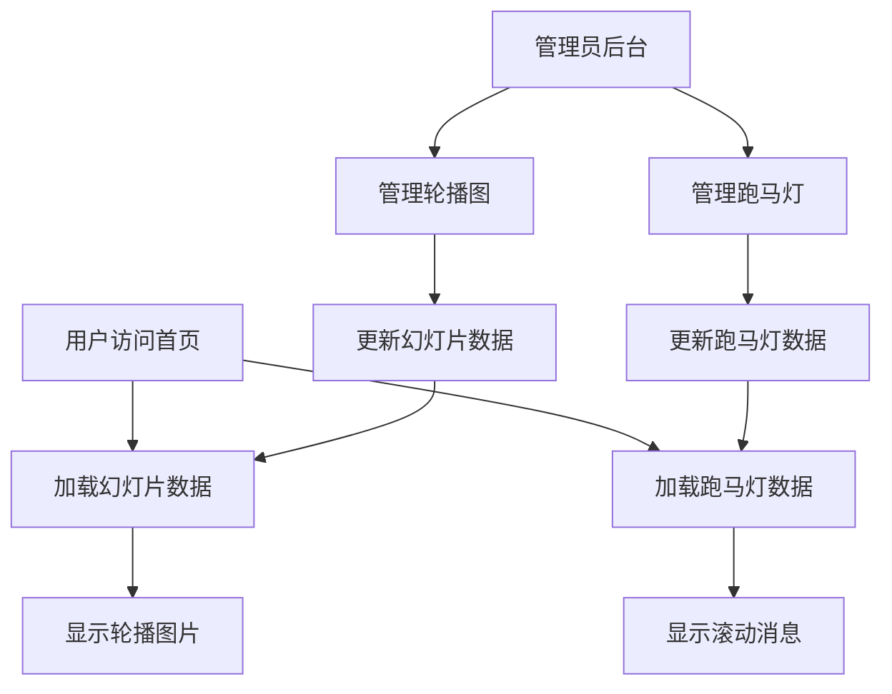

# 首页幻灯片和跑马灯功能修复需求文档

## 1. 产品概述

本项目旨在修复网站首页的幻灯片轮播功能和跑马灯功能，确保管理员在后台设置的内容能够正确显示在前端页面。
- 解决幻灯片无法正确加载和显示的问题，确保后台管理的轮播图能够在首页正常播放
- 实现动态跑马灯功能，支持显示用户赚钱祝贺信息，并提供后台管理界面进行内容管理

## 2. 核心功能

### 2.1 用户角色
| 角色 | 注册方式 | 核心权限 |
|------|----------|----------|
| 超级管理员 | 系统预设账户 | 可管理所有系统设置，包括幻灯片和跑马灯内容 |
| 普通管理员 | 超级管理员创建 | 可管理幻灯片和跑马灯内容 |
| 普通用户 | 注册登录 | 可查看首页幻灯片和跑马灯内容 |

### 2.2 功能模块

本次修复涉及以下主要页面：
1. **首页**：幻灯片轮播区域、跑马灯显示区域
2. **后台管理页面**：轮播图管理、网站设置中的跑马灯管理
3. **API接口**：幻灯片数据接口、跑马灯数据接口

### 2.3 页面详情

| 页面名称 | 模块名称 | 功能描述 |
|----------|----------|----------|
| 首页 | 幻灯片轮播区域 | 显示管理员设置的轮播图片，支持自动播放、手动切换、指示器导航 |
| 首页 | 跑马灯显示区域 | 滚动显示用户赚钱祝贺信息和系统公告，支持动态内容更新 |
| 后台管理 | 轮播图管理 | 上传、编辑、删除轮播图片，设置图片标题、描述、链接和显示顺序 |
| 后台管理 | 跑马灯管理 | 添加、编辑、删除跑马灯消息，支持多种消息类型（赚钱提示、系统公告） |
| API接口 | 幻灯片数据接口 | 提供幻灯片数据的增删改查功能，确保前端能正确获取数据 |
| API接口 | 跑马灯数据接口 | 提供跑马灯数据的增删改查功能，支持实时内容更新 |

## 3. 核心流程

### 管理员操作流程
1. 管理员登录后台管理系统
2. 在轮播图管理中上传图片，设置标题、描述和链接
3. 在网站设置的跑马灯管理中添加祝贺消息
4. 保存设置后，前端首页自动更新显示内容

### 用户浏览流程
1. 用户访问网站首页
2. 页面自动加载并显示轮播图片
3. 跑马灯区域滚动显示最新的祝贺消息和公告

## 4. 用户界面设计

### 4.1 设计风格
- 主色调：蓝色系（#007bff）和白色
- 按钮样式：圆角按钮，悬停效果
- 字体：系统默认字体，标题16px，正文14px
- 布局风格：响应式设计，卡片式布局
- 图标样式：Font Awesome图标库，简洁现代风格

### 4.2 页面设计概览

| 页面名称 | 模块名称 | UI元素 |
|----------|----------|---------|
| 首页 | 幻灯片轮播区域 | 全宽轮播容器，圆形指示器，左右切换箭头，自动播放功能 |
| 首页 | 跑马灯显示区域 | 水平滚动容器，礼品图标，彩色文字，无缝循环滚动 |
| 后台管理 | 轮播图管理 | 图片上传区域，表格列表，编辑表单，预览功能 |
| 后台管理 | 跑马灯管理 | 消息列表，添加表单，消息类型选择，实时预览 |

### 4.3 响应式设计
- 桌面优先设计，支持移动端自适应
- 幻灯片在移动端保持全屏显示
- 跑马灯在小屏幕上调整滚动速度和字体大小