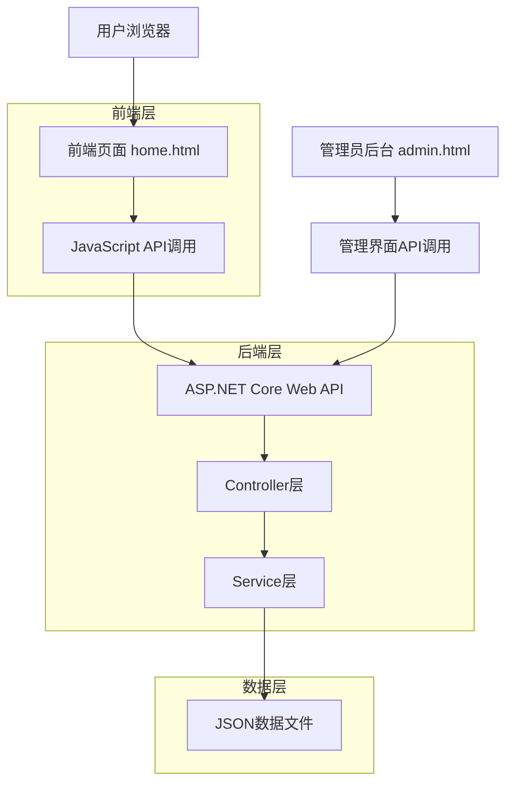
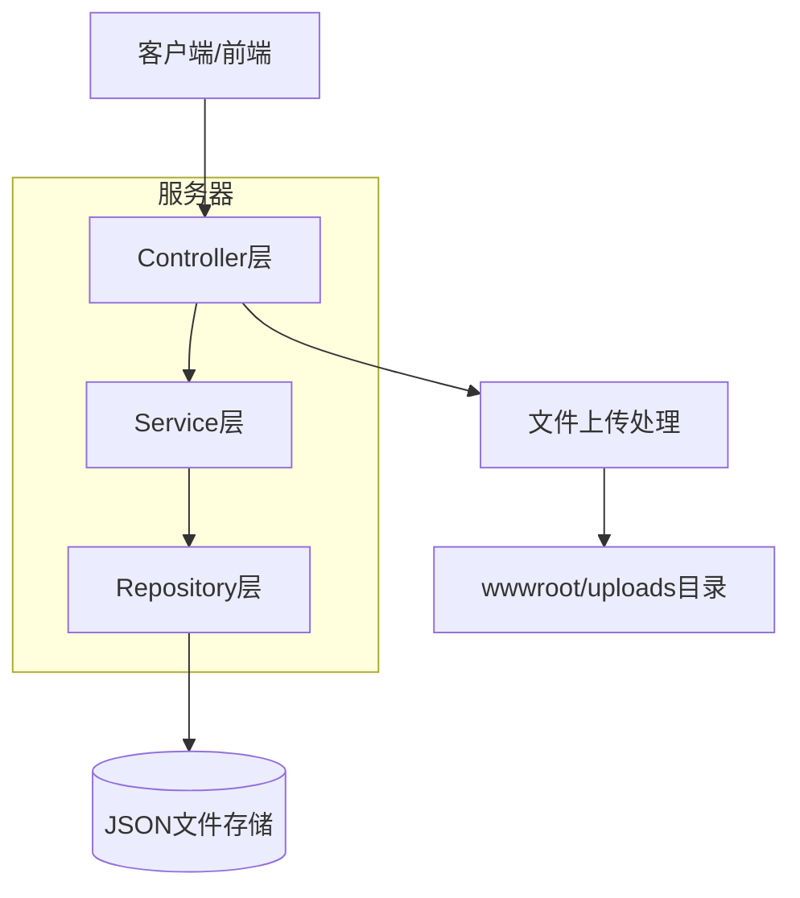
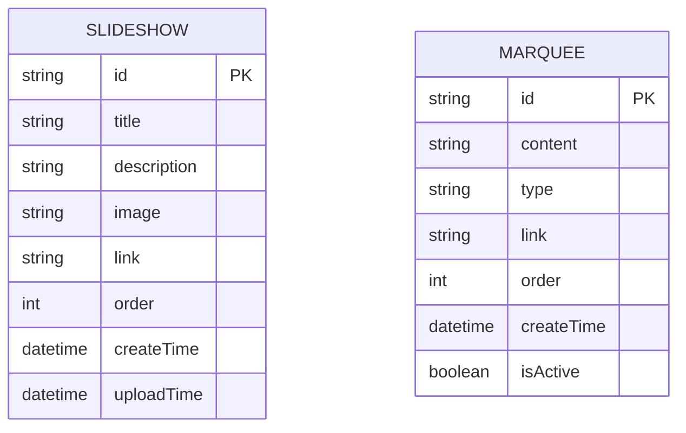

# 首页幻灯片和跑马灯技术架构文档

## 1. 架构设计



## 2. 技术描述

- 前端：HTML5 + CSS3 + JavaScript (原生) + Bootstrap 4
- 后端：ASP.NET Core Web API + C#
- 数据存储：JSON文件存储 (slideshow.json, marquee.json)
- 文件上传：ASP.NET Core文件上传处理

## 3. 路由定义

| 路由 | 用途 |
|------|------|
| /home.html | 首页，显示幻灯片和跑马灯内容 |
| /admin.html | 后台管理页面，管理轮播图和跑马灯 |
| /api/slideshow | 幻灯片数据API接口 |
| /api/marquee | 跑马灯数据API接口 |
| /api/admin/slideshow | 管理员幻灯片管理API |
| /api/admin/marquee | 管理员跑马灯管理API |

## 4. API定义

### 4.1 核心API

#### 幻灯片相关API

```
GET /api/slideshow
```

响应：
| 参数名称 | 参数类型 | 描述 |
|----------|----------|------|
| id | string | 幻灯片ID |
| title | string | 幻灯片标题 |
| description | string | 幻灯片描述 |
| image | string | 图片路径 |
| link | string | 点击链接 |
| order | number | 显示顺序 |

示例：
```json
[
  {
    "id": "slide001",
    "title": "欢迎使用我们的服务",
    "description": "最优质的服务体验",
    "image": "/uploads/slideshow/slide1.jpg",
    "link": "/service.html",
    "order": 1
  }
]
```

```
POST /api/admin/slideshow
```

请求：
| 参数名称 | 参数类型 | 是否必需 | 描述 |
|----------|----------|----------|------|
| title | string | true | 幻灯片标题 |
| description | string | false | 幻灯片描述 |
| image | file | true | 上传的图片文件 |
| link | string | false | 点击链接 |
| order | number | false | 显示顺序 |

#### 跑马灯相关API

```
GET /api/marquee
```

响应：
| 参数名称 | 参数类型 | 描述 |
|----------|----------|------|
| id | string | 消息ID |
| content | string | 消息内容 |
| type | string | 消息类型 (notice, congratulation) |
| order | number | 显示顺序 |
| isActive | boolean | 是否启用 |

示例：
```json
[
  {
    "id": "msg001",
    "content": "恭喜用户5645865******赚取了$128.50",
    "type": "congratulation",
    "order": 1,
    "isActive": true
  }
]
```

```
POST /api/admin/marquee
```

请求：
| 参数名称 | 参数类型 | 是否必需 | 描述 |
|----------|----------|----------|------|
| content | string | true | 消息内容 |
| type | string | true | 消息类型 |
| order | number | false | 显示顺序 |
| isActive | boolean | false | 是否启用 |

## 5. 服务器架构图



## 6. 数据模型

### 6.1 数据模型定义



### 6.2 数据定义语言

#### 幻灯片数据结构 (slideshow.json)
```json
[
  {
    "Id": "slide001",
    "Title": "幻灯片标题",
    "Description": "幻灯片描述",
    "Image": "/uploads/slideshow/image.jpg",
    "Link": "/target-page.html",
    "Order": 1,
    "CreateTime": "2024-01-01T00:00:00Z",
    "UploadTime": "2024-01-01T00:00:00Z"
  }
]
```

#### 跑马灯数据结构 (marquee.json)
```json
[
  {
    "Id": "msg001",
    "Content": "恭喜用户5645865******赚取了$128.50",
    "Type": "congratulation",
    "Link": null,
    "Order": 1,
    "CreateTime": "2024-01-01T00:00:00Z",
    "IsActive": true
  },
  {
    "Id": "msg002",
    "Content": "系统维护通知：今晚22:00-24:00进行系统升级",
    "Type": "notice",
    "Link": "/notice.html",
    "Order": 2,
    "CreateTime": "2024-01-01T00:00:00Z",
    "IsActive": true
  }
]
```

#### 初始化数据

幻灯片初始数据：
```json
[
  {
    "Id": "default001",
    "Title": "欢迎使用我们的平台",
    "Description": "体验最优质的服务",
    "Image": "/uploads/slideshow/default1.jpg",
    "Link": "/service.html",
    "Order": 1,
    "CreateTime": "2024-01-01T00:00:00Z",
    "UploadTime": "2024-01-01T00:00:00Z"
  }
]
```

跑马灯初始数据：
```json
[
  {
    "Id": "welcome001",
    "Content": "欢迎来到我们的平台！",
    "Type": "notice",
    "Link": null,
    "Order": 1,
    "CreateTime": "2024-01-01T00:00:00Z",
    "IsActive": true
  },
  {
    "Id": "congratulation001",
    "Content": "恭喜用户1234567******赚取了$99.99",
    "Type": "congratulation",
    "Link": null,
    "Order": 2,
    "CreateTime": "2024-01-01T00:00:00Z",
    "IsActive": true
  }
]
```